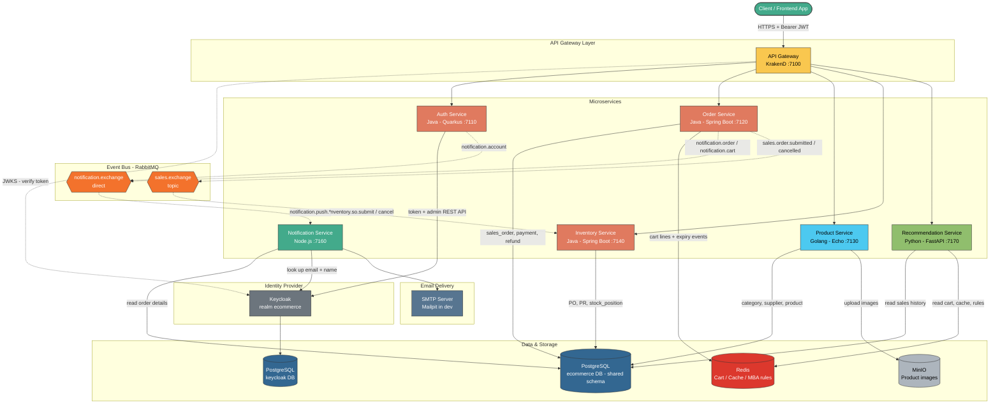
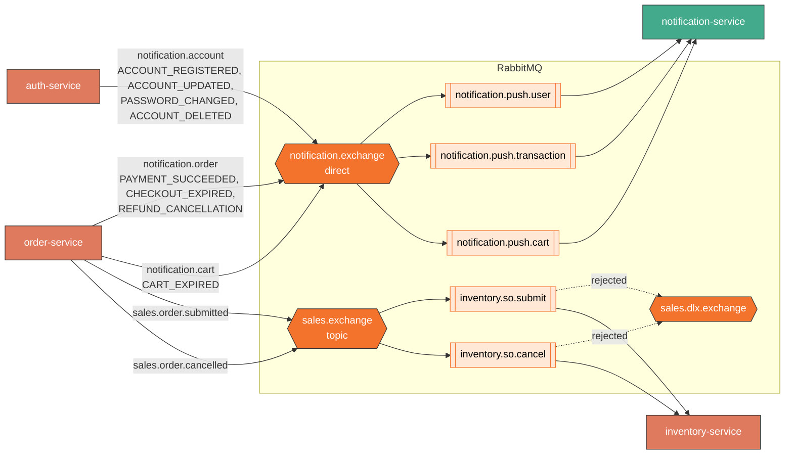
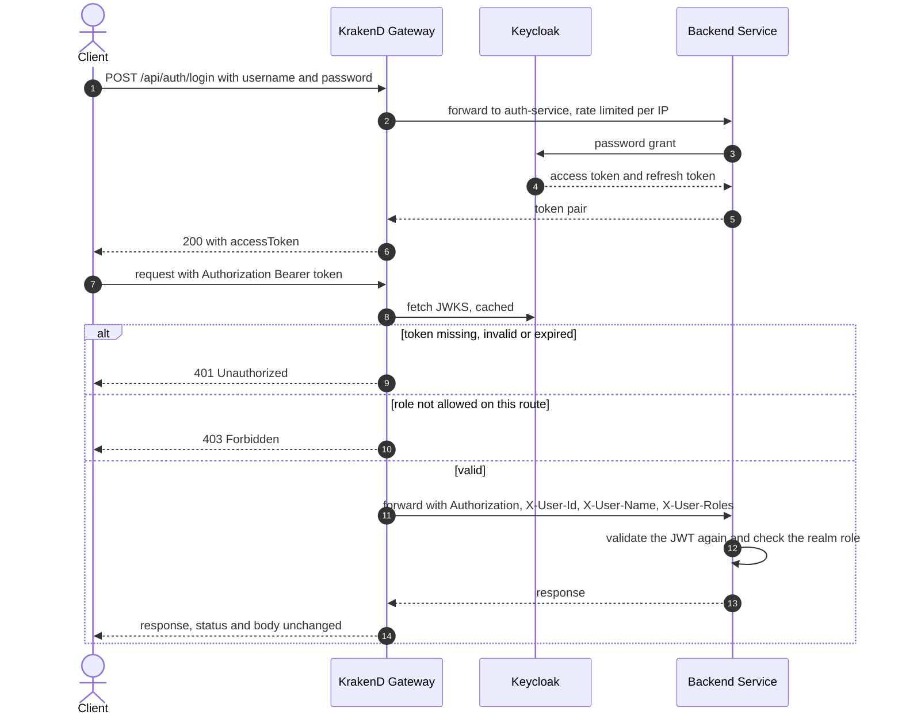
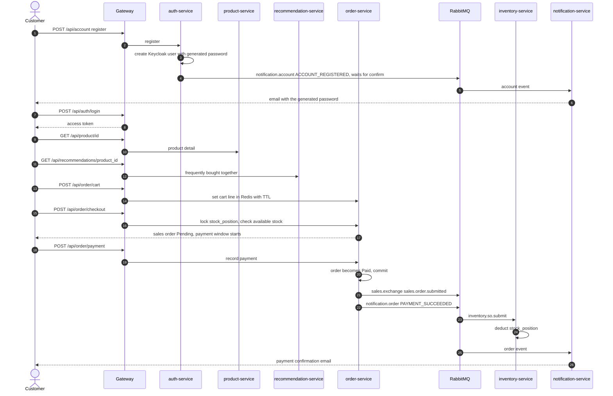
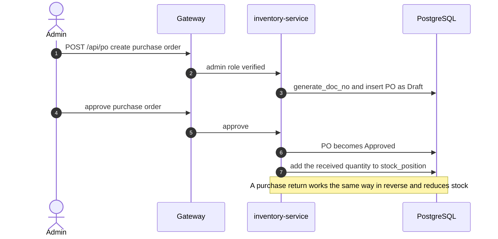
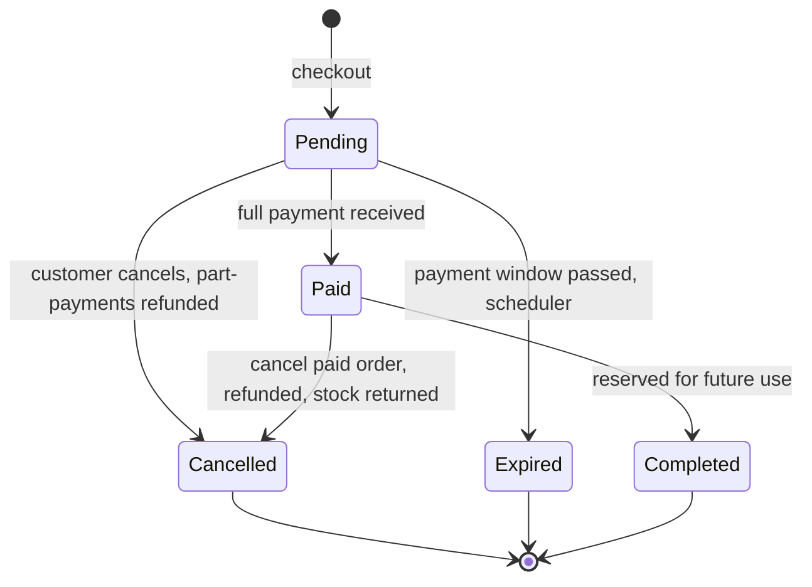

# polygot-ecommerce

An e-commerce backend API built the **polyglot** way: seven microservices written in
Java, Go, Python and Node.js, each in the language that suits its job best. They sit
behind a single KrakenD gateway, share one Keycloak realm for identity, and talk to
each other through RabbitMQ and Redis.


## Table of Contents

- [Overview](#overview)
- [Services](#services)
- [Infrastructure](#infrastructure)
- [Tech Stack](#tech-stack)
- [Architecture](#architecture)
- [Project Flow](#project-flow)
- [Getting Started](#getting-started)
- [API Documentation (Swagger)](#api-documentation-swagger)
- [CI/CD](#cicd)
- [Repository Layout](#repository-layout)
- [License](#license)

## Overview

The platform covers the main parts of an online store:

- **Identity:** customers register, log in and manage their accounts. Keycloak stores
  the users and issues the tokens.
- **Catalogue:** categories, suppliers and products, with product images stored in
  MinIO.
- **Procurement:** purchase orders and purchase returns, which move stock in and out.
- **Selling:** a Redis cart, checkout with stock reservation, payment, cancellation,
  refund and automatic expiry of unpaid orders.
- **Engagement:** transactional emails, plus product recommendations from Market
  Basket Analysis (FP-Growth).

Every public request goes through the gateway. The gateway validates the Keycloak
token and its realm role before the request reaches a service, and each service checks
the token again itself. Work that doesn't need to block the caller, such as stock
deduction and emails, is published to RabbitMQ after the database transaction commits.

## Services

Click a service name to open its own README. Each one covers its tech stack, flows,
diagrams, configuration, how to run it and its Swagger docs.

| Service | Language / Framework | Port | Responsibility |
| --- | --- | --- | --- |
| [**gateway-service**](services/gateway-service/README.md) | KrakenD 2.10 (config only) | `7100` | The single entry point: routing, JWT and role validation, CORS, rate limiting, aggregated OpenAPI docs |
| [**auth-service**](services/auth-service/README.md) | Java 17 · Quarkus 3.38 | `7110` | Login, logout and account management, built on Keycloak; publishes account events |
| [**order-service**](services/order-service/README.md) | Java 17 · Spring Boot 4.0 | `7120` | Cart (Redis), checkout, payment, cancellation, refund and order expiry; publishes sales and notification events |
| [**product-service**](services/product-service/README.md) | Go 1.25 · Echo v5 | `7130` | Categories, suppliers and products; product images in MinIO |
| [**inventory-service**](services/inventory-service/README.md) | Java 17 · Spring Boot 4.0 | `7140` | Purchase orders, purchase returns and stock positions; consumes sales-order events |
| [**notification-service**](services/notification-service/README.md) | Node.js 22 · amqplib · Nodemailer | `7160` | RabbitMQ consumer that turns account, order and cart events into emails (no REST API) |
| [**recommendation-service**](services/recommendation-service/README.md) | Python 3.13 · FastAPI | `7170` | Customer and product recommendations, built with FP-Growth Market Basket Analysis |

Shared database schema: [**migrations**](migrations/README.md) (Liquibase changelogs for the `ecommerce` database).

## Infrastructure

All of it is defined in [`app/docker-compose.yml`](app/docker-compose.yml).

| Component | Image | Port(s) | Used for |
| --- | --- | --- | --- |
| PostgreSQL | `postgres:16-alpine` | `5432` | `ecommerce` database (shared business schema) and `keycloak` database |
| Keycloak | `keycloak:26.7` | `8080` | Identity provider: realm `ecommerce`, users, roles `user` / `admin`, token signing (JWKS) |
| Redis | `redis:7-alpine` | `6379` | Cart lines with TTL plus key-expiry events, recommendation cache and MBA rules |
| RabbitMQ | `rabbitmq:4-management-alpine` | `5672`, UI `15672` | `notification.exchange` (direct) and `sales.exchange` (topic) |
| MinIO | `quay.io/minio/minio` | `9000`, console `9001` | Product images (bucket `ecommerce`) |
| Mailpit | `axllent/mailpit` | SMTP `1025`, UI `8025` | Local SMTP server that catches every email |

## Tech Stack

Each service is built on the stack that fits its problem best. The per-service READMEs
explain every library choice in detail.

| Area | Choice | Why |
| --- | --- | --- |
| API gateway | **KrakenD** | Declarative and stateless, with no code to maintain. Validates JWTs offline against Keycloak's JWKS, so a bad request never reaches a service. Uses Go templates to produce one config from per-service settings files. |
| Identity | **Keycloak** + **Quarkus** (auth-service) | Keycloak handles password hashing, brute-force protection, sessions and token signing, so none of that is written by hand. Quarkus has first-class OIDC and Keycloak Admin client support, and starts quickly. |
| Transactional core | **Spring Boot** (order, inventory) | Mature JPA/transaction handling, row locking (`FOR UPDATE`), schedulers and Spring AMQP with publisher confirms. That matters most where money and stock change. |
| Catalogue | **Go + Echo** (product) | A small, fast, statically compiled service for CRUD-heavy, read-mostly traffic. The MinIO Go SDK handles image uploads with very little overhead. |
| Recommendations | **Python + FastAPI** | Python suits the data-mining side (FP-Growth, association rules). FastAPI with async SQLAlchemy and Pydantic gives typed, self-documenting endpoints. |
| Notifications | **Node.js** | An I/O-bound consumer (broker in, SMTP out), a good fit for the event loop. Nodemailer is the de-facto email library. |
| Messaging | **RabbitMQ** | Durable exchanges, routing keys and dead-letter queues decouple stock deduction and emails from the HTTP request. |
| Cache / state | **Redis** | A cart line is a key with a TTL. Key-expiry events drive the abandoned-cart email. It also caches recommendations and stores the mined rules. |
| Database | **PostgreSQL** + **Liquibase** | One relational schema with one migration history, versioned centrally in `/migrations`, so services never run conflicting migrations. |
| Object storage | **MinIO** | S3-compatible storage for product images that runs locally and can be swapped for S3 unchanged. |
| Runtime | **Docker Compose** | One command (`./build.sh`) brings up the infrastructure, migrates the schema, provisions Keycloak and starts every service. |

## Architecture

### System overview

Solid arrows are synchronous calls (HTTP, SQL, Redis). Dotted arrows are asynchronous
events through RabbitMQ.



### Event topology

What each exchange carries, and which queue picks it up:



Messages carry ids only, never full rows. Consumers read the committed rows
themselves, which is why the producers publish only after the transaction commits.

### Data ownership in the shared `ecommerce` database

There is one schema with one migration history ([`/migrations`](migrations/README.md)).
Each table has a single writer:

| Tables | Written by | Read by |
| --- | --- | --- |
| `category`, `supplier`, `product` | product-service | order, inventory, recommendation, notification |
| `purchase_order(_detail)`, `purchase_return(_detail)`, `stock` | inventory-service | — |
| `stock_position` | inventory-service | order-service (stock check at checkout, under row lock) |
| `sales_order(_detail)`, `payment`, `refund` | order-service | inventory, recommendation, notification |
| Users, credentials, roles | Keycloak (own `keycloak` database) | auth-service, notification-service via the Admin API |

## Project Flow

### 1. Authentication at the edge

Every protected request is checked twice: once by the gateway, and again by the service
itself.



### 2. Customer journey: register, shop, pay



### 3. Background flows

| Flow | Trigger | What happens |
| --- | --- | --- |
| Unpaid order expiry | `SalesOrderExpiryScheduler` in order-service, every minute | A `Pending` order past its payment window becomes `Expired`. Any part-payments are refunded and `CHECKOUT_EXPIRED` is published. |
| Abandoned cart | Redis key-expiry event on `cart:<user>:<product>` | order-service claims the event (`SET NX`) so only one instance handles it, then publishes `CART_EXPIRED`. notification-service batches those per customer and sends one email. |
| Cancellation of a paid order | `PUT /api/order/payment/{id}` | The order is refunded payment by payment, and `sales.order.cancelled` makes inventory-service return the stock. |
| Market Basket Analysis | On startup, then every `MBA_INTERVAL` seconds in recommendation-service | Under a Redis lock it reads every sales order as a basket, runs FP-Growth, writes the association rules to Redis and clears the recommendation cache. |

### 4. Procurement: stock coming in



### 5. Sales order lifecycle



See [order-service](services/order-service/README.md#sales-order-lifecycle) for the exact
rules behind each transition.

## Getting Started

### Prerequisites

- Docker with Docker Compose v2
- Bash (the scripts re-exec themselves under bash)
- To run a service outside Docker, its own toolchain: JDK 17 + Maven, Go 1.25,
  Python 3.13 or Node.js 22. See each service's README.

### Run the whole stack

```shell script
./build.sh            # infra up, migrate the ecommerce DB, provision Keycloak, build and start every service
./build.sh --wait     # same, but block until every healthcheck passes
```

`build.sh` works in two phases, so no service boots against an empty schema or a
missing realm:

1. It starts PostgreSQL, MinIO, Keycloak, Redis, RabbitMQ and Mailpit. It then applies
   the Liquibase changelogs (`app/init/migrate.sh`) and provisions the realm, clients
   and test users (`app/init/keycloak-init.sh`).
2. It builds and starts the application services (`docker compose up -d --build`).

A cold first boot takes several minutes, because Keycloak has to build its own schema
first.

```shell script
./build.sh order-service     # rebuild and restart a single service
./build.sh --no-init         # skip the Keycloak provisioning step
./build.sh --no-migrate      # skip the database migration step
```

### Stop and clean

```shell script
./down.sh                    # stop and remove containers and the network, data volumes kept
./down.sh -v                 # also delete the data volumes, which wipes the databases
./down.sh --rmi local        # also remove the locally built images
```

To clean a single service's build artefacts (`target/`, `venv/`, `node_modules/`,
coverage reports...), see the **Clean** section of that service's README.

### Useful URLs

| What | URL | Credentials |
| --- | --- | --- |
| API gateway | <http://localhost:7100> | Bearer token |
| Gateway health | <http://localhost:7100/__health> | — |
| Keycloak admin console | <http://localhost:8080> | `admin` / `P@ssw0rd` |
| RabbitMQ management | <http://localhost:15672> | `admin` / `p@ssw0rd` |
| Mailpit inbox | <http://localhost:8025> | — |
| MinIO console | <http://localhost:9001> | `admin` / `password` |

These are the local defaults from `app/docker-compose.yml`. Any of them can be
overridden through environment variables.

### Try it

`keycloak-init.sh` creates two test users: `userapp` (role `user`) and `adminapp`
(role `admin`), both with password `P@ssw0rd`.

```shell script
# log in through the gateway
TOKEN=$(curl -s -X POST http://localhost:7100/api/auth/login \
  -H 'Content-Type: application/json' \
  -d '{"username":"adminapp","password":"P@ssw0rd"}' | jq -r '.. | .accessToken? // empty')

# call a protected route
curl -H "Authorization: Bearer $TOKEN" http://localhost:7100/api/product
```

## API Documentation (Swagger)

Each service serves its own Swagger UI. The gateway also republishes every OpenAPI
document under `/docs/<service>/openapi.json` (enabled with `env.swagger.enabled`).

| Service | Swagger UI (direct) | OpenAPI through the gateway |
| --- | --- | --- |
| auth-service | <http://localhost:7110/q/swagger-ui> | <http://localhost:7100/docs/auth/openapi.json> |
| order-service | <http://localhost:7120/api/swagger-ui/index.html> | <http://localhost:7100/docs/order/openapi.json> |
| product-service | <http://localhost:7130/api/swagger/index.html> | <http://localhost:7100/docs/product/openapi.json> |
| inventory-service | <http://localhost:7140/api/swagger-ui/index.html> | <http://localhost:7100/docs/inventory/openapi.json> |
| recommendation-service | <http://localhost:7170/docs> (ReDoc: `/redoc`) | <http://localhost:7100/docs/recommendation/openapi.json> |
| notification-service | No REST API. See its [message contracts](services/notification-service/README.md#message-contracts) | — |

To call protected endpoints from Swagger UI, press **Authorize** and paste the access
token from the login call above. To browse all five documents in one UI, see
[gateway-service › API Documentation](services/gateway-service/README.md#api-documentation-swagger).

## CI/CD

Every service has its own GitHub Actions workflow in `.github/workflows/<service>.yml`. A push or merge to `master` that changes `services/<service>/**` runs that service's tests, pushes its image to GHCR (`ghcr.io/<owner>/<repo>/<service>:<sha>`) and deploys it to Kubernetes with `k8s/<service>.yaml`. Services that did not change are left alone. The shared build-and-deploy steps live in `.github/workflows/deploy.yml`.

See [k8s/README.md](k8s/README.md) for the one-time setup: the `KUBE_CONFIG` secret, the namespace, and the secrets the cluster needs.

## Repository Layout

```
polygot-ecommerce/
├── .github/workflows/         # per-service CI/CD + shared deploy.yml
├── app/
│   ├── docker-compose.yml     # infrastructure + every service
│   └── init/                  # create-db, create-bucket, keycloak-init, migrate scripts
├── k8s/                       # Kubernetes manifests, applied by CI
├── migrations/                # Liquibase changelogs for the shared ecommerce database
├── services/
│   ├── gateway-service/       # KrakenD configuration
│   ├── auth-service/          # Quarkus
│   ├── order-service/         # Spring Boot
│   ├── product-service/       # Go + Echo
│   ├── inventory-service/     # Spring Boot
│   ├── notification-service/  # Node.js
│   └── recommendation-service/# FastAPI
├── build.sh                   # bring the whole stack up
├── down.sh                    # tear it down
└── migration.sh               # scaffold a new Liquibase changelog
```

## License

[MIT](LICENSE) © 2026 Denny Afrizal
