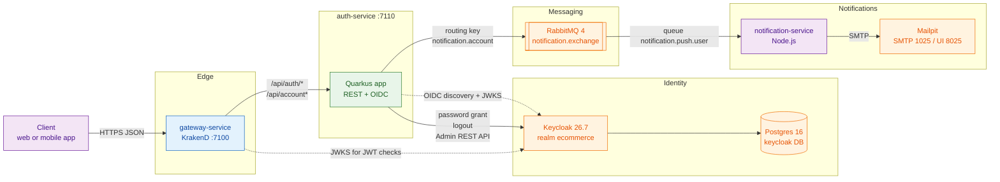
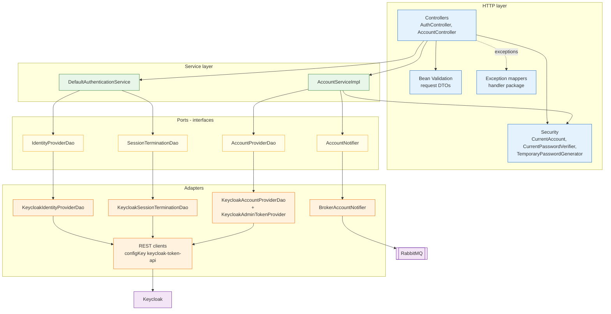
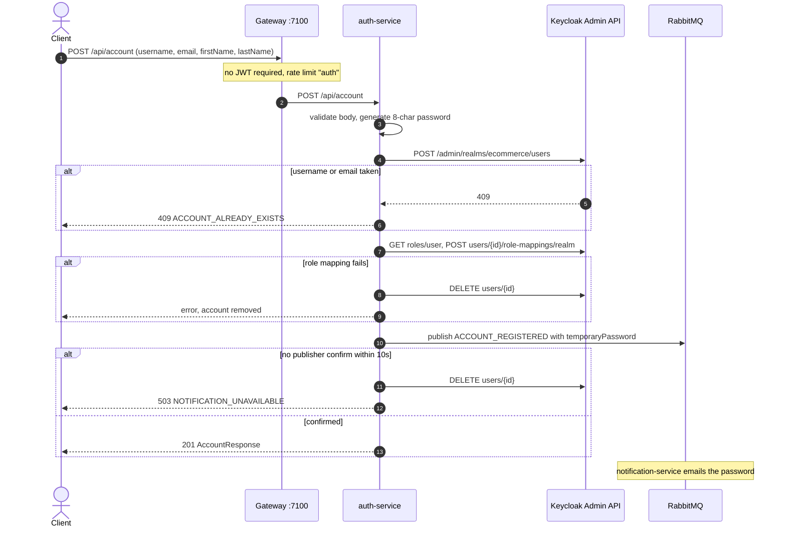
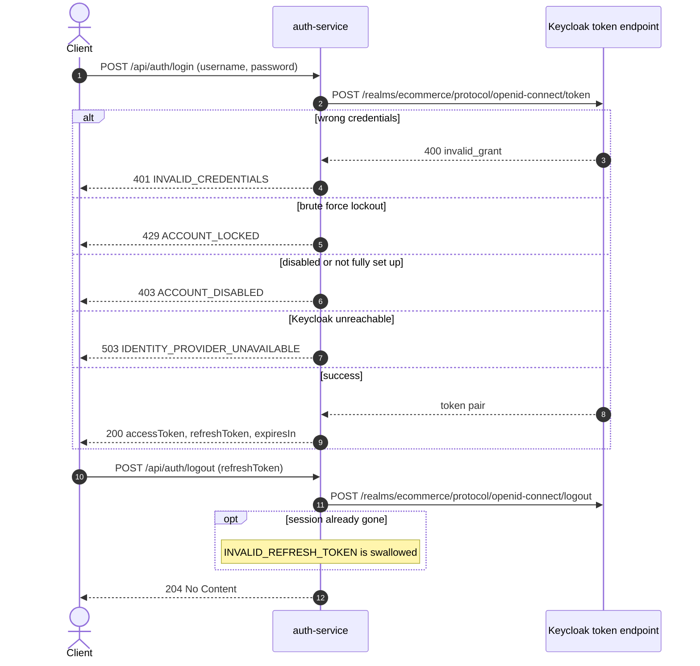
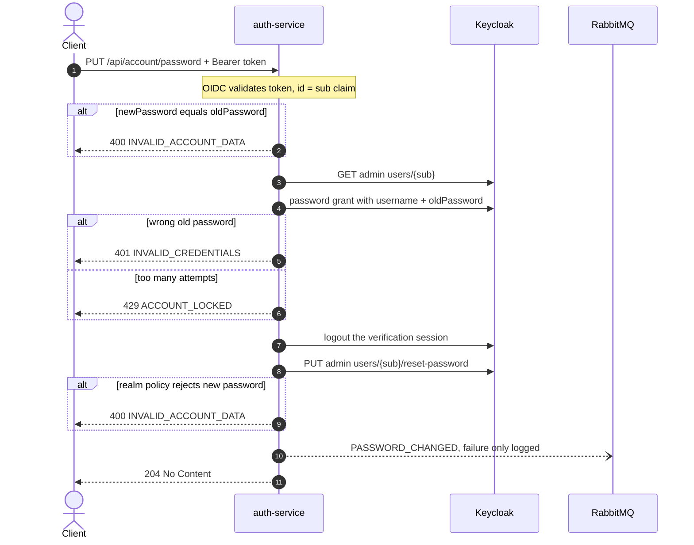
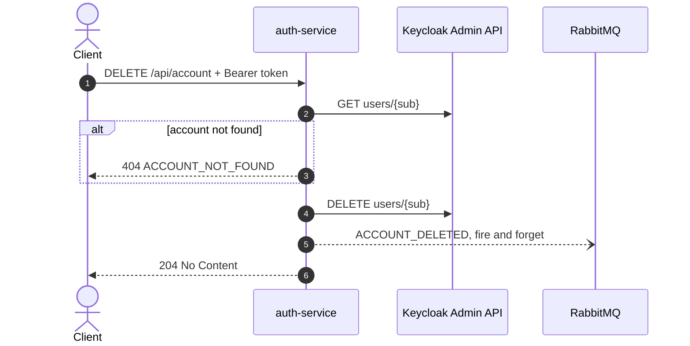
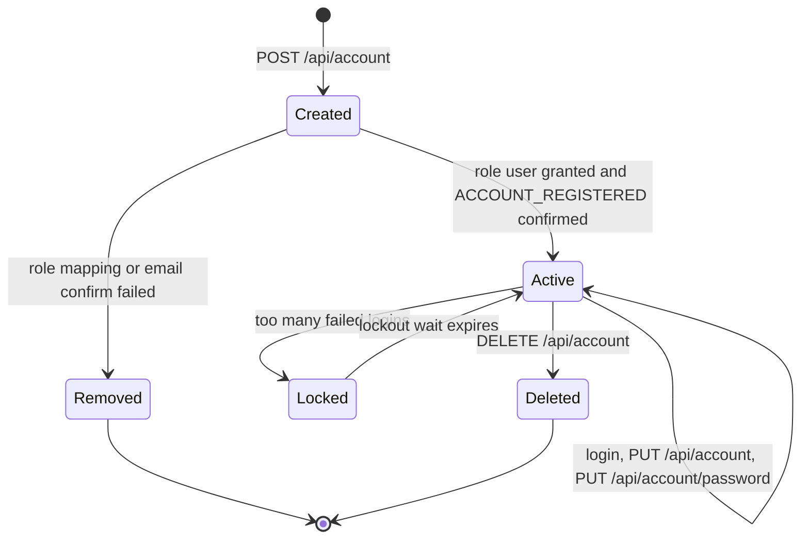

# auth-service

Authentication and account management for the polygot-ecommerce platform: a thin, well-defined Quarkus front for Keycloak that issues and revokes tokens and lets a customer register, read, change and delete their own account.

## Table of Contents

- [Overview](#overview)
- [Tech Stack](#tech-stack)
- [Architecture](#architecture)
- [Project Flow](#project-flow)
- [Getting Started](#getting-started)
  - [Prerequisites](#prerequisites)
  - [Configuration](#configuration)
  - [Clean](#clean)
  - [Build](#build)
  - [Run](#run)
- [API Documentation (Swagger)](#api-documentation-swagger)
- [Endpoints](#endpoints)
- [Message Contracts](#message-contracts)
- [Testing](#testing)
- [Project Layout](#project-layout)
- [Design Notes](#design-notes)
- [Troubleshooting](#troubleshooting)

## Overview

auth-service is the platform's single entry point for **identity**. It runs on port **7110** and sits behind the KrakenD gateway (`gateway-service`, port 7100).

What it is responsible for:

- **Authentication** (`/api/auth/*`): exchanging a username and password for a Keycloak token pair (password grant on the public `ecommerce-app` client), and ending the session a refresh token belongs to.
- **Account lifecycle** (`/api/account`): registering a customer (with a generated password that is emailed to them), reading and updating the caller's own profile, changing the caller's password (old password required), and deleting the caller's account. New accounts get the `user` realm role.
- **Account events**: publishing `ACCOUNT_REGISTERED`, `ACCOUNT_UPDATED`, `PASSWORD_CHANGED` and `ACCOUNT_DELETED` to RabbitMQ so that `notification-service` can email the customer.

What it does **not** own:

- **No database.** It never stores credentials, sessions or profiles itself; Keycloak is the single source of truth for all three. The service does not connect to Postgres, Redis or MinIO (Keycloak itself keeps its data in the `keycloak` Postgres database). The Liquibase migrations in `/migrations` do not concern this service.
- **No email.** It does not talk to SMTP. `notification-service` owns the templates and the SMTP connection (Mailpit locally).
- **No token validation for other services.** Every other service (and the gateway) validates the same Keycloak-issued JWTs on its own.
- **No administration.** There is no admin override; support and operations work goes through the Keycloak admin console.

## Tech Stack

| Technology | Version | Why we use it |
| --- | --- | --- |
| Java | 17 (`maven.compiler.release`) | LTS release; records are used throughout for DTOs, domain models and the broker event, and pattern matching (`instanceof JsonWebToken jwt`) keeps the token handling short. |
| Quarkus | 3.38.1 (`quarkus-bom`) | Fast startup and low memory for a small, stateless front service; build-time config fixes the security posture and OpenAPI settings into the artefact; Dev UI and live reload in dev mode. |
| Quarkus REST + Jackson (`quarkus-rest-jackson`) | managed by Quarkus BOM | JAX-RS resources (`AuthController`, `AccountController`) with JSON (de)serialisation and `ExceptionMapper`s for a uniform `ErrorResponse`. |
| Quarkus OIDC (`quarkus-oidc`) | managed by Quarkus BOM | Validates incoming bearer tokens against the Keycloak realm (issuer, signature and the `auth-service` audience), and exposes the `sub` claim that every account endpoint acts on. |
| Quarkus REST Client + Jackson (`quarkus-rest-client-jackson`) | managed by Quarkus BOM | Typed clients for Keycloak's token, logout and Admin REST endpoints (`KeycloakTokenClient`, `KeycloakLogoutClient`, `KeycloakAdminClient`, `KeycloakAdminTokenClient`), with `ResponseExceptionMapper`s that turn Keycloak errors into domain exceptions. |
| Hibernate Validator (`quarkus-hibernate-validator`) | managed by Quarkus BOM | Bean Validation on request DTOs (`@NotBlank`, `@Email`, `@Size`, `@Pattern`); violations become `400 VALIDATION_ERROR` with per-field `details`. |
| SmallRye Reactive Messaging RabbitMQ (`quarkus-messaging-rabbitmq`) | managed by Quarkus BOM | Publishes account events to the durable direct exchange `notification.exchange` with publisher confirms, so registration can wait for the broker to accept the password email. |
| Keycloak | 26.7 (compose image) | Identity provider: users, credentials, sessions, realm roles, password policy and brute force detection. This service is a front for its token endpoint and its Admin REST API. |
| RabbitMQ | 4 (`rabbitmq:4-management-alpine`) | Decouples account changes from email delivery; `notification-service` consumes the events. |
| SmallRye OpenAPI + Swagger UI (`quarkus-smallrye-openapi`) | managed by Quarkus BOM | Generates the OpenAPI 3.1 document from annotations and serves Swagger UI, kept in the packaged app (`quarkus.swagger-ui.always-include=true`). |
| JUnit 5 + Quarkus JUnit (`quarkus-junit`, `quarkus-junit5-mockito`) | managed by Quarkus BOM | `@QuarkusTest` controller tests with mocked services, plus plain unit tests for mappers, models and DAOs. |
| REST Assured | managed by Quarkus BOM | Fluent HTTP assertions against the running test application. |
| Quarkus Test Security OIDC (`quarkus-test-security-oidc`) | managed by Quarkus BOM | `@TestSecurity` with a `JsonWebToken` principal, so authenticated endpoints are tested without a live Keycloak. |
| SmallRye Reactive Messaging In-Memory | managed by Quarkus BOM | Replaces the RabbitMQ connector in the `%test` profile, so the suite boots without a broker. |
| JaCoCo (`jacoco-maven-plugin` + `quarkus-jacoco`) | 0.8.13 | Coverage for both plain JUnit and `@QuarkusTest` tests; `mvn verify` fails below **90 %** instruction, line and branch coverage. |
| Maven | 3.9 (`maven:3.9-eclipse-temurin-17` build image) | Build tool; the Quarkus Maven plugin packages the fast-jar layout. |
| Docker (UBI 9 OpenJDK 17 runtime) | `ubi9/openjdk-17-runtime:1.24` | Multi-stage image (`Dockerfile`) builds from source, so `docker compose up --build auth-service` works on a fresh checkout. |

## Architecture

### Service in context



### Internal layers



Mappers (`mapper/`) translate between Keycloak DTOs, domain models (`model/`) and API DTOs (`dto/`). The service layer only knows the DAO and notifier interfaces, never Keycloak or RabbitMQ directly.

## Project Flow

### 1. Registration

The caller sends a profile without a password. The service generates an eight-character password, creates the user in Keycloak through the Admin REST API (using the `auth-service` service account token, cached by `KeycloakAdminTokenProvider`), grants the `user` realm role, and publishes `ACCOUNT_REGISTERED` carrying the password. Registration is all-or-nothing: if the role cannot be granted or the broker does not confirm within `notification.confirm-timeout` (10 s), the account is deleted again.



### 2. Login and logout

Login is a password grant against the public `ecommerce-app` client. Keycloak's errors are translated without revealing whether the username or the password was wrong. Logout revokes the refresh token's session; an unknown or already-ended session still answers `204`, so the endpoint cannot be used to test whether a stolen refresh token is live.



### 3. Change password

The account id comes from the token's `sub`. The old password is checked with a real login attempt (so it counts towards brute force detection), the session that check opened is ended at once, and only then is the password reset through the Admin API. `PASSWORD_CHANGED` is published best effort.



### 4. Update and delete the current account

`PUT /api/account` rejects a body with no fields (`400 INVALID_ACCOUNT_DATA`), applies the change, reads the account back and publishes `ACCOUNT_UPDATED` with the list of changed fields. `DELETE /api/account` reads the account first (afterwards there is no address left to write to), deletes it and publishes `ACCOUNT_DELETED`. Both notifications are best effort: the change stands even if the broker refuses the message.



### Account lifecycle



`Locked` is Keycloak's temporary brute force lockout as provisioned by `app/init/keycloak-init.sh` (5 failures arm it, 60 s first wait, doubling up to 15 minutes).

## Getting Started

### Prerequisites

- JDK 17
- Maven 3.9+ (`mvn`; the Makefile calls `mvn`. A `./mvnw` wrapper may exist locally but `mvnw` and `.mvn/` are not tracked in git)
- Docker with the Compose plugin (for the stack and the image)
- A running Keycloak with the `ecommerce` realm provisioned by `app/init/keycloak-init.sh`, and a running RabbitMQ (both come from `app/docker-compose.yml`)
- `curl` and `jq` if you run `keycloak-init.sh` yourself

### Configuration

Runtime configuration comes from environment variables. For local runs Quarkus reads a `.env` file in the service directory; copy `.env.example` to `.env` and fill it in (`.env` is gitignored). `src/main/resources/application.properties` holds only build-time settings (OpenAPI, Swagger UI, HTTP permissions, the RabbitMQ channel shape) plus `%test` fallbacks.

| Variable | Default (compose / local `.env`) | Description |
| --- | --- | --- |
| `QUARKUS_HTTP_PORT` | `7110` | HTTP port. Quarkus falls back to `8080` if unset. |
| `QUARKUS_OIDC_AUTH_SERVER_URL` | `http://keycloak:8080/realms/ecommerce` (local: `http://localhost:8080/realms/ecommerce`) | Realm used to validate incoming bearer tokens. |
| `QUARKUS_OIDC_CLIENT_ID` | `auth-service` | Confidential client this service is. |
| `QUARKUS_OIDC_CREDENTIALS_SECRET` | `${AUTH_SERVICE_CLIENT_SECRET:-auth-service-secret}` | Secret of the `auth-service` client, for token validation. |
| `QUARKUS_OIDC_APPLICATION_TYPE` | `service` | Bearer-token-only resource server, no browser login flow. |
| `QUARKUS_OIDC_TOKEN_AUDIENCE` | `auth-service` | Required `aud` claim on incoming tokens. |
| `QUARKUS_REST_CLIENT_KEYCLOAK_TOKEN_API_URL` | `http://keycloak:8080` (local: `http://localhost:8080`) | Keycloak base URL for the token, logout and Admin REST clients (`configKey = keycloak-token-api`). |
| `QUARKUS_REST_CLIENT_KEYCLOAK_TOKEN_API_CONNECT_TIMEOUT` | `5000` | Connect timeout in ms. |
| `QUARKUS_REST_CLIENT_KEYCLOAK_TOKEN_API_READ_TIMEOUT` | `10000` | Read timeout in ms. |
| `KEYCLOAK_AUTH_REALM` | `${KEYCLOAK_REALM:-ecommerce}` | Realm for login, logout and the Admin API. |
| `KEYCLOAK_AUTH_CLIENT_ID` | `${KEYCLOAK_CLIENT:-ecommerce-app}` | Public client used for the password grant. |
| `KEYCLOAK_AUTH_CLIENT_SECRET` | none (optional) | Only if the login client is confidential. |
| `KEYCLOAK_AUTH_SCOPE` | none (optional) | Scope requested on login. |
| `KEYCLOAK_AUTH_GRANT_TYPE` | `password` | Grant type for login. |
| `KEYCLOAK_ADMIN_API_CLIENT_ID` | `auth-service` | Client whose service account calls the Admin REST API. |
| `KEYCLOAK_ADMIN_API_CLIENT_SECRET` | `${AUTH_SERVICE_CLIENT_SECRET:-auth-service-secret}` | Its secret (mandatory). Same value as `QUARKUS_OIDC_CREDENTIALS_SECRET`. |
| `KEYCLOAK_ADMIN_API_GRANT_TYPE` | `client_credentials` | Grant type for the admin token. |
| `KEYCLOAK_ADMIN_API_TOKEN_EXPIRY_LEEWAY_SECONDS` | `30` | Seconds before expiry at which the cached admin token is refreshed. |
| `RABBITMQ_HOST` | `rabbitmq` (local: `localhost`) | Broker host. |
| `RABBITMQ_PORT` | `5672` | Broker AMQP port. |
| `RABBITMQ_USERNAME` | `${RABBITMQ_USER:-admin}` | Broker user. |
| `RABBITMQ_PASSWORD` | `${RABBITMQ_PASSWORD:-p@ssw0rd}` | Broker password. |
| `NOTIFICATION_CONFIRM_TIMEOUT` | `10s` | How long registration waits for the broker confirm (`notification.confirm-timeout`). |
| `QUARKUS_LOG_CATEGORY__COM_ECOMMERCE_AUTH__LEVEL` | not set in compose (local `.env.example` has it) | Log level for `com.ecommerce.auth`, e.g. `DEBUG`. |
| `_DEV_QUARKUS_KEYCLOAK_DEVSERVICES_ENABLED` | `false` in local `.env` | Dev profile only: stop Quarkus starting its own Keycloak container, use the stack's. |
| `_DEV_QUARKUS_RABBITMQ_DEVSERVICES_ENABLED` | `false` in local `.env` | Dev profile only: same for RabbitMQ. |

The variables without a compose value (`KEYCLOAK_AUTH_SCOPE`, `..._GRANT_TYPE`, `..._LEEWAY_SECONDS`, `NOTIFICATION_CONFIRM_TIMEOUT`) map to the `@ConfigMapping` / `@ConfigProperty` names in `KeycloakAuthProperties`, `KeycloakAdminApiProperties` and `BrokerAccountNotifier` through the standard MicroProfile Config environment-variable rules.

The client secret is printed by `app/init/keycloak-init.sh` at the end of its run; it defaults to `auth-service-secret` (`AUTH_SERVICE_CLIENT_SECRET`).

### Clean

The Makefile has no `clean` target. Use Maven directly:

```shell
mvn clean        # removes target/ (classes, quarkus-app, openapi, jacoco data and reports)
```

### Build

```shell
make install                                      # mvn clean install (runs tests and the 90% coverage gate)
mvn package                                       # target/quarkus-app/quarkus-run.jar, tests included
mvn package -DskipTests                           # faster, as the Docker build does
mvn package -Dquarkus.package.jar.type=uber-jar   # single target/*-runner.jar
mvn package -Dnative                              # native executable (needs GraalVM)
mvn package -Dnative -Dquarkus.native.container-build=true   # native build inside a container
```

The default package is the Quarkus fast-jar: `target/quarkus-app/quarkus-run.jar` is not an uber-jar, its dependencies are copied into `target/quarkus-app/lib/`. The native executable is `./target/auth-service-1.0.0-SNAPSHOT-runner`. `mvn package` also writes the OpenAPI document to `target/openapi/openapi.{json,yaml}`.

### Run

**Locally (dev mode with live reload)** - start Keycloak and RabbitMQ first (for example `./build.sh postgres keycloak rabbitmq`, which also provisions the realm), create `.env`, then:

```shell
make run            # mvn quarkus:dev
# or
mvn quarkus:dev
```

The service listens on <http://localhost:7110> (from `QUARKUS_HTTP_PORT` in `.env`). The Quarkus Dev UI is at <http://localhost:7110/q/dev-ui> in dev mode only.

**Packaged jar:**

```shell
java -jar target/quarkus-app/quarkus-run.jar      # or java -jar target/*-runner.jar for an uber-jar
```

**With Docker** - `Dockerfile` compiles from source (tests skipped) and is what compose uses. Run from `services/auth-service`:

```shell
docker build -t polygot/auth-service .

docker run -i --rm -p 7110:7110 \
  -e QUARKUS_HTTP_PORT=7110 \
  -e QUARKUS_OIDC_AUTH_SERVER_URL=http://host.docker.internal:8080/realms/ecommerce \
  -e QUARKUS_OIDC_CLIENT_ID=auth-service \
  -e QUARKUS_OIDC_CREDENTIALS_SECRET=auth-service-secret \
  -e QUARKUS_OIDC_APPLICATION_TYPE=service \
  -e QUARKUS_OIDC_TOKEN_AUDIENCE=auth-service \
  -e QUARKUS_REST_CLIENT_KEYCLOAK_TOKEN_API_URL=http://host.docker.internal:8080 \
  -e KEYCLOAK_AUTH_REALM=ecommerce \
  -e KEYCLOAK_AUTH_CLIENT_ID=ecommerce-app \
  -e KEYCLOAK_ADMIN_API_CLIENT_ID=auth-service \
  -e KEYCLOAK_ADMIN_API_CLIENT_SECRET=auth-service-secret \
  -e RABBITMQ_HOST=host.docker.internal -e RABBITMQ_PORT=5672 \
  -e RABBITMQ_USERNAME=admin -e RABBITMQ_PASSWORD='p@ssw0rd' \
  polygot/auth-service
```

The image does not contain `.env` (it is excluded from the build context), so every runtime variable must be passed with `-e` or `--env-file`. The image `EXPOSE`s 8080 but the app listens on whatever `QUARKUS_HTTP_PORT` says. `Dockerfile.jvm` is the faster alternative when you already ran `mvn package` on the host (it only copies `target/quarkus-app/`).

**As part of the whole stack** - from the repository root:

```shell
./build.sh                       # infra up, migrate ecommerce DB, provision Keycloak, then build + start all services
./build.sh auth-service          # rebuild and restart only auth-service (no migration / Keycloak provisioning)
docker compose -f app/docker-compose.yml up -d --build auth-service   # plain compose equivalent
./down.sh                        # stop the stack (add -v to also delete volumes)
```

In compose the container is `auth-service`, published on `${AUTH_SERVICE_PORT:-7110}`, and waits for Keycloak and RabbitMQ to be healthy. `build.sh` uses the compose project name `app` and honours a root `.env`.

## API Documentation (Swagger)

The service publishes an OpenAPI 3.1 document and renders it with Swagger UI.

| What | Where |
| --- | --- |
| Swagger UI (on the service) | <http://localhost:7110/q/swagger-ui> |
| OpenAPI document, YAML (on the service) | <http://localhost:7110/q/openapi> |
| OpenAPI document, JSON (on the service) | <http://localhost:7110/q/openapi?format=json> |
| OpenAPI document, JSON (through the gateway) | <http://localhost:7100/docs/auth/openapi.json> (when the gateway's `env.swagger.enabled` is true; proxies `/q/openapi?format=json`) |
| Build artefact | `target/openapi/openapi.json`, `target/openapi/openapi.yaml` |

`/q/*` is covered by `quarkus.http.auth.permission.public.paths`, so no token is needed to reach them. Swagger UI is normally a dev-mode-only feature in Quarkus; it is kept in the packaged application through `quarkus.swagger-ui.always-include=true`. Set that to `false` for a deployment where the schema should not be browsable - and note it is a build-time property, so it must be changed in `application.properties` and rebuilt.

The document is assembled from three places:

- `com.ecommerce.auth.configuration.OpenApiConfiguration` - title, version, description, servers (`http://localhost:7110`, `http://auth-service:7110`) and the `bearerAuth` security scheme;
- the `@Operation` and `@APIResponse` annotations on `AuthController` and `AccountController` - one entry per status code the exception mappers can produce;
- the `@Schema` annotations on the request and response DTOs, plus their Bean Validation constraints, which SmallRye turns into `required`, `maxLength` and so on.

**Authorizing in Swagger UI.** Get an access token, click *Authorize*, and paste it into `bearerAuth` (without the `Bearer ` prefix). The same token works on the other services, which validate the same Keycloak tokens.

```shell
# Through this service (or http://localhost:7100 through the gateway).
# adminapp / userapp with P@ssw0rd are seeded by app/init/keycloak-init.sh.
TOKEN=$(curl -s -X POST http://localhost:7110/api/auth/login \
  -H 'Content-Type: application/json' \
  -d '{"username":"userapp","password":"P@ssw0rd"}' | jq -r .accessToken)

# Or directly from Keycloak with the public client
curl -s -X POST http://localhost:8080/realms/ecommerce/protocol/openid-connect/token \
  -d grant_type=password -d client_id=ecommerce-app \
  -d username=userapp -d password='P@ssw0rd' | jq -r .access_token

curl -H "Authorization: Bearer $TOKEN" http://localhost:7110/api/account
```

## Endpoints

| Method | Path | Token | Success | Errors (`error` code) | What it does |
| --- | --- | --- | --- | --- | --- |
| `POST` | `/api/auth/login` | - | `200` `LoginResponse` | `400` VALIDATION_ERROR, `401` INVALID_CREDENTIALS, `403` ACCOUNT_DISABLED, `429` ACCOUNT_LOCKED, `503` IDENTITY_PROVIDER_UNAVAILABLE | Exchange username and password for a token pair |
| `POST` | `/api/auth/logout` | - | `204` | `400` VALIDATION_ERROR, `503` IDENTITY_PROVIDER_UNAVAILABLE | End the session a refresh token belongs to (unknown token also `204`) |
| `POST` | `/api/account` | - | `201` `AccountResponse` | `400` VALIDATION_ERROR, `409` ACCOUNT_ALREADY_EXISTS, `503` IDENTITY_PROVIDER_UNAVAILABLE / NOTIFICATION_UNAVAILABLE | Register; the password is generated and emailed |
| `GET` | `/api/account` | required | `200` `AccountResponse` | `401`, `404` ACCOUNT_NOT_FOUND, `503` | Read the account the token belongs to, fresh from Keycloak |
| `PUT` | `/api/account` | required | `204` | `400` VALIDATION_ERROR / INVALID_ACCOUNT_DATA, `401`, `404`, `503` | Change profile fields (`email`, `firstName`, `lastName`; omitted = unchanged, at least one) |
| `PUT` | `/api/account/password` | required | `204` | `400`, `401` INVALID_CREDENTIALS, `403` ACCOUNT_DISABLED, `404`, `429` ACCOUNT_LOCKED, `503` | Replace the password, given `oldPassword` |
| `DELETE` | `/api/account` | required | `204` | `401`, `404`, `503` | Delete the account |

Any account call can also answer `403 ACCOUNT_ACCESS_DENIED` if the token carries no `sub`.

Through the gateway the same paths are exposed on port 7100. The gateway itself requires a JWT with the `user` or `admin` realm role on the four authenticated routes, and applies the `auth` rate limit (per IP, 1 request/s, burst 5) to `POST /api/auth/login` and `POST /api/account`.

The usual first run for a new customer:

```
POST /api/account            -> 201, password sent by email
(read the email at http://localhost:8025)
POST /api/auth/login         -> token pair
PUT  /api/account/password   -> 204, replace the emailed password
```

Every failure uses the same body:

```json
{
  "status": 400,
  "error": "VALIDATION_ERROR",
  "message": "...",
  "details": [{ "field": "username", "message": "username is required" }],
  "timestamp": "2026-08-19T09:15:30.123Z"
}
```

Branch on `error`, not on `message`: the code is the contract, the message may be reworded. `details` is present only for `VALIDATION_ERROR`.

## Message Contracts

auth-service publishes; it consumes nothing.

| Property | Value |
| --- | --- |
| Channel | `account-notification` (SmallRye, outgoing) |
| Exchange | `notification.exchange`, type `direct`, durable |
| Routing key | `notification.account` |
| Consumer queue (notification-service) | `notification.push.user` (`ACCOUNT_QUEUE` in compose) |
| Message properties | `content-type: application/json`, persistent (delivery mode 2), `message-id` = `eventId`, `type` = `eventType` |
| Publisher confirms | on |

| Event | Sent when | Extra `data` | Blocks the request? |
| --- | --- | --- | --- |
| `ACCOUNT_REGISTERED` | `POST /api/account` | `temporaryPassword` | Yes: waits for the broker confirm (10 s); the account is deleted again if it does not come |
| `ACCOUNT_UPDATED` | `PUT /api/account` | `changedFields` | No: best effort, a failure is only logged |
| `PASSWORD_CHANGED` | `PUT /api/account/password` | - | No |
| `ACCOUNT_DELETED` | `DELETE /api/account` | - | No |

Payload (flat on purpose, so the Node.js consumer does not need to know this service's model):

```json
{
  "eventId": "6c1e0b0e-7c55-4c0e-9f3b-2b8e1d7c9a10",
  "eventType": "ACCOUNT_REGISTERED",
  "occurredAt": "2026-10-05T06:00:00Z",
  "source": "auth-service",
  "accountId": "8f1a5c2e-6b3d-4f7a-9e21-0c4d8b5a7f36",
  "username": "denny.afrizal",
  "email": "denny.afrizal@mail.com",
  "firstName": "Denny",
  "lastName": "Afrizal",
  "data": { "temporaryPassword": "K7mQ2x#9" }
}
```

The event type names are the contract (the consumer picks its email template by them), so renaming an `AccountEventType` constant is a breaking change.

## Testing

```shell
mvn test                 # unit + @QuarkusTest tests, no Keycloak or RabbitMQ needed
mvn verify               # tests + JaCoCo gate: >= 90% instruction, line and branch coverage
make install             # mvn clean install, includes the gate
```

- The `%test` profile supplies fallback Keycloak settings and swaps the RabbitMQ channel for the in-memory connector, so `mvn test` works on a fresh clone without `.env`.
- Authenticated endpoints are tested with `@TestSecurity` and a `JsonWebToken` principal (`quarkus-test-security-oidc`).
- Coverage: the JaCoCo agent writes `target/jacoco-quarkus.exec` and the Quarkus JaCoCo extension renders the HTML report at **`target/jacoco-report/index.html`** after `mvn test`.
- `make coverage` runs `mvn jacoco:report`, which by default reads `target/jacoco.exec` and therefore skips ("missing execution data file"). Use the report above, or point the goal at the right file: `mvn jacoco:report -Djacoco.dataFile=target/jacoco-quarkus.exec` (output in `target/site/jacoco/`).

Test classes mirror the main packages: controllers (`AuthControllerTest`, `AccountControllerTest`), Keycloak DAOs and token provider, all mappers, domain models, `BrokerAccountNotifierTest`, security helpers, and both service implementations.

## Project Layout

```
auth-service/
├── Makefile                       # install / run / coverage shortcuts
├── pom.xml                        # Quarkus 3.38.1, Java 17, JaCoCo 90% gate
├── .env.example                   # template for the local .env (runtime config)
├── Dockerfile                     # builds from source; used by compose and CI
├── Dockerfile.dockerignore
├── .dockerignore                  # lets only target/ through (for Dockerfile.jvm)
└── src
    ├── main
    │   ├── docker
    │   │   ├── Dockerfile.jvm                   # needs mvn package first
    │   │   ├── Dockerfile.legacy-jar
    │   │   ├── Dockerfile.native
    │   │   └── Dockerfile.native-micro
    │   ├── java/com/ecommerce/auth
    │   │   ├── configuration/     # @ConfigMapping for Keycloak, OpenAPI header + bearerAuth scheme
    │   │   ├── controller/        # AuthController (/api/auth), AccountController (/api/account)
    │   │   ├── dao/               # IdentityProviderDao, AccountProviderDao, SessionTerminationDao
    │   │   │   └── keycloak/      # REST clients, admin token cache, Keycloak error mappers, DAO impls
    │   │   │       └── dto/       # Keycloak wire representations
    │   │   ├── dto/request|response/  # API DTOs with validation and @Schema
    │   │   ├── enums/             # AuthErrorCode, AccountErrorCode, AccountEventType
    │   │   ├── exception/         # domain exceptions
    │   │   ├── handler/           # ExceptionMappers -> ErrorResponse
    │   │   ├── mapper/            # Keycloak <-> model <-> DTO mapping
    │   │   ├── model/             # Account, NewAccount, AccountUpdate, RawPassword, AuthToken, ...
    │   │   ├── notification/      # AccountNotifier port
    │   │   │   └── broker/        # BrokerAccountNotifier, AccountEvent (RabbitMQ)
    │   │   ├── security/          # CurrentAccount, CurrentPasswordVerifier, TemporaryPasswordGenerator
    │   │   └── service/           # AuthenticationService, AccountService (+ impl/)
    │   └── resources/application.properties   # build-time config: OpenAPI, Swagger UI, permissions, channel
    └── test
        ├── java/com/ecommerce/auth/...        # tests mirroring main packages
        └── resources/application.properties   # JaCoCo data file / report location
```

## Design Notes

### There is no account id in any URL

Every authenticated endpoint acts on `/api/account` and resolves the account from the `sub` claim of the bearer token (`CurrentAccount`). No path parameter, no id in a body.

This started out as `/api/account/{accountId}` with a check that the id matched the token. That works, but it is the weaker shape: a URL that *can* name somebody else's account needs a comparison to reject it, and a comparison is something the next endpoint can forget. Taking the id from the token instead makes the wrong request impossible to phrase, so there is nothing left to enforce - and a client never has to be told its own id before it can call the API.

### Registration does not take a password

The caller does not choose one and never sees it. The service generates eight characters from `SecureRandom` - guaranteed to contain an upper-case letter, a lower-case letter, a digit and a special character, then shuffled with a `SecureRandom` Fisher-Yates so the classes are not in fixed positions - so the realm policy (`length(8) and upperCase(1) and lowerCase(1) and specialChars(1)`, which Keycloak applies to admin-set passwords too) can never reject it, and mails them to the address on the request.

Two consequences worth knowing:

- **The email address is load-bearing.** A typo does not merely inconvenience the new customer, it makes the account unusable, because the mailbox is the only place the password ever appears.
- **Registration is all-or-nothing.** If the role cannot be granted or the broker does not accept the email, the account is deleted again and the call fails (`503 NOTIFICATION_UNAVAILABLE` for the broker case). Otherwise it would sit there with a password nobody knows, holding the username and address against the retry. The role is granted *before* the email, so a failure there never costs a message carrying the password of an account about to be deleted. If even the undo fails, it is logged as an account that must be deleted by hand.

Characters that are hard to tell apart in an email - `O`/`0`, `l`/`1`/`I` - are excluded, since the value is transcribed by hand. The password is never logged (`RawPassword#toString`), and request DTOs mask passwords and refresh tokens in their `toString`.

### Changing a password needs the old one

`PUT /api/account/password` requires a bearer token **and** `oldPassword`. The token says which account is being changed; the old password says you are the person who owns it. Without the second, a stolen token would be a permanently stolen account.

The check is a real login attempt against Keycloak, so it goes through the realm's brute force detection: the endpoint cannot be used as an offline password oracle, and enough wrong guesses answer `429 ACCOUNT_LOCKED`. The session that attempt opens is ended immediately and never reaches the caller. A new password equal to the old one is refused before Keycloak is touched (`400 INVALID_ACCOUNT_DATA`).

Tokens already issued keep working until they expire - a JWT cannot be recalled - so a password change does not by itself end sessions elsewhere. Call `POST /api/auth/logout` with each refresh token for that.

### Who may change which account

Everything except login, logout and register needs a bearer token, stated twice on purpose:

| Where | What it does | Answers |
| --- | --- | --- |
| `quarkus.http.auth.permission.*` in `application.properties` | Stops an anonymous request before it reaches the controller | `401` |
| `@Authenticated` on each method | Says the same in code, so the rule survives a configuration file being edited or missing | `401` |

The permission set is: `/api/auth/*` and `/q/*` permitted; `POST /api/account` permitted (register); `GET`, `PUT`, `DELETE /api/account` authenticated - listed explicitly because once a path has a method-scoped permission, an unlisted method would get `403` instead of falling through; and `/*` authenticated, so a new endpoint is protected by default.

There is no third check any more, and that is the point: with the id coming from the token there is no such thing as a request for somebody else's account.

**No administrative override exists.** Holding the `admin` realm role changes nothing here - the account acted on is always the token's own. Support and operations work goes through the Keycloak admin console instead, where it lands in Keycloak's own audit log rather than disappearing into this service's.

Those permissions live in `src/main/resources/application.properties`, not in `.env`: they are the security posture of the service rather than a credential, so they belong in version control next to the endpoints they protect.

### Keycloak setup the account endpoints need

They are a front for the Keycloak Admin REST API, which this service calls with the **service account of the confidential `auth-service` client** (client-credentials token, cached and refreshed 30 s before expiry) - not with the public `ecommerce-app` client used for logins. `app/init/keycloak-init.sh` sets up:

1. the service account holds the `realm-management` roles `manage-users`, `view-users` and `view-realm` (the last one only to read the `user` role's id before mapping it), or account calls answer `503`;
2. the public client has an audience mapper for `auth-service`, or a customer's own token is refused with `401` by this service's audience validation (`QUARKUS_OIDC_TOKEN_AUDIENCE`).

The client secret goes into the environment twice - once as `QUARKUS_OIDC_CREDENTIALS_SECRET` for validating incoming tokens, and once as `KEYCLOAK_ADMIN_API_CLIENT_SECRET` for making outgoing admin calls. A rejected secret is treated as an outage (`503`), never passed on to the caller as `401`.

### Error translation

Keycloak's `400 invalid_grant` (and `401`) become `INVALID_CREDENTIALS` without revealing whether the username or the password was wrong, to avoid user enumeration. "temporarily disabled/locked" maps to `ACCOUNT_LOCKED` (checked first, since it also contains "disabled"); "disabled" or "not fully set up" maps to `ACCOUNT_DISABLED`.

### Where the account emails go

auth-service does not talk to SMTP. It publishes an account event to RabbitMQ (see [Message Contracts](#message-contracts)) and `services/notification-service` turns it into an email. The broker connection comes from `RABBITMQ_HOST` / `_PORT` / `_USERNAME` / `_PASSWORD`; the channel itself is in `application.properties`. With the notification service pointed at Mailpit (SMTP `1025`), the emails can be read at <http://localhost:8025>.

### Build-time vs runtime configuration

Everything in `application.properties` (except the `%test` block) is fixed while the application is built. `Dockerfile` copies only `pom.xml` and `src/` into the build stage, so a `.env` file cannot override those properties.

## Troubleshooting

| Symptom | Likely cause |
| --- | --- |
| Every account call answers `503 IDENTITY_PROVIDER_UNAVAILABLE` | Service account missing `manage-users` / `view-users` / `view-realm`, wrong `KEYCLOAK_ADMIN_API_CLIENT_SECRET`, or Keycloak unreachable. Re-run `./app/init/keycloak-init.sh`. |
| A valid customer token gets `401` on `/api/account` | The token has no `aud: auth-service` (audience mapper missing on `ecommerce-app`), or the issuer does not match `QUARKUS_OIDC_AUTH_SERVER_URL`. |
| Registration answers `503 NOTIFICATION_UNAVAILABLE` | RabbitMQ is down or did not confirm within 10 s; the account was rolled back, retry is safe. |
| The new customer never receives the password | Check `notification-service` and Mailpit (<http://localhost:8025>). The event was confirmed by the broker if registration returned `201`. |
| `make coverage` produces nothing | See [Testing](#testing): read `target/jacoco-report/index.html` or pass `-Djacoco.dataFile=target/jacoco-quarkus.exec`. |
| Dev mode tries to start Keycloak or RabbitMQ containers | Set `_DEV_QUARKUS_KEYCLOAK_DEVSERVICES_ENABLED=false` and `_DEV_QUARKUS_RABBITMQ_DEVSERVICES_ENABLED=false` in `.env`. |
| Service listens on 8080 instead of 7110 | `QUARKUS_HTTP_PORT` not set (no `.env`, or `docker run` without `-e`). |
| `./mvnw: No such file` on a fresh clone | The wrapper is not tracked; use `mvn` (as the Makefile does). |
