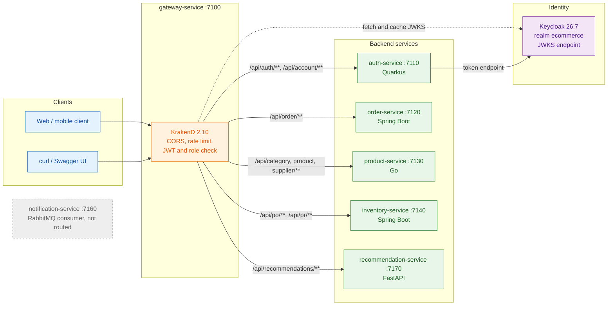
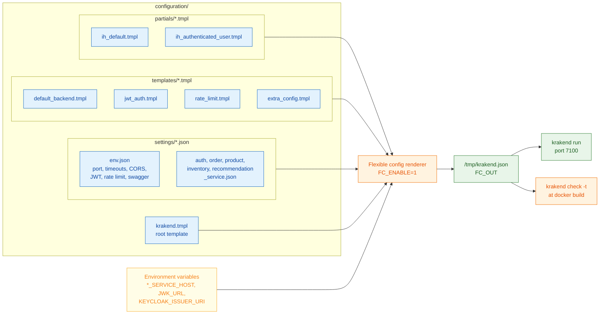
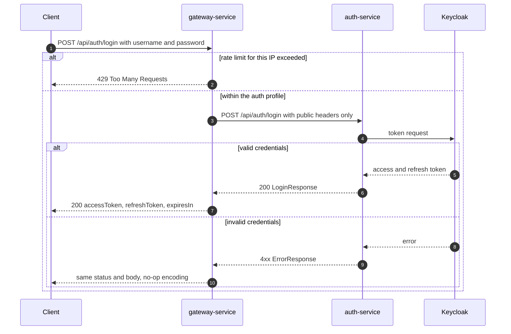
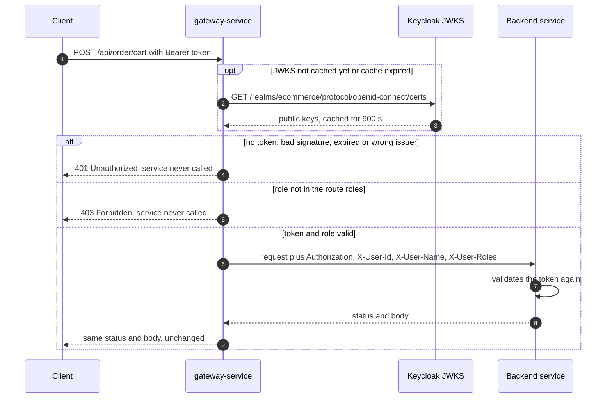
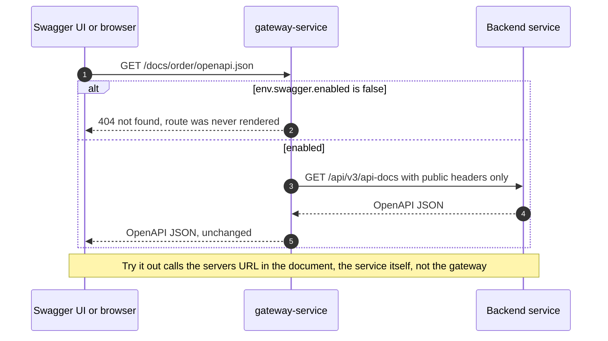

# gateway-service

The single front door of polygot-ecommerce: a stateless, declarative
[KrakenD](https://www.krakend.io/) 2.10 API gateway on port **7100** that
validates Keycloak tokens and maps public routes onto the backend services.

## Table of Contents

- [Overview](#overview)
- [Tech Stack](#tech-stack)
- [Architecture](#architecture)
- [Project Flow](#project-flow)
  - [Public route (login, rate limited)](#public-route-login-rate-limited)
  - [Protected route (JWT and role check)](#protected-route-jwt-and-role-check)
  - [Docs route (OpenAPI documents)](#docs-route-openapi-documents)
- [Getting Started](#getting-started)
  - [Prerequisites](#prerequisites)
  - [Configuration](#configuration)
  - [Clean](#clean)
  - [Build](#build)
  - [Run](#run)
- [API Documentation (Swagger)](#api-documentation-swagger)
- [Routes](#routes)
- [Testing](#testing)
- [Project Layout](#project-layout)
- [Design Notes](#design-notes)
  - [Flexible configuration](#flexible-configuration)
  - [Settings format](#settings-format)
  - [Configuration notes](#configuration-notes)
  - [Adding the next service](#adding-the-next-service)

## Overview

gateway-service is the only entry point clients need: every public API route of
the platform is exposed here on port 7100 and forwarded to the service that
owns it — auth-service (7110), order-service (7120), product-service (7130),
inventory-service (7140) and recommendation-service (7170). notification-service
(7160) is not routed: it is a RabbitMQ consumer with no HTTP routes.

There is no code here, only the configuration that maps public routes onto
backend services. For every request the gateway:

- validates the Keycloak access token and the realm role of every protected
  route before the request reaches a service;
- injects the caller's identity (`X-User-Id`, `X-User-Name`, `X-User-Roles`)
  from the validated token;
- applies CORS and per-IP rate limits (login and registration);
- forwards status codes and bodies unchanged;
- optionally publishes each service's OpenAPI document under
  `/docs/<service>/openapi.json`.

The services still validate the token themselves; the gateway check is a first
line, not a replacement.

There is one set of settings. Nothing is split per environment: what differs
between machines (backend hosts, JWKS URL, issuer) is overridden with
environment variables at container start.

## Tech Stack

| Technology | Version | Why we use it |
| --- | --- | --- |
| KrakenD Community Edition | 2.10 (`krakend:2.10` image) | A declarative, stateless gateway: routing, JWT validation, CORS and rate limiting are configuration, not code, so there is nothing to compile, test or patch in this service. It is a single Go binary with a small footprint and fast startup. |
| KrakenD flexible configuration (Go templates + Sprig) | built into KrakenD 2.10 | 56 routes would be a long, repetitive `krakend.json`. Flexible config renders one root template against per-service JSON settings files, so each route is a few lines of data and every route goes through the same template (`default_backend.tmpl`). Environment overrides (`env` function) let one image run against the host or the compose network. |
| `auth/validator` (KrakenD JWT validation) | built into KrakenD 2.10 | Validates RS256 Keycloak access tokens against the realm's JWKS endpoint (cached for 900 s), checks the issuer and the realm roles in `realm_access.roles`, and propagates claims as headers. Unauthenticated or unauthorized calls are rejected before any service is called. |
| `qos/ratelimit/router` | built into KrakenD 2.10 | Per-client-IP rate limiting on login and registration, in front of Keycloak's own brute force detection. |
| `security/cors` | built into KrakenD 2.10 | One CORS policy for the whole API, so browser clients (and a Swagger UI on another origin) can call the gateway. |
| Keycloak | 26.7 (realm `ecommerce`) | The identity provider of the platform; the gateway only needs its JWKS URL and issuer to verify tokens offline. |
| Docker / Docker Compose | Docker with Compose v2 | The image bakes the configuration in and runs `krakend check` at build time, so a broken template fails `docker build`. Compose wires the gateway to the services by name on the `ecommerce` network. |

## Architecture

The gateway sits between the clients and the services. Tokens are validated
offline against Keycloak's JWKS (fetched once and cached), never by calling a
service.



The configuration KrakenD runs is not written by hand. At every start (and once
at `docker build`) the binary renders `krakend.tmpl` as a Go template against
the settings files, templates and partials, writes the result to
`/tmp/krakend.json` (`FC_OUT`) and parses it.



## Project Flow

### Public route (login, rate limited)

`POST /api/auth/login` and `POST /api/account` (registration) need no token but
are rate limited per client IP by the `auth` profile (1 request per second,
burst 5). Public routes forward only the headers in `partials/ih_default.tmpl` —
no `Authorization` and no `X-User-*` — so a client cannot inject an identity.



### Protected route (JWT and role check)

Every route with `"auth": true` goes through `auth/validator`: RS256 signature
against Keycloak's cached JWKS, the issuer, and the realm roles allowed for the
route. On success the gateway forwards `Authorization` and sets `X-User-Id`
(`sub`), `X-User-Name` (`preferred_username`) and `X-User-Roles`
(`realm_access.roles`) from the token.



### Docs route (OpenAPI documents)

When `env.swagger.enabled` is `true`, each service's OpenAPI JSON is published
publicly under `/docs/<service>/openapi.json` and proxied to the path the
service serves it on.



## Getting Started

### Prerequisites

- Docker (and the Compose v2 plugin, or `docker-compose`, for the full stack).
- For standalone runs: the backend services and Keycloak (realm `ecommerce`)
  reachable from the container — by default on the host at
  `host.docker.internal`.
- Optional: `curl` and `jq` for the smoke tests.

### Configuration

All values live in `configuration/settings/*.json`. The variables below override
them at container start. The template is rendered on every start, so none of
these need a rebuild.

| Variable                      | Overrides                         | Default (settings)                                                       | Value in `app/docker-compose.yml` |
| ----------------------------- | --------------------------------- | ------------------------------------------------------------------------ | --------------------------------- |
| `AUTH_SERVICE_HOST`           | `auth_service.host`               | `http://host.docker.internal:7110`                                       | `http://auth-service:7110` |
| `ORDER_SERVICE_HOST`          | `order_service.host`              | `http://host.docker.internal:7120`                                       | `http://order-service:7120` |
| `PRODUCT_SERVICE_HOST`        | `product_service.host`            | `http://host.docker.internal:7130`                                       | `http://product-service:7130` |
| `INVENTORY_SERVICE_HOST`      | `inventory_service.host`          | `http://host.docker.internal:7140`                                       | `http://inventory-service:7140` |
| `RECOMMENDATION_SERVICE_HOST` | `recommendation_service.host`     | `http://host.docker.internal:7170`                                       | `http://recommendation-service:7170` |
| `JWK_URL`                     | `env.jwt.jwk_url`                 | `http://host.docker.internal:8080/realms/ecommerce/protocol/openid-connect/certs` | `http://keycloak:8080/realms/${KEYCLOAK_REALM:-ecommerce}/protocol/openid-connect/certs` |
| `KEYCLOAK_ISSUER_URI`         | `env.jwt.issuer`                  | `http://localhost:8080/realms/ecommerce`                                 | `http://keycloak:8080/realms/${KEYCLOAK_REALM:-ecommerce}` |
| `GATEWAY_PORT` (compose only) | host port mapped to container 7100 | —                                                                       | `7100` |

Settings that are not environment-driven (edit `settings/env.json` and rebuild):
listen port `7100`, timeouts (`10s` request, `60s` idle, `5s` read header),
`swagger.enabled` (`true`), CORS, `jwt.cache_duration` (`900`),
`jwt.default_roles` (`user`, `admin`) and the `auth` rate limit profile.

The image itself sets the flexible configuration variables: `FC_ENABLE=1`,
`FC_SETTINGS=/etc/krakend/config/settings`,
`FC_TEMPLATES=/etc/krakend/config/templates`,
`FC_PARTIALS=/etc/krakend/config/partials`, `FC_OUT=/tmp/krakend.json`.

### Clean

There is no Makefile and no build output on disk; cleaning means removing the
container and the image.

```shell script
# standalone container (started with --name gateway-service, see Run)
docker rm -f gateway-service

# the image
docker rmi polygot/gateway-service           # standalone tag
docker rmi polygot/gateway-service:latest    # tag used by app/docker-compose.yml

# as part of the stack: stop and remove only the gateway
docker compose -f app/docker-compose.yml rm -sf gateway-service

# the whole stack (root script): containers + network; -v also drops volumes
./down.sh
./down.sh --rmi local                        # also remove locally built images
```

### Build

From the repository root:

```shell script
docker build -t polygot/gateway-service services/gateway-service
```

The build copies `configuration/` to `/etc/krakend/config/` and runs
`krakend check -t -c /etc/krakend/config/krakend.tmpl`, so a broken template or
invalid rendered JSON fails `docker build` instead of the container start.

Validate and render the configuration without building, straight from the
working tree:

```shell script
docker run --rm \
  -v "$PWD/services/gateway-service/configuration:/etc/krakend/config:ro" \
  -e FC_ENABLE=1 \
  -e FC_SETTINGS=/etc/krakend/config/settings \
  -e FC_TEMPLATES=/etc/krakend/config/templates \
  -e FC_PARTIALS=/etc/krakend/config/partials \
  -e FC_OUT=/tmp/krakend.json \
  --entrypoint sh krakend:2.10 \
  -c 'krakend check -t -c /etc/krakend/config/krakend.tmpl && cat /tmp/krakend.json'
```

Or from a built image (the image's entrypoint is the `krakend` binary):

```shell script
docker run --rm polygot/gateway-service check -t -c /etc/krakend/config/krakend.tmpl
```

### Run

**Standalone**, with the services running on the host:

```shell script
docker run --rm --name gateway-service -p 7100:7100 \
  --add-host host.docker.internal:host-gateway \
  polygot/gateway-service
```

Override any host, the JWKS URL or the issuer with `-e`, e.g.
`-e ORDER_SERVICE_HOST=http://order-service:7120`. Once the services run on the
`ecommerce` compose network, point the gateway at them by name, e.g.
`ORDER_SERVICE_HOST=http://order-service:7120` and
`JWK_URL=http://keycloak:8080/realms/ecommerce/protocol/openid-connect/certs`.

**As part of the stack** (`app/docker-compose.yml`, container `gateway-service`,
image `polygot/gateway-service:latest`). The compose file already sets every
`*_SERVICE_HOST`, `JWK_URL` and `KEYCLOAK_ISSUER_URI` to the compose service
names, waits for Keycloak to be healthy and for the five services to start,
and health-checks `http://127.0.0.1:7100/__health`.

```shell script
# whole platform: infrastructure up, ecommerce DB migrated (Liquibase),
# Keycloak realm provisioned, then every service built and started
./build.sh
./build.sh --wait                    # also block until healthchecks pass

# rebuild and restart only the gateway (single step: no migration, no Keycloak provisioning)
./build.sh gateway-service

# plain compose equivalent (project name "app", as build.sh uses)
docker compose -p app -f app/docker-compose.yml up -d --build gateway-service

# logs and the rendered configuration
docker compose -p app -f app/docker-compose.yml logs -f gateway-service
docker exec gateway-service cat /tmp/krakend.json
```

`docker compose up gateway-service` also starts its `depends_on` chain
(Keycloak and the five routed services, and transitively their dependencies).
On a fresh machine run `./build.sh` first so the database is migrated and the
Keycloak realm exists.

## API Documentation (Swagger)

With `env.swagger.enabled` set to `true` (the default in `settings/env.json`),
each service's OpenAPI document is published without authentication under
`/docs/<service>/`:

| Gateway route                           | Service document                                          |
| --------------------------------------- | --------------------------------------------------------- |
| `GET /docs/auth/openapi.json`           | auth-service `/q/openapi?format=json`                     |
| `GET /docs/order/openapi.json`          | order-service `/api/v3/api-docs`                          |
| `GET /docs/product/openapi.json`        | product-service `/api/swagger/swagger.json` (Swagger 2.0) |
| `GET /docs/inventory/openapi.json`      | inventory-service `/api/v3/api-docs`                      |
| `GET /docs/recommendation/openapi.json` | recommendation-service `/openapi.json`                    |

The `/docs/<service>/` prefix is needed because order-service and
inventory-service serve their document on the same path. Set
`env.swagger.enabled` to `false` to remove all five routes at once, for example
on any deployment reachable from outside.

Only the JSON documents go through the gateway, not the Swagger UI pages. Each
UI loads its assets from a subtree (`/q/swagger-ui/*`, `/api/swagger-ui/*`,
`/api/swagger/*`), and KrakenD Community Edition has no wildcard routes to
proxy a subtree. Each service's own Swagger UI is reachable directly:

| Service                | Swagger UI (direct)                            |
| ---------------------- | ---------------------------------------------- |
| auth-service           | http://localhost:7110/q/swagger-ui             |
| order-service          | http://localhost:7120/api/swagger-ui/index.html |
| product-service        | http://localhost:7130/api/swagger/index.html   |
| inventory-service      | http://localhost:7140/api/swagger-ui/index.html |
| recommendation-service | http://localhost:7170/docs                     |

**All services in one Swagger UI.** Point any Swagger UI at the five gateway
documents, for example a `swaggerapi/swagger-ui` container with `URLS` (the
gateway allows any CORS origin, so the browser can fetch them):

```shell script
docker run --rm -p 8081:8080 \
  -e URLS='[
    {"name":"auth-service","url":"http://localhost:7100/docs/auth/openapi.json"},
    {"name":"order-service","url":"http://localhost:7100/docs/order/openapi.json"},
    {"name":"product-service","url":"http://localhost:7100/docs/product/openapi.json"},
    {"name":"inventory-service","url":"http://localhost:7100/docs/inventory/openapi.json"},
    {"name":"recommendation-service","url":"http://localhost:7100/docs/recommendation/openapi.json"}
  ]' \
  -e URLS_PRIMARY_NAME=auth-service \
  swaggerapi/swagger-ui
```

Then open http://localhost:8081 and pick a service from the top-right
selector. "Try it out" calls the `servers` URL written in each document, which
is the service itself, not the gateway.

**Getting a bearer token.** Log in through the gateway and use `accessToken`
with "Authorize" (or as `Authorization: Bearer ...`). The users provisioned by
`app/init/keycloak-init.sh` are `userapp` (role `user`) and `adminapp` (role
`admin`), both with password `P@ssw0rd`:

```shell script
ACCESS_TOKEN=$(curl -s -X POST http://localhost:7100/api/auth/login \
  -H 'Content-Type: application/json' \
  -d '{"username":"adminapp","password":"P@ssw0rd"}' | jq -r .accessToken)
```

## Routes

56 API routes, plus 5 API document routes. Public paths equal the backend paths,
except recommendation-service, which has no `/api` prefix of its own.

| Service                | Public routes                                        | Gateway auth                                                    |
| ---------------------- | ---------------------------------------------------- | --------------------------------------------------------------- |
| auth-service (7)       | `POST /api/auth/login`, `POST /api/auth/logout`, `POST /api/account` | public; login and register are rate limited per IP (`auth` profile) |
|                        | `GET/PUT/DELETE /api/account`, `PUT /api/account/password` | `user`, `admin`                                           |
| order-service (6)      | `POST/DELETE /api/order/cart`, `POST /api/order/checkout`, `PUT /api/order/checkout/{id}`, `POST /api/order/payment`, `PUT /api/order/payment/{id}` | `user`, `admin` |
| product-service (22)   | `/api/category/**`, `/api/product/**`, `/api/supplier/**` (CRUD, `activate/{id}`, `deactivate/{id}`, `GET /api/product/history/{id}`) | `admin`; `GET /api/product/{id}` also `user` |
| inventory-service (18) | `/api/po/**`, `/api/pr/**` (CRUD, `POST .../list`, `activate`, `deactivate`, `approve`, `cancel`) | `admin` |
| recommendation-service (3) | `GET /api/recommendations/users/{user_id}`, `GET /api/recommendations/{product_id}` → `/recommendations/...` | `user`, `admin` |
|                        | `GET /api/recommendations/mba/status` → `/recommendations/mba/status` | `admin`                                 |
| docs (5)               | `GET /docs/{auth,order,product,inventory,recommendation}/openapi.json` | public, only when `env.swagger.enabled` |
| —                      | `GET /__health`                                      | KrakenD's own liveness endpoint                                 |

The exact list is in `configuration/settings/*.json`. Not published on purpose:
product-service `/health`, the services' own Swagger UI pages, and
notification-service, which has no HTTP routes (it is a RabbitMQ consumer).

## Testing

There are no unit tests (there is no code); `krakend check` at `docker build`
is the configuration test. With the stack running, smoke test the gateway:

```shell script
# liveness of the gateway itself
curl -i http://localhost:7100/__health

# login through the gateway (public, rate limited)
curl -i -X POST http://localhost:7100/api/auth/login \
  -H 'Content-Type: application/json' \
  -d '{"username":"userapp","password":"P@ssw0rd"}'

# keep a "user" token
ACCESS_TOKEN=$(curl -s -X POST http://localhost:7100/api/auth/login \
  -H 'Content-Type: application/json' \
  -d '{"username":"userapp","password":"P@ssw0rd"}' | jq -r .accessToken)

# no token -> 401 from the gateway, the service is never called
curl -i -X POST http://localhost:7100/api/order/cart

# "user" token on an admin-only route -> 403 from the gateway
curl -i http://localhost:7100/api/product -H "Authorization: Bearer $ACCESS_TOKEN"

# rate limit: more than the burst of 5 in a row -> 429
for i in $(seq 1 8); do
  curl -s -o /dev/null -w '%{http_code}\n' -X POST http://localhost:7100/api/auth/login \
    -H 'Content-Type: application/json' -d '{"username":"x","password":"y"}'
done

# an OpenAPI document through the gateway
curl -s http://localhost:7100/docs/order/openapi.json | jq '.info'
```

## Project Layout

```
services/gateway-service/
├── Dockerfile                          # krakend:2.10, FC_* variables, krakend check at build, port 7100
├── README.md
└── configuration/                      # copied to /etc/krakend/config/ in the image
    ├── krakend.tmpl                    # root template: global settings + the loop over all services
    ├── settings/                       # the values
    │   ├── env.json                    # port, timeouts, CORS, JWT, rate limit profiles, swagger switch
    │   ├── auth_service.json           # host + endpoints of auth-service
    │   ├── order_service.json
    │   ├── product_service.json
    │   ├── inventory_service.json
    │   └── recommendation_service.json
    ├── templates/                      # reusable pieces
    │   ├── default_backend.tmpl        # renders ONE endpoint from a settings entry
    │   ├── jwt_auth.tmpl               # auth/validator against Keycloak
    │   ├── rate_limit.tmpl             # qos/ratelimit/router
    │   └── extra_config.tmpl           # router + CORS
    └── partials/                       # static snippets
        ├── ih_default.tmpl             # input_headers for public routes
        └── ih_authenticated_user.tmpl  # input_headers for protected routes
```

## Design Notes

### Flexible configuration

This is KrakenD's [flexible configuration](https://www.krakend.io/docs/configuration/flexible-config/):
the binary renders `krakend.tmpl` as a Go template at startup and parses the
result. Each file in `settings/` becomes a top-level variable named after the
file, so `settings/env.json` is `{{ .env }}`.

The rendered configuration is written to `/tmp/krakend.json` inside the
container (`FC_OUT`). Look there first when a change does not behave the way it
reads:

```shell script
docker exec gateway-service cat /tmp/krakend.json
```

The image also runs `krakend check` at build time, so a broken template fails
`docker build` instead of the container start. The file rendered at build time
is removed afterwards: it is written as root there, and the runtime user
(`krakend`) could not overwrite it at start.

### Settings format

`settings/<service>.json`:

```json
{
  "host": "http://host.docker.internal:7120",
  "host_env": "ORDER_SERVICE_HOST",
  "timeout": "10s",
  "swagger": { "endpoint": "/docs/order/openapi.json", "backend": "/api/v3/api-docs" },
  "endpoints": [
    { "endpoint": "/api/order/cart", "method": "POST", "backend": "/api/order/cart",
      "auth": true, "roles": ["user", "admin"] }
  ]
}
```

| Field (endpoint) | Meaning                                                      | Default                  |
| ---------------- | ------------------------------------------------------------ | ------------------------ |
| `endpoint`       | public path on the gateway                                   | required                 |
| `method`         | HTTP method                                                  | required                 |
| `backend`        | path on the service                                          | required                 |
| `auth`           | validate the JWT at the gateway                              | `false`                  |
| `roles`          | Keycloak realm roles accepted (`realm_access.roles`)         | `env.jwt.default_roles`  |
| `rate_limit`     | name of a profile in `env.rate_limit` (e.g. `"auth"`)        | none                     |
| `timeout`        | overrides the service `timeout`                              | service `timeout`        |

`swagger` is optional and adds one public `GET` route for the service's OpenAPI
document (see [API Documentation](#api-documentation-swagger)). `host_env`
names the variable that overrides `host` at container start. Every endpoint
forwards all query strings (`input_query_strings: ["*"]`).

### Configuration notes

**Encoding.** Every endpoint uses `no-op` on both the endpoint and the backend.
With KrakenD's default `json` encoding any non-2xx answer would become an
opaque 500 and the service's `ErrorResponse` body would be lost.

**Issuer.** Keycloak (`start-dev`, no fixed hostname) puts in `iss` the host the
token was requested through. The default `http://localhost:8080/realms/ecommerce`
matches the services' `KEYCLOAK_ISSUER_URI`. If tokens are minted through
another host name, set `KEYCLOAK_ISSUER_URI` to match. In
`app/docker-compose.yml` the gateway and every service use
`http://keycloak:8080/realms/ecommerce`, the host auth-service requests tokens
through. An empty `env.jwt.issuer` in `env.json` skips the check (an empty
environment variable does not: it falls back to the default).

**JWKS.** Keys are fetched from `JWK_URL` and cached (`cache_duration` 900 s).
`disable_jwk_security` is `true` because the JWKS URL is plain HTTP inside the
local network.

**Forwarded headers.** KrakenD forwards nothing that is not in `input_headers`.
Public routes get `partials/ih_default.tmpl`, which deliberately contains no
`Authorization` and no `X-User-*` headers, so a client cannot inject an
identity on a route where the gateway checks none. Protected routes get
`Authorization` plus `X-User-Id` (`sub`), `X-User-Name` (`preferred_username`)
and `X-User-Roles` (`realm_access.roles`), which the gateway sets from the
validated token. Only claims Keycloak always issues are propagated: for a
missing claim KrakenD would leave a client-sent header of that name in place.

**Rate limiting.** The `auth` profile in `env.json` (1 req/s, burst 5, per client
IP) protects login and registration in front of Keycloak's own brute force
detection. Behind another proxy, that proxy must set `X-Forwarded-For`.

**CORS / debug.** `allow_origins` is `*`, which is fine locally and wrong for
production; `allow_credentials` may only be enabled once `*` is gone.
`debug_endpoint` and `echo_endpoint` are off; `/__echo` reflects request
headers, including tokens.

**Router.** The `X-KrakenD-Version` header is hidden, `/__health` is not logged,
and 404/405 answers have a JSON body (`{"error": "not found"}`,
`{"error": "method not allowed"}`).

### Adding the next service

1. Create `configuration/settings/<service>.json` with `host`, `host_env`, `timeout`,
   its `endpoints` and, if it serves an OpenAPI document, `swagger`.
2. Add `.<service>` to the `$services` list at the top of `configuration/krakend.tmpl`.
3. Add the matching `<SERVICE>_HOST` variable to the `gateway-service` entry in
   `app/docker-compose.yml` so the gateway reaches it by name on the compose network.

No new template is needed. Commas between endpoints are generated by the loop,
so a service with an empty `endpoints` list is harmless.
