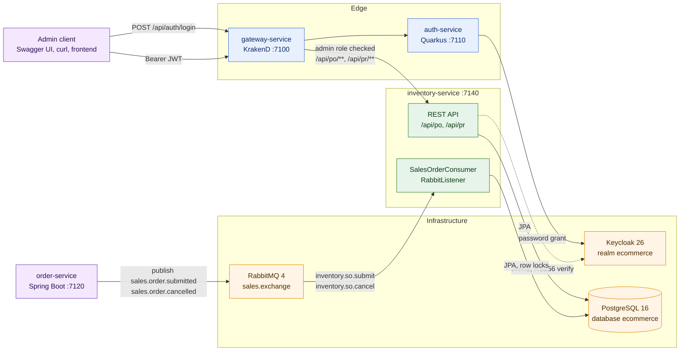
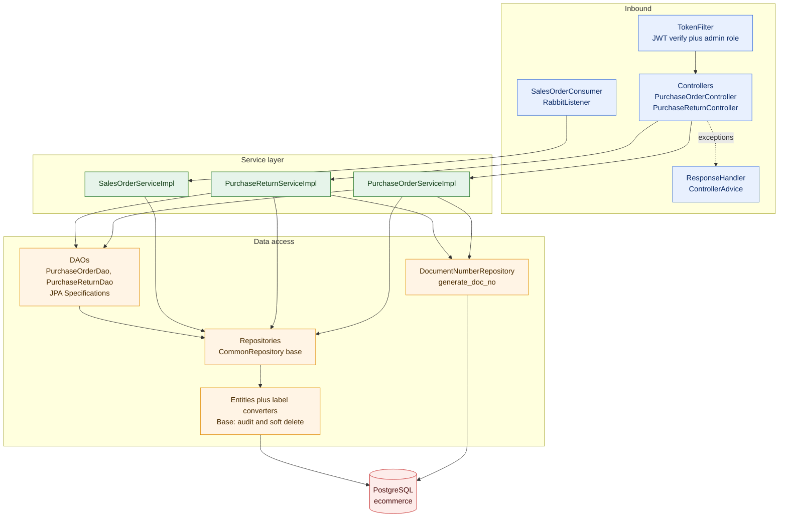
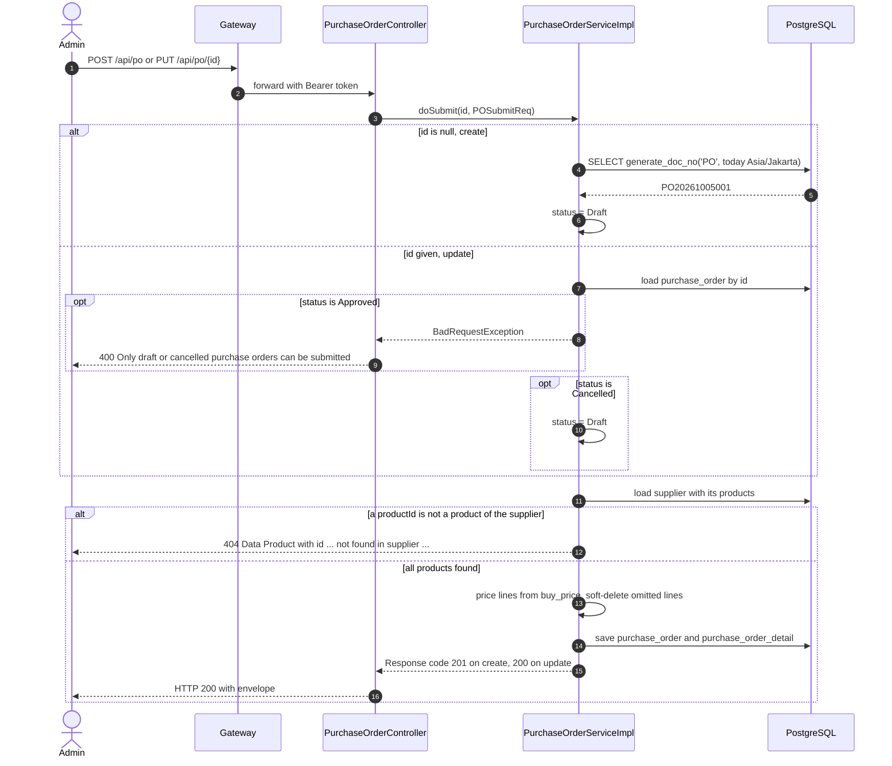
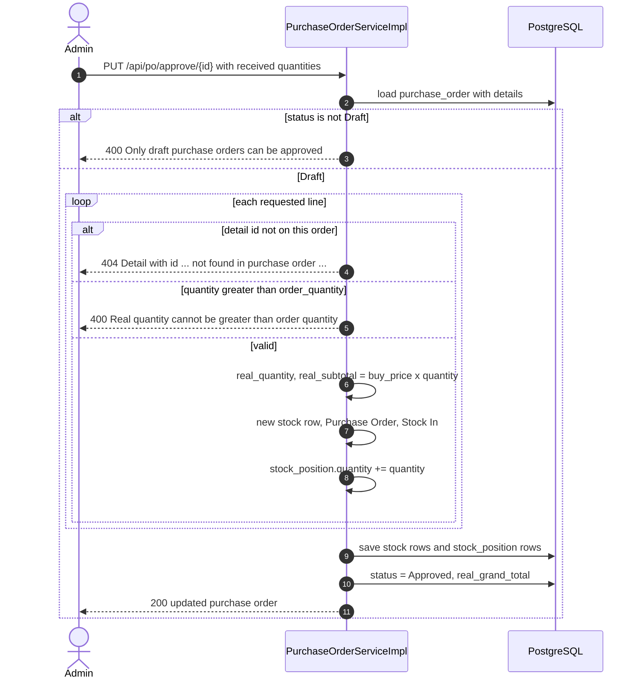
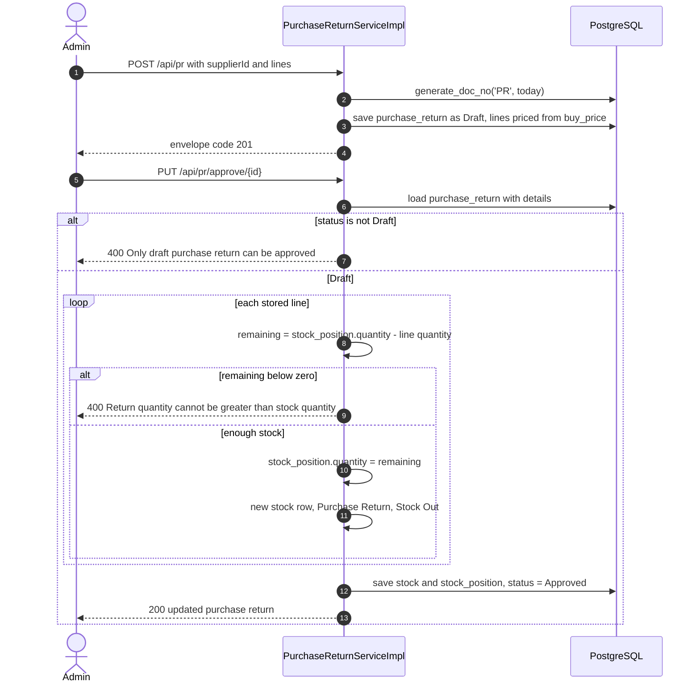
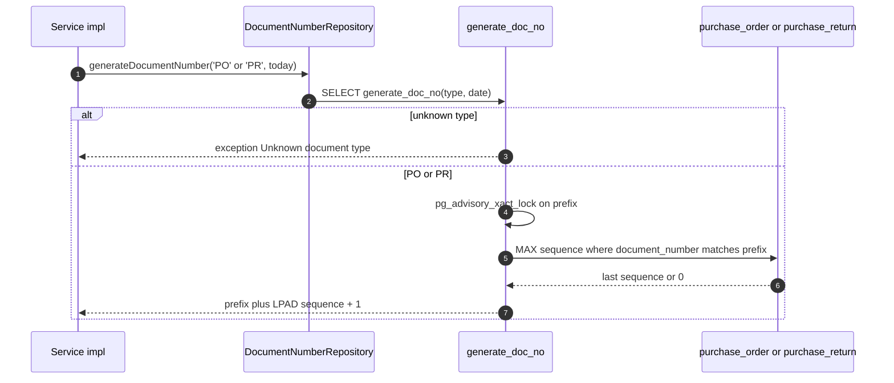
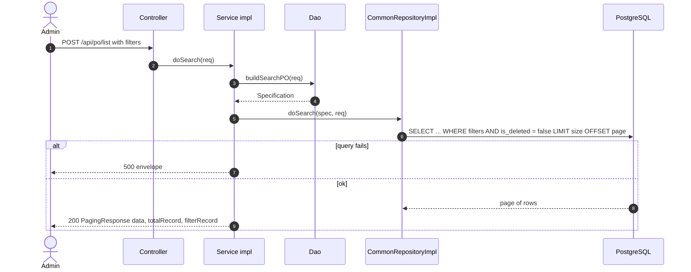
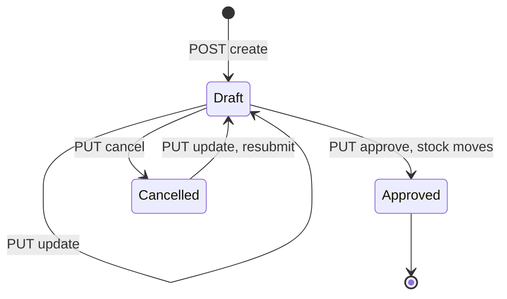
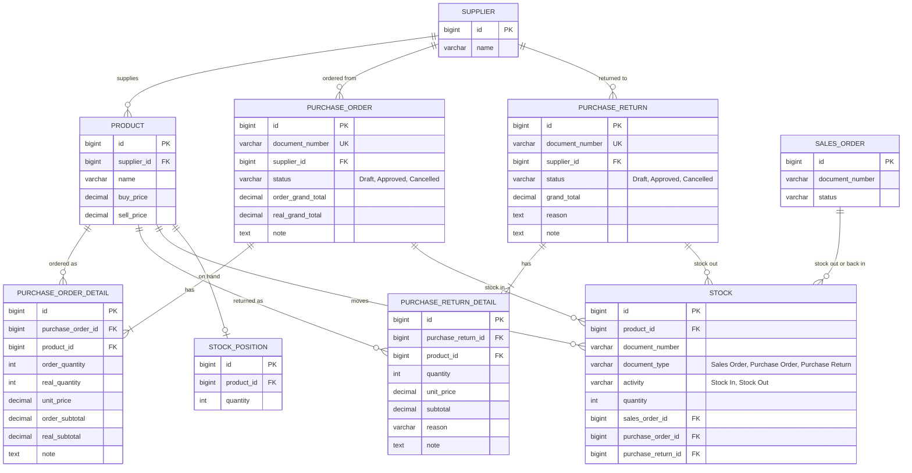

# inventory-service

The stock ledger of the polygot-ecommerce platform. It takes goods in from suppliers through purchase orders, sends them back through purchase returns, and moves stock out and back in when order-service reports a paid or cancelled sales order over RabbitMQ.

## Table of Contents

- [Overview](#overview)
- [Tech Stack](#tech-stack)
- [Architecture](#architecture)
- [Project Flow](#project-flow)
  - [Create and update a purchase order](#create-and-update-a-purchase-order)
  - [Approve a purchase order](#approve-a-purchase-order)
  - [Purchase return](#purchase-return)
  - [Sales order stock movements over RabbitMQ](#sales-order-stock-movements-over-rabbitmq)
  - [Document number generation](#document-number-generation)
  - [Search](#search)
  - [Document status lifecycle](#document-status-lifecycle)
  - [Data model](#data-model)
- [Getting Started](#getting-started)
  - [Prerequisites](#prerequisites)
  - [Configuration](#configuration)
  - [Clean](#clean)
  - [Build](#build)
  - [Run](#run)
- [API Documentation (Swagger)](#api-documentation-swagger)
- [Endpoints](#endpoints)
- [Testing](#testing)
- [Project Layout](#project-layout)
- [Design Notes](#design-notes)
- [Troubleshooting](#troubleshooting)

## Overview

inventory-service is a Spring Boot application on port **7140**. It serves everything under the servlet context path `/api`. It has three jobs:

- **Purchase orders (`/api/po`)**: an admin orders goods from a supplier. The order starts as a draft priced from each product's `buy_price`. On approval, the received quantity of each line is booked into stock.
- **Purchase returns (`/api/pr`)**: an admin sends goods back to a supplier. On approval, the returned quantities are deducted from stock. The deduction is rejected if it would take a product below zero.
- **Sales order stock movements (RabbitMQ)**: when order-service publishes a paid sales order, this service takes the goods out of stock. When it publishes a cancelled one, this service puts back exactly what was taken. Both handlers are idempotent.

Every stock change is written in two places:

| Table | Role |
|---|---|
| `stock` | Append-only movement ledger: one row per product per document, with `activity` = `Stock In` / `Stock Out` and `document_type` = `Purchase Order` / `Purchase Return` / `Sales Order`. |
| `stock_position` | Current on-hand quantity per product, updated in the same transaction as the ledger rows. |

**What it owns:** the `purchase_order`, `purchase_order_detail`, `purchase_return`, `purchase_return_detail`, `stock` and `stock_position` rows, and the purchase document lifecycle.

**What it does not own:**
- **Schema.** The schema lives in the root `/migrations` Liquibase changelog. Hibernate runs with `ddl-auto: none`.
- **Catalogue rows.** `supplier`, `product` and `category` are only read. product-service owns them.
- **Sales orders.** `sales_order` and `sales_order_detail` are only read and row-locked. order-service owns them.
- **Users and tokens.** Keycloak issues them. This service only verifies them.
- **Stock API.** There is no HTTP endpoint for stock or stock positions. They change only as a side effect of approving purchase documents and of consuming sales order messages.

**Role in the platform:** clients reach it through the KrakenD gateway (`gateway-service`, port 7100), where every `/api/po/**` and `/api/pr/**` route requires the `admin` realm role. The service checks the same thing again on its own (see [Design Notes](#design-notes)).

## Tech Stack

| Technology | Version | Why we use it |
|---|---|---|
| Java | 17 (`java.version`) | LTS release. It provides the records, `switch` arrows and pattern-matching `instanceof` used in the code, for example `realmAccess.get("roles") instanceof List<?> roles` in `TokenFilter`. |
| Spring Boot | 4.0.7 (parent POM) | Gives one dependency-managed base for web, JPA, AMQP and validation. Also provides the `./config/application.yml` lookup that the Docker image relies on. |
| Spring Web MVC (`spring-boot-starter-webmvc`) | managed by Boot 4.0.7 | Hosts the REST controllers, the `@ControllerAdvice` error envelope and the servlet `OncePerRequestFilter` that guards every request. |
| Spring Data JPA / Hibernate (`spring-boot-starter-data-jpa`) | managed by Boot 4.0.7 | Covers the entity mappings with label converters, the `@SQLRestriction("is_deleted = false")` soft delete, `Specification`-based search, `PESSIMISTIC_WRITE` row locks and the native `generate_doc_no` call. |
| Spring JDBC / Spring Data JDBC starters | managed by Boot 4.0.7 | Declared in the POM. All repositories in the code are JPA. Nothing uses Spring Data JDBC or `JdbcTemplate` directly. |
| Spring AMQP (`spring-boot-starter-amqp`) | managed by Boot 4.0.7 | Declares the `sales.exchange` topology with dead-letter queues. `@RabbitListener` consumes sales order submit and cancel messages as JSON (`JacksonJsonMessageConverter`). |
| Bean Validation (`spring-boot-starter-validation`) | managed by Boot 4.0.7 | Applies `@NotNull` / `@Positive` / `@NotEmpty` on the submit payloads. Violations become a `400` envelope. |
| PostgreSQL JDBC driver | managed by Boot 4.0.7 | Connects to the shared `ecommerce` database (Postgres 16 in the stack). |
| Nimbus JOSE + JWT | 10.9.1 | Verifies Keycloak RS256 access tokens against the realm JWKS (`/protocol/openid-connect/certs`) and checks `iss`, `sub` and `exp` without pulling in Spring Security. |
| springdoc-openapi (`springdoc-openapi-starter-webmvc-ui`) | 3.0.3 | Generates the OpenAPI 3 document and Swagger UI from the controller annotations. The gateway republishes the document. |
| Lombok | managed by Boot 4.0.7 | Removes boilerplate getters, setters and constructors. `lombok.config` marks generated code `@Generated` so JaCoCo does not count it. |
| JaCoCo Maven plugin | 0.8.13 | Writes the coverage report on `test`. Fails `verify` below **90 %** instruction, line and branch coverage. |
| Spring Boot DevTools | managed by Boot 4.0.7 | Restarts the app on recompile during `mvn spring-boot:run`. Runtime-only and optional, so it is not part of the packaged jar. |
| Maven | 3.9 (Docker build image `maven:3.9-eclipse-temurin-17`) | Build tool. The wrapper (`mvnw`, `.mvn/`) is gitignored, so the image brings its own Maven. |

## Architecture

### Service in context



### Internal layers



| Layer | Package | Responsibility |
|---|---|---|
| Security | `token`, `util` | `TokenFilter` verifies the bearer token and requires the `admin` realm role. It stores `sub` in the `AccountUtil` thread-local, which fills the `created_by` / `updated_by` audit columns. |
| Web | `controller`, `handler` | Thin controllers that delegate to services. `ResponseHandler` maps exceptions to the `Response` envelope. |
| Messaging | `consumer`, `configuration.BrokerConfig` | Queue, exchange and binding declarations, plus the listeners. |
| Business | `service`, `service.impl` | Document lifecycle, pricing, stock ledger and positions. `@Transactional` per call. |
| Data | `dao`, `repository`, `model.entity`, `converter` | Criteria search, a shared repository base (`doGet`, `doDelete`, `doActivate`, `doDeactivate`, `doSearch`), and enums stored by label (`Draft`, `Stock In`, ...). |

## Project Flow

All HTTP flows below go through `TokenFilter` first. A missing token gets `401`. An invalid or expired token gets `401`. A malformed token gets `400`. A token without the `admin` realm role gets `403`.

### Create and update a purchase order

`POST /api/po` creates a draft. `PUT /api/po/{id}` updates a **draft or cancelled** order. Updating a cancelled order puts it back into `Draft`.

Each line is priced from the product's `buy_price`, and every product must belong to the chosen supplier. On update, lines are reconciled by `id`:
- A line with no `id` is new.
- A line with an `id` is updated.
- An existing line missing from the request is soft-deleted.

`order_grand_total` is the sum of the line subtotals. `real_grand_total` is reset to `0` until approval.



### Approve a purchase order

`PUT /api/po/approve/{id}` takes the same `POSubmitReq` body as create and update. In this body, `details[].id` names an existing line and `details[].quantity` is the quantity **actually received**. The received quantity cannot exceed the ordered quantity.

For each line in the request, the service:
- sets `real_quantity` and `real_subtotal` on the line,
- writes a `stock` row (`Purchase Order`, `Stock In`),
- adds the quantity to the product's `stock_position`. A position row is created on first receipt.

The order then becomes `Approved` and gets its `real_grand_total`. Everything happens in one transaction.



`PUT /api/po/cancel/{id}` moves a `Draft` order to `Cancelled`. Calling it on any other status returns `400`. Cancelling never touches stock, because a draft has not moved any.

### Purchase return

A purchase return has the same create and update rules as a purchase order. Lines are priced from `buy_price` and must belong to the supplier. A cancelled return goes back to draft on update. `reason` and `note` default to `-`.

Approval takes **no body**. It uses the stored line quantities. For each line it writes a `stock` row (`Purchase Return`, `Stock Out`) and subtracts the quantity from `stock_position`. If any product would go below zero, the whole approval rolls back with `400`.



### Sales order stock movements over RabbitMQ

order-service publishes to the durable topic exchange `sales.exchange`. This service declares and binds two queues to it:

| Queue | Routing key | Handler | Dead-letter queue (via `sales.dlx.exchange`) |
|---|---|---|---|
| `inventory.so.submit` | `sales.order.submitted` | `SalesOrderServiceImpl.doSubmit` | `inventory.so.submit.dlq` (`sales.order.submitted.dlq`) |
| `inventory.so.cancel` | `sales.order.cancelled` | `SalesOrderServiceImpl.doCancel` | `inventory.so.cancel.dlq` (`sales.order.cancelled.dlq`) |

**Message format.** The payload is JSON `{"id": <sales order id>}`. An optional `X-User-Id` header (a UUID) fills the audit columns. A missing or malformed header is ignored.

**Delivery.** The listener uses `prefetch: 1` and `default-requeue-rejected: false`. A message without an `id` is dead-lettered immediately. So is a message whose handler throws `BadRequestException` or `NotFoundException`. Any other exception is left to the listener container.

**Idempotency.** Submit and cancel run on different queues and may arrive in either order or more than once. The handlers stay correct because:
- the `sales_order` row is locked first (`PESSIMISTIC_WRITE`),
- the affected `stock_position` rows are locked next (`SELECT ... FOR UPDATE` ordered by `product_id`, so concurrent orders cannot deadlock),
- the handler checks which `stock` movements already exist for the order before writing new ones.

```mermaid
sequenceDiagram
    autonumber
    participant OS as order-service
    participant MQ as RabbitMQ
    participant L as SalesOrderConsumer
    participant S as SalesOrderServiceImpl
    participant DB as PostgreSQL

    OS->>MQ: publish sales.order.submitted with id
    MQ->>L: deliver from inventory.so.submit
    alt id missing
        L-->>MQ: reject, dead-letter to inventory.so.submit.dlq
    else id present
        L->>S: doSubmit as X-User-Id
        S->>DB: lock sales_order row FOR UPDATE
        alt Stock Out rows already exist for this order
            S-->>L: ignored, already applied
        else order is Cancelled
            S-->>L: ignored, cancelled before stock was taken
        else order is not Paid
            S-->>L: BadRequestException
            L-->>MQ: reject, dead-letter
        else Paid
            S->>DB: lock stock_position rows ordered by product_id
            loop each order line
                alt stock would go below zero
                    S-->>L: BadRequestException, rollback
                    L-->>MQ: reject, dead-letter
                else enough stock
                    S->>S: deduct position, new stock row Sales Order, Stock Out
                end
            end
            S->>DB: save stock and stock_position
        end
    end
    OS->>MQ: publish sales.order.cancelled with id
    MQ->>L: deliver from inventory.so.cancel
    L->>S: doCancel
    S->>DB: lock sales_order row
    alt order is not Cancelled
        S-->>L: BadRequestException, dead-letter
    else Stock In rows already exist
        S-->>L: ignored, already returned
    else no Stock Out rows
        S-->>L: nothing to return
    else Stock Out rows found
        S->>DB: add each taken quantity back, new Stock In rows
    end
```



### Document number generation

New purchase orders and returns call the Postgres function `generate_doc_no(type, date)`. It is defined in `migrations/changelog/20260925160610-create-function-generate-doc-no.sql`.

- **Date.** The date is today in `Asia/Jakarta`.
- **Format.** The number is `<TYPE><yyyyMMdd><sequence>`, with the sequence zero-padded to at least 3 digits, for example `PO20261005001` or `PR20261005012`.
- **Sequence.** The function takes `pg_advisory_xact_lock(hashtext(prefix))`, so concurrent creates on the same day queue up instead of colliding. It then reads the highest existing number with that prefix from the type's table and adds one.
- **Uniqueness.** `document_number` is `UNIQUE` on both tables.
- **Other types.** The same function also serves `SO`, `PY` (payment) and `RF` (refund) for other services.



### Search

`POST /api/po/list` and `POST /api/pr/list` take a JSON body. `PurchaseOrderDao` / `PurchaseReturnDao` turn it into a JPA `Specification`. All filters are optional and combined with `AND`:

| Filter | PO | PR | Behaviour |
|---|---|---|---|
| `documentNumber` | yes | yes | Case-insensitive contains match (`lower(...) LIKE %value%`). |
| `supplierId` | yes | yes | Equality. |
| `status` | yes | yes | `DRAFT`, `APPROVED` or `CANCELLED`. |
| `minOrderGrandTotal` / `maxOrderGrandTotal` | yes | no | Inclusive range. Applied only when the value is greater than 0. |
| `minRealGrandTotal` / `maxRealGrandTotal` | yes | no | Same, on `real_grand_total`. |
| `minGrandTotal` / `maxGrandTotal` | no | yes | Same, on `grand_total`. |
| `createdFrom` / `createdTo` | yes | yes | Inclusive range on `created_at`. |
| `isActive` | yes | yes | `true` or `false`. Omit it to get both. |
| `page`, `size`, `sortBy`, `sort` | yes | yes | Defaults: page `0`, size `10` (also used when `size <= 0`), sort by `id`, `ASC`. |

Soft-deleted rows never appear, because the entities carry `@SQLRestriction("is_deleted = false")`. The response is a `PagingResponse`, where `totalRecord` and `filterRecord` both hold the total matching count. Any failure inside a search, such as an unknown `sortBy`, is wrapped in `ServiceException` and returns `500`.



### Document status lifecycle

`DocStatus` is shared by purchase orders and purchase returns. It is stored as the label (`Draft`, `Approved`, `Cancelled`), which matches the table `CHECK` constraints.



Three operations work in any status, independently of the lifecycle:
- **Activate / deactivate** flip only `is_active`. They cascade to the detail lines.
- **Delete** is a soft delete (`is_deleted = true`). It also cascades.

None of the three checks the status or reverses stock. Deleting an approved document leaves its `stock` rows and `stock_position` quantities in place.

### Data model

These are the tables this service writes, plus the ones it reads, as defined in `/migrations/changelog`. The audit and soft-delete columns are omitted for brevity: `is_active`, `is_deleted`, `created_by`, `updated_by`, `created_at`, `updated_at`.



## Getting Started

### Prerequisites

- **JDK 17**
- **Maven 3.9+**. The Makefile calls `mvn`. `mvnw` and `.mvn/` are gitignored, so `./mvnw` only works if you generated the wrapper locally.
- **Docker with Compose v2**, for the infrastructure or for running the service as a container.
- **A running `ecommerce` database, migrated.** The service never creates tables. Run the root `./build.sh`, which migrates automatically, or `./app/init/migrate.sh` once Postgres is up.
- **RabbitMQ.** The listeners start with the application context.
- **Keycloak realm `ecommerce`**, provisioned by `./app/init/keycloak-init.sh` (`build.sh` runs it). It creates the `admin` / `user` realm roles, the public client `ecommerce-app` and the admin user `adminapp` / `P@ssw0rd`.

### Configuration

There is **no `src/main/resources/application.yml`**. Configuration comes from `./config/application.yml`, which Spring Boot loads from the working directory:

| File | Tracked in git | Used by |
|---|---|---|
| `config/application.yml` | No (gitignored, per machine) | Local runs (`make run`, `mvn spring-boot:run`) and `ApplicationTests`. It hard-codes the DB URL, user, password and `server.port: 7140`. It reads RabbitMQ and Keycloak from env vars with localhost defaults. |
| `docker/application.yml` | Yes | Baked into the image as `/app/config/application.yml`. Every per-environment value comes from env vars. |

On a fresh clone, create the local file from the Docker one and point it at localhost:

```bash
cd services/inventory-service
mkdir -p config && cp docker/application.yml config/application.yml
export DB_HOST=localhost DB_PASSWORD='p@ssw0rd' \
       RABBITMQ_HOST=localhost RABBITMQ_PASSWORD='p@ssw0rd' \
       KEYCLOAK_ISSUER_URI=http://localhost:8080/realms/ecommerce
```

Environment variables read by `docker/application.yml`:

| Variable | Default in `docker/application.yml` | Value set by `app/docker-compose.yml` | Purpose |
|---|---|---|---|
| `SERVER_PORT` | `7140` | not set | HTTP port. The context path is always `/api`. |
| `DB_HOST` | `postgres` | `postgres` | Postgres host. |
| `DB_PORT` | `5432` | `5432` | Postgres port. |
| `DB_NAME` | `ecommerce` | `${ECOMMERCE_DB:-ecommerce}` | Database name. |
| `DB_USER` | `postgres` | `${POSTGRES_USER:-postgres}` | Database user. |
| `DB_PASSWORD` | empty | `${POSTGRES_PASSWORD:-p@ssw0rd}` | Database password. |
| `SHOW_SQL` | `false` | not set | Hibernate SQL logging. |
| `RABBITMQ_HOST` | `rabbitmq` | `rabbitmq` | Broker host. |
| `RABBITMQ_PORT` | `5672` | `5672` | Broker AMQP port. |
| `RABBITMQ_USER` | `admin` | `${RABBITMQ_USER:-admin}` | Broker user. |
| `RABBITMQ_PASSWORD` | empty | `${RABBITMQ_PASSWORD:-p@ssw0rd}` | Broker password. |
| `RABBITMQ_VHOST` | `/` | `${RABBITMQ_VHOST:-/}` | Virtual host. |
| `RABBITMQ_SALES_EXCHANGE` | `sales.exchange` | not set | Topic exchange that order-service publishes to. |
| `RABBITMQ_SALES_DLX_EXCHANGE` | `sales.dlx.exchange` | not set | Dead-letter exchange. |
| `RABBITMQ_SO_SUBMIT_QUEUE` / `RABBITMQ_SO_SUBMIT_DLQ` | `inventory.so.submit` / `inventory.so.submit.dlq` | not set | Submit queue and its DLQ. |
| `RABBITMQ_SO_CANCEL_QUEUE` / `RABBITMQ_SO_CANCEL_DLQ` | `inventory.so.cancel` / `inventory.so.cancel.dlq` | not set | Cancel queue and its DLQ. |
| `RABBITMQ_SO_SUBMIT_ROUTING_KEY` / `RABBITMQ_SO_SUBMIT_DLQ_ROUTING_KEY` | `sales.order.submitted` / `sales.order.submitted.dlq` | not set | Submit bindings. |
| `RABBITMQ_SO_CANCEL_ROUTING_KEY` / `RABBITMQ_SO_CANCEL_DLQ_ROUTING_KEY` | `sales.order.cancelled` / `sales.order.cancelled.dlq` | not set | Cancel bindings. |
| `KEYCLOAK_ISSUER_URI` | `http://keycloak:8080/realms/ecommerce` | `http://keycloak:8080/realms/${KEYCLOAK_REALM:-ecommerce}` | Expected `iss`. The JWKS URL is `<issuer>/protocol/openid-connect/certs`. |
| `LOG_LEVEL_SPRING` | `INFO` | not set | Log level of `org.springframework`. |

On the compose host, the published port can be changed with `INVENTORY_SERVICE_PORT` (default `7140`).

### Clean

There is no `clean` target in the Makefile. Clean with Maven directly:

```bash
mvn clean        # or ./mvnw clean if you have a local wrapper
```

`make install` also starts with `clean` (see below).

### Build

| Makefile target | Command it runs | What it does |
|---|---|---|
| `make install` | `mvn clean install` | Cleans, compiles, runs every test, writes the JaCoCo report, enforces the 90 % coverage gate at `verify`, then installs `target/inventory-service-1.0.0.jar` into `~/.m2`. |
| `make run` | `mvn spring-boot:run` | Runs the app from source on port 7140. |
| `make coverage` | `mvn jacoco:report` | Regenerates `target/site/jacoco/` from an existing `target/jacoco.exec`. Run the tests first. |

Native equivalents:

```bash
mvn clean package                 # build the jar, tests included
mvn clean package -DskipTests     # build the jar only, as the Dockerfile does
mvn clean verify                  # tests plus the coverage gate
```

Docker image (multi-stage: `maven:3.9-eclipse-temurin-17` builds, `eclipse-temurin:17-jre` runs as non-root uid 10001):

```bash
docker build -t polygot/inventory-service:latest services/inventory-service
```

### Run

**Locally, from source.** Infrastructure comes from Docker and the service runs on the host:

```bash
# from the repo root: infrastructure only, then migrate and provision Keycloak
./build.sh postgres rabbitmq keycloak

# from services/inventory-service, with config/application.yml in place
make run                  # = mvn spring-boot:run
# or
mvn spring-boot:run
./mvnw spring-boot:run    # only if the wrapper exists locally
java -jar target/inventory-service-1.0.0.jar   # after a build
```

When `./build.sh` is given a service list, it migrates only if `postgres` is in the list and provisions Keycloak only if `keycloak` is in the list. The command above does both.

**Docker, standalone container**, on the compose network:

```bash
docker run --rm -p 7140:7140 --network app_ecommerce \
  -e DB_PASSWORD='p@ssw0rd' -e RABBITMQ_PASSWORD='p@ssw0rd' \
  polygot/inventory-service:latest
```

**As part of the stack:**

```bash
# whole platform: infra up, migrate, provision Keycloak, build and start all services
./build.sh

# rebuild and restart only this service, for example after a code change
./build.sh inventory-service

# plain compose (no migration or Keycloak provisioning; add --build to pick up code changes)
docker compose -f app/docker-compose.yml up -d inventory-service

# stop everything (volumes are kept; -v deletes them after a confirmation)
./down.sh
```

In compose, the service waits for `postgres`, `rabbitmq` and `keycloak` to be healthy. Its own healthcheck is a TCP probe on port 7140.

**Migrations.** The schema comes only from `/migrations`. `./build.sh` runs `./app/init/migrate.sh` automatically, and you can run it by hand: `status`, `updateSQL` and `rollbackCount 1` are forwarded to Liquibase. To add a changeset, use `./migration.sh "<name>"` at the repo root and **do not** add DDL to this service.

## API Documentation (Swagger)

springdoc generates the document from the controller annotations. Both paths sit under the `/api` context path and are exempt from `TokenFilter`.

| What | URL |
|---|---|
| Swagger UI (service) | http://localhost:7140/api/swagger-ui/index.html (also `/api/swagger-ui.html`) |
| OpenAPI JSON (service) | http://localhost:7140/api/v3/api-docs |
| OpenAPI JSON (through the gateway) | http://localhost:7100/docs/inventory/openapi.json (backend `/api/v3/api-docs`) |

**Authorize.** The document declares a global HTTP bearer scheme `bearerAuth` (JWT). Get an access token for a user with the `admin` realm role, then click **Authorize** in Swagger UI and paste the raw token (without the word `Bearer`).

Via the gateway (auth-service, recommended):

```bash
TOKEN=$(curl -s -X POST http://localhost:7100/api/auth/login \
  -H 'Content-Type: application/json' \
  -d '{"username":"adminapp","password":"P@ssw0rd"}' | jq -r '.accessToken')
```

Directly from Keycloak (public client `ecommerce-app`, password grant):

```bash
TOKEN=$(curl -s -X POST http://localhost:8080/realms/ecommerce/protocol/openid-connect/token \
  -d grant_type=password -d client_id=ecommerce-app \
  -d username=adminapp -d password='P@ssw0rd' | jq -r '.access_token')
```

Then call the API:

```bash
curl -s -X POST http://localhost:7100/api/po/list \
  -H "Authorization: Bearer $TOKEN" -H 'Content-Type: application/json' \
  -d '{"page":0,"size":10,"status":"DRAFT"}'
```

Keycloak puts the host the token was requested through into `iss`. The service must see an `iss` equal to its `KEYCLOAK_ISSUER_URI`. See [Troubleshooting](#troubleshooting).

## Endpoints

All paths include the `/api` context path. Every endpoint requires a bearer token with the **`admin`** realm role, both at the gateway and in the service. Responses use the envelope `{"code", "status", "data"}`; search endpoints add `totalRecord` and `filterRecord`. Create returns HTTP `200` with envelope `code: 201`.

| Method | Path | Role | Description |
|---|---|---|---|
| POST | `/api/po` | admin | Create a purchase order in `Draft`. Lines are priced from the product's `buy_price`. |
| POST | `/api/po/list` | admin | Search purchase orders (paged, filtered). |
| GET | `/api/po/{id}` | admin | Purchase order detail with its lines. |
| PUT | `/api/po/{id}` | admin | Update a `Draft` or `Cancelled` order. Lines are reconciled and a cancelled order goes back to `Draft`. |
| PUT | `/api/po/approve/{id}` | admin | Approve a `Draft` order. The body carries the received quantity per line, which is booked as `Stock In`. |
| PUT | `/api/po/cancel/{id}` | admin | Cancel a `Draft` order. |
| PUT | `/api/po/activate/{id}` | admin | Set `is_active = true`. Visibility only, the status is unchanged. |
| PUT | `/api/po/deactivate/{id}` | admin | Set `is_active = false`. Visibility only. |
| DELETE | `/api/po/{id}` | admin | Soft delete (`is_deleted = true`). |
| POST | `/api/pr` | admin | Create a purchase return in `Draft`. |
| POST | `/api/pr/list` | admin | Search purchase returns (paged, filtered). |
| GET | `/api/pr/{id}` | admin | Purchase return detail with its lines. |
| PUT | `/api/pr/{id}` | admin | Update a `Draft` or `Cancelled` return. |
| PUT | `/api/pr/approve/{id}` | admin | Approve a `Draft` return. Stored quantities are booked as `Stock Out` and stock cannot go below zero. No body. |
| PUT | `/api/pr/cancel/{id}` | admin | Cancel a `Draft` return. |
| PUT | `/api/pr/activate/{id}` | admin | Set `is_active = true`. |
| PUT | `/api/pr/deactivate/{id}` | admin | Set `is_active = false`. |
| DELETE | `/api/pr/{id}` | admin | Soft delete. |
| GET | `/api/v3/api-docs`, `/api/swagger-ui/**` | public | OpenAPI document and Swagger UI (direct to the service only). |

Example payloads:

```jsonc
// POST /api/po  and  PUT /api/po/{id}
{ "supplierId": 1, "note": "Monthly restock",
  "details": [ { "productId": 10, "quantity": 50, "note": "-" },
               { "id": 3, "productId": 11, "quantity": 20 } ] }   // id = existing line

// PUT /api/po/approve/{id}  (details[].id = existing line, quantity = received)
{ "supplierId": 1, "details": [ { "id": 3, "productId": 11, "quantity": 18 } ] }

// POST /api/pr
{ "supplierId": 1, "reason": "Damaged", "details": [ { "productId": 10, "quantity": 2, "reason": "Broken seal" } ] }
```

Error statuses: `400` for validation, wrong status or insufficient stock; `401` for a missing or invalid token; `403` without the `admin` role; `404` when an id or supplier product is not found; `500` for unexpected errors, including any search failure.

## Testing

```bash
make install          # mvn clean install: tests + JaCoCo report + 90 % gate
mvn test              # tests and report only (report bound to the test phase)
mvn verify            # tests + coverage gate, no install
make coverage         # regenerate the report from target/jacoco.exec
open target/site/jacoco/index.html
```

- **21 test classes** under `src/test/java`, mirroring the main packages: configuration, consumer, controllers, converter, DAOs, enums, handler, base entity, `CommonRepositoryImpl`, the three services, `TokenFilter` and the utils.
- **Most tests are plain JUnit 5 + Mockito unit tests.** Controller tests use `MockMvcBuilders.standaloneSetup`, so they need no Spring context and no database.
- **`ApplicationTests` is a full `@SpringBootTest` context load.** It needs `config/application.yml` and is slow, because it tries to reach Postgres and RabbitMQ.
- **The coverage gate** (`jacoco-maven-plugin` `check`, `verify` phase) requires at least 0.90 of instructions, lines **and** branches across the bundle. `Application.class` is excluded, and Lombok-generated code is excluded via `lombok.config`. The last local report in `target/site/jacoco` shows 98 % instruction coverage.

## Project Layout

```
services/inventory-service/
├── Dockerfile                  multi-stage build: Maven 3.9 / Temurin 17 -> Temurin 17 JRE, non-root
├── Makefile                    install, run, coverage
├── pom.xml                     Spring Boot 4.0.7 parent, deps, JaCoCo 90 % gate
├── lombok.config               marks generated code @Generated for JaCoCo
├── config/application.yml      local config (gitignored, create it yourself)
├── docker/application.yml      image config, everything from env vars
└── src/
    ├── main/java/com/inventory/api/
    │   ├── Application.java            boot class, sets CommonRepositoryImpl as repository base
    │   ├── configuration/              BrokerConfig (queues, DLX, JSON converter), DocConfig (OpenAPI), InterceptorConfig
    │   ├── constant/                   ActionType, ResponseMsg, SecurityType (admin role, public paths)
    │   ├── consumer/                   SalesOrderConsumer: RabbitListener for submit and cancel
    │   ├── controller/                 PurchaseOrderController (/po), PurchaseReturnController (/pr)
    │   ├── converter/                  JPA converters that store enums by label
    │   ├── dao/                        CommonDao predicates + PO/PR search Specifications
    │   ├── enums/                      DocStatus, DocType, SalesStatus, StockActivity, Labeled
    │   ├── exception/                  BadRequest, Forbidden, NotFound, Service exceptions
    │   ├── handler/                    ResponseHandler: exceptions to the Response envelope
    │   ├── model/dto/request|response/ submit, search and message payloads, Response / PagingResponse
    │   ├── model/entity/               JPA entities; base/Base holds audit, soft delete, cascades
    │   ├── repository/                 Spring Data repositories, row locks, generate_doc_no call
    │   ├── repository/common/          CommonRepository + Impl: doGet, doSearch, doDelete, doActivate, doDeactivate
    │   ├── service/ and service/impl/  PO, PR and sales order stock logic
    │   ├── token/                      TokenFilter: Keycloak JWT verification + admin role
    │   └── util/                       AccountUtil (current user thread-local), TokenUtil (bearer parsing)
    └── test/java/com/inventory/api/    unit tests per package + ApplicationTests
```

## Design Notes

- **Defence in depth on auth.** The gateway already enforces `admin` on `/api/po/**` and `/api/pr/**`. `TokenFilter` re-verifies the RS256 signature against Keycloak's JWKS, checks `iss` and requires `sub` and `exp`, and checks `realm_access.roles` contains `admin`. The service is therefore safe even when called directly on port 7140. Only `/v3/api-docs`, `/swagger-ui` and `/error` (and `OPTIONS`) skip the filter. Spring Security is deliberately not used.
- **Audit from the token.** `sub` (or the `X-User-Id` message header) goes into a thread-local. `Base.@PrePersist` / `@PreUpdate` copy it into `created_by` / `updated_by`.
- **Ledger plus position.** `stock` is the immutable history and `stock_position` is the running total. Both are written in the same `@Transactional` call, so they cannot drift apart within one operation.
- **Approve PO uses the request; approve PR uses stored lines.** A PO's received quantity is only known at approval, so `approve` takes a body. Lines not included in it are not stocked. A PR's quantities are fixed when it is submitted.
- **Concurrency.**
  - The sales order path locks the order row and the affected `stock_position` rows in `product_id` order before reading, so it is safe against concurrent messages and duplicate deliveries.
  - The purchase order and return approval paths do **not** take these locks. They rely on the status check inside their own transaction.
  - Document numbers are serialised by a Postgres advisory lock.
- **Enums by label.** `LabelConverter` stores `Draft`, `Stock In`, `Purchase Order` and so on, which matches the `CHECK` constraints in the migrations. The API (JSON) uses the enum names, such as `DRAFT`.
- **One response shape.** Successes and errors share `Response {code, status, data}`. Errors put `{timestamp, status, error, path}` in `data`, and `500` messages are replaced with a generic text so internals do not leak.
- **Shared schema.** The service maps tables it does not own (`product`, `supplier`, `category`, `sales_order*`) read-only. Schema changes go through `/migrations` so every service sees the same history.

## Troubleshooting

| Symptom | Likely cause and fix |
|---|---|
| App fails at startup with datasource or placeholder errors | `config/application.yml` is missing (it is gitignored). Create it as shown in [Configuration](#configuration). |
| `relation "purchase_order" does not exist`, or the `generate_doc_no` function is missing | The database is not migrated. Run `./app/init/migrate.sh`, or `./build.sh` with `postgres` included. |
| `401 Access token is invalid or expired` with a fresh token | The `iss` claim does not match `KEYCLOAK_ISSUER_URI`. The container expects `http://keycloak:8080/realms/ecommerce`, so a token fetched from `localhost:8080` (`iss` = localhost) is rejected. A token from `POST /api/auth/login`, which auth-service requests from `keycloak:8080`, is accepted. When running on the host, use `KEYCLOAK_ISSUER_URI=http://localhost:8080/realms/ecommerce` with localhost tokens. |
| `403 You don't have permission` | The user lacks the `admin` realm role. `adminapp` has it; users created through registration get `user`. |
| `400 Invalid token format` | The `Authorization` header is not a JWT, or `sub` is not a UUID. |
| `400 Only draft ... can be approved/cancelled` | The document is not in `Draft`. Update a `Cancelled` document to bring it back to `Draft`. `Approved` is final. |
| `400 Return quantity ... cannot be greater than stock quantity` | `stock_position` for that product is lower than the return. Approve the purchase order that brought the goods in first. |
| Messages pile up in `inventory.so.submit.dlq` or `inventory.so.cancel.dlq` | The handler refused them: no `id`, sales order not found, order not `Paid` (submit) or not `Cancelled` (cancel), or insufficient stock. Check the logs for `Rejecting sales order`. Inspect the queues in the RabbitMQ UI at http://localhost:15672. |
| `500` on `/list` | Search wraps every error. A common cause is a `sortBy` that is not an entity field (use camelCase, for example `createdAt`). |
| Code change not visible in Docker | Use `./build.sh inventory-service`, or add `--build` to `docker compose ... up -d inventory-service`. |
| `./mvnw: No such file or directory` | The wrapper is gitignored. Use `mvn`, or run `mvn wrapper:wrapper` once. |
