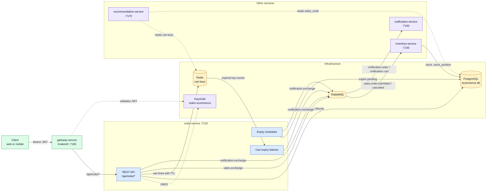
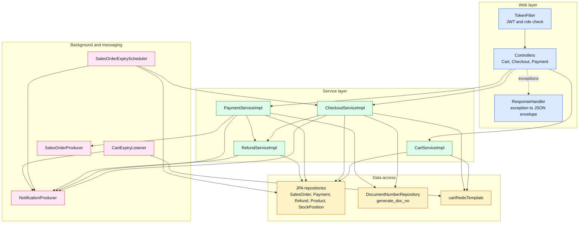
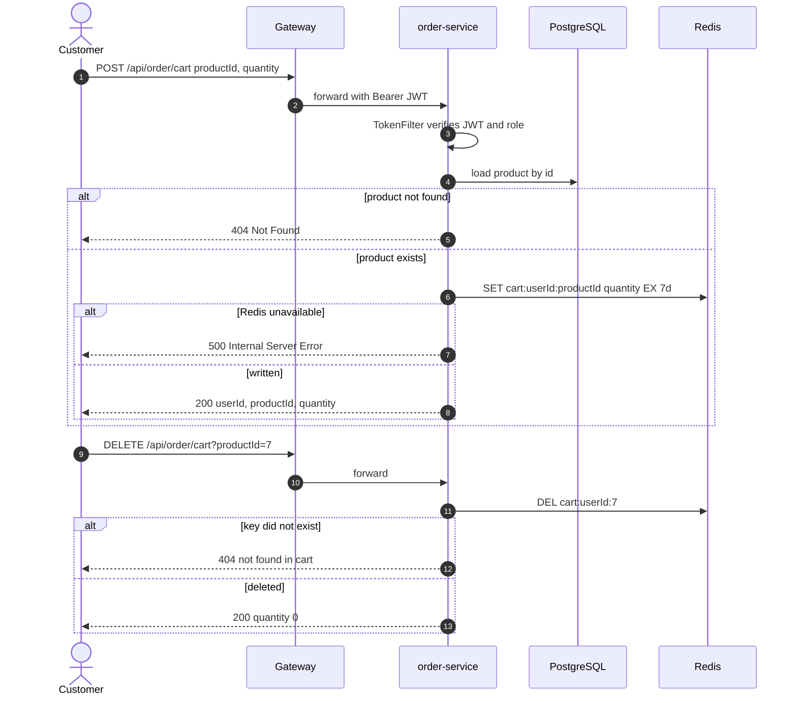
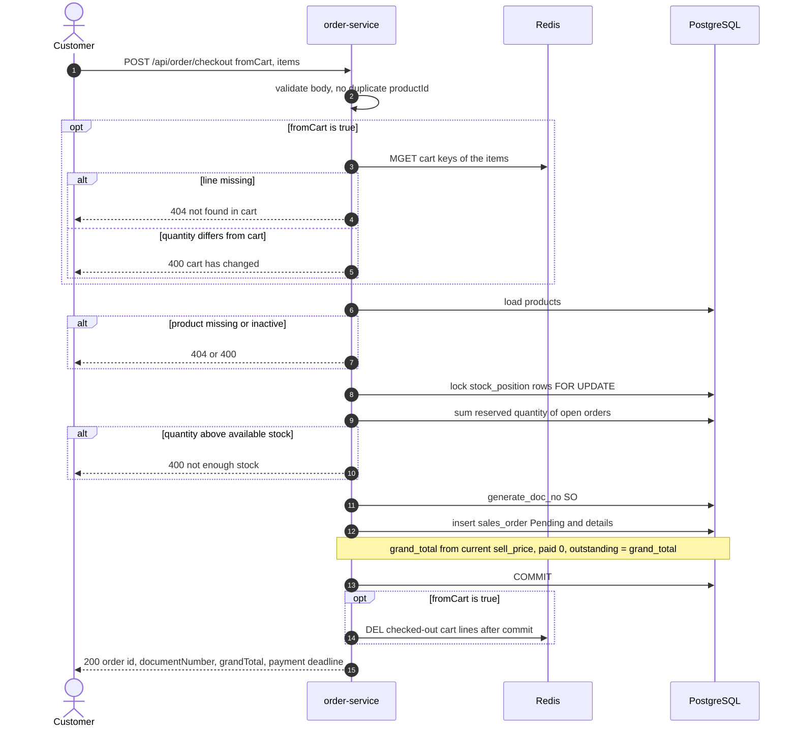
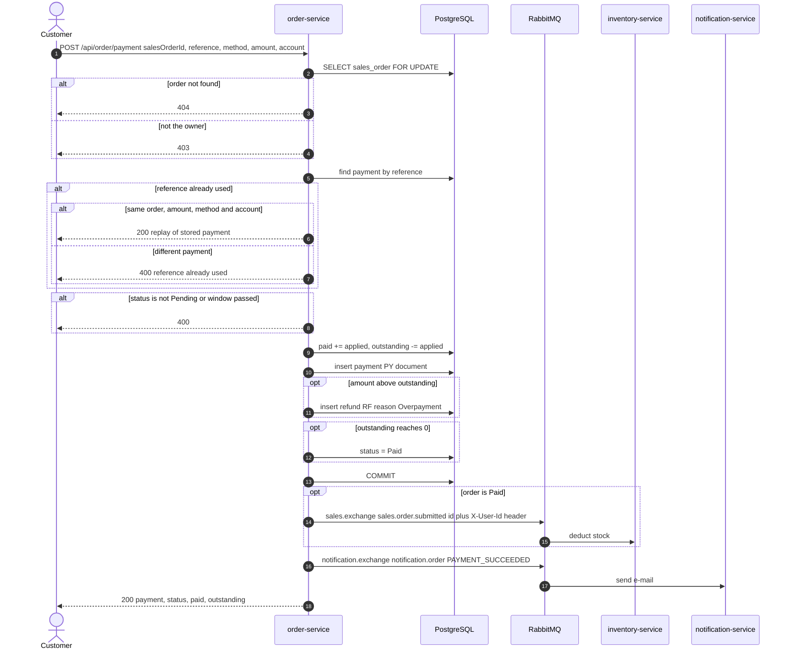
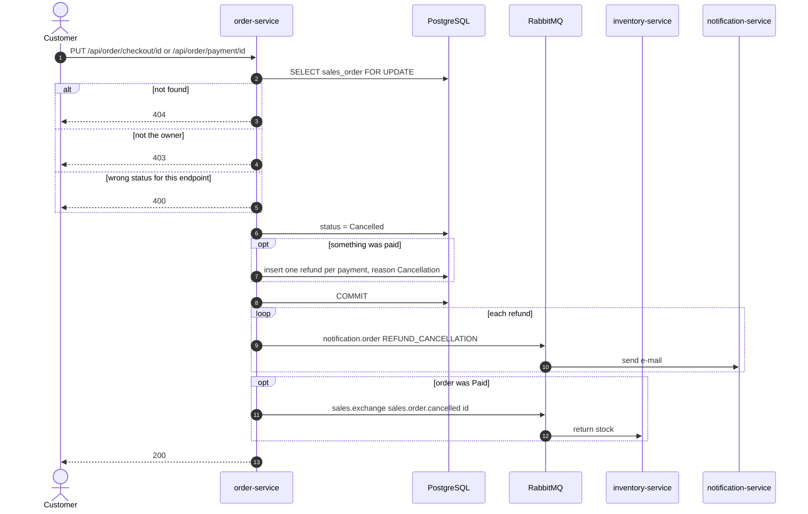
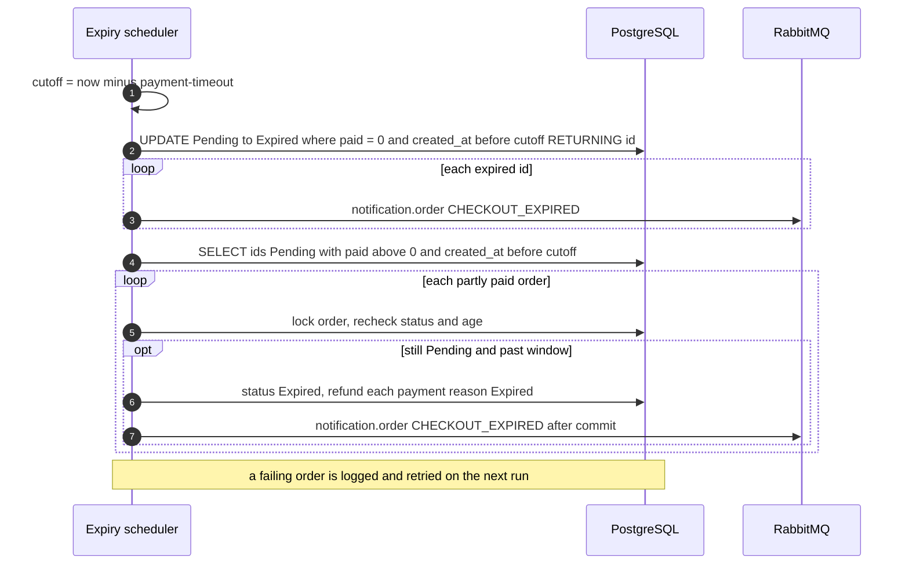
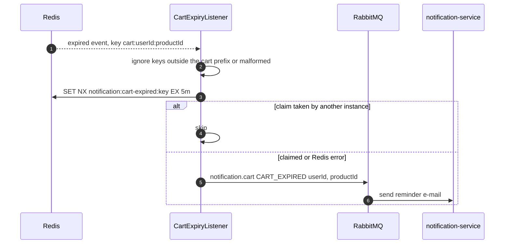
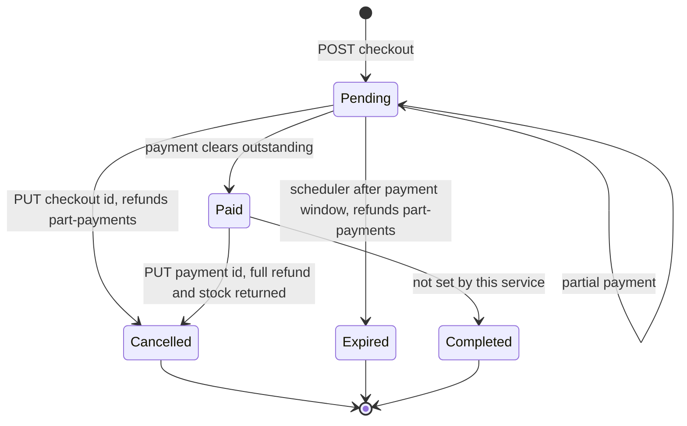

# order-service

The buying side of the polygot-ecommerce platform: it holds each customer's cart in Redis, turns picked products into a sales order that reserves stock, and takes payments, cancellations and refunds against that order.

## Table of Contents

- [Overview](#overview)
- [Tech Stack](#tech-stack)
- [Architecture](#architecture)
  - [Service in context](#service-in-context)
  - [Internal layers](#internal-layers)
- [Project Flow](#project-flow)
  - [Cart](#cart)
  - [Checkout](#checkout)
  - [Payment](#payment)
  - [Cancellation and refund](#cancellation-and-refund)
  - [Expiry of unpaid orders](#expiry-of-unpaid-orders)
  - [Abandoned cart lines](#abandoned-cart-lines)
  - [Sales order lifecycle](#sales-order-lifecycle)
- [Getting Started](#getting-started)
  - [Prerequisites](#prerequisites)
  - [Configuration](#configuration)
  - [Clean](#clean)
  - [Build](#build)
  - [Run](#run)
- [API Documentation (Swagger)](#api-documentation-swagger)
- [Endpoints](#endpoints)
- [Testing](#testing)
- [Project Layout](#project-layout)
- [Design Notes](#design-notes)
- [Troubleshooting](#troubleshooting)

## Overview

`order-service` is a Spring Boot REST API on port **7120**, under the servlet context path `/api`. Clients reach it through the KrakenD gateway (`gateway-service`, port 7100), which forwards `/api/order/**` to it unchanged.

**What it does**

| Area | Responsibility |
|------|----------------|
| Cart | Stores one Redis key per cart line (`cart:{user_id}:{product_id}` → quantity) with a sliding 7-day TTL. Products are checked against the `product` table before a line is written. |
| Checkout | Creates a `Pending` sales order (`sales_order` + `sales_order_detail`) from cart lines or from a single "buy now" product. Prices come from the product's current `sell_price`. Stock is checked under a row lock against `stock_position` minus what other orders already reserve. |
| Payment | Accepts payments, including several smaller payments, during the payment window (60 minutes by default). A repeated `reference` is treated as a retry and returns the same payment, and any amount above what is still owed is refunded straight away. The payment that clears the balance moves the order to `Paid`. |
| Cancel / refund | Cancels a `Pending` order (via checkout) or a `Paid` order (via payment), and writes one `refund` row per payment back to the account it came from. |
| Expiry | A scheduled job moves `Pending` orders past their payment window to `Expired` and refunds anything already paid. |
| Events | Publishes to RabbitMQ: sales-order submit/cancel messages for `inventory-service` and e-mail notification events for `notification-service`. It also listens for Redis key-expiry events so it can report abandoned cart lines. |

**What it does not own**

- **Stock movements.** It only *reads* `stock_position` to validate checkout. When an order becomes `Paid`, `inventory-service` deducts the stock (writes `stock`, updates `stock_position`), and it puts stock back when a paid order is cancelled.
- **The schema.** Tables (`sales_order`, `sales_order_detail`, `payment`, `refund`, `product`, `stock_position`, ...) and the `generate_doc_no` function are managed centrally with Liquibase in [`/migrations`](../../migrations). Hibernate runs with `ddl-auto: none`.
- **Products and identity.** The product catalogue belongs to `product-service`, and users and tokens to Keycloak / `auth-service`. This service only reads the catalogue and validates the JWTs.
- **E-mail delivery.** `notification-service` reads the ids this service publishes and sends the mail.

`recommendation-service` reads the same Redis cart keys and the `sales_order` table, so the cart key layout is effectively a shared contract.

## Tech Stack

| Technology | Version | Why we use it |
|------------|---------|---------------|
| Java | 17 | LTS runtime, set as `java.version` in `pom.xml`. Records (`CartCacheProperties`, `CheckoutProperties`) and pattern matching (`instanceof Number q`) keep the config and cart code short. |
| Spring Boot | 4.0.7 | Parent POM and auto-configuration for web, data, AMQP and Redis. It also provides `@Scheduled` for the expiry job and `@Transactional` with after-commit hooks, which keep messages from going out before the data is committed. |
| Spring Web MVC (`spring-boot-starter-webmvc`) | managed by Boot 4.0.7 | Blocking REST controllers. The work is mostly short transactional database calls, so a servlet stack is the simplest fit. |
| Spring Data JPA / Hibernate | managed by Boot 4.0.7 | Entity mapping and repositories. It is needed for `PESSIMISTIC_WRITE` locks on `sales_order` and native `FOR UPDATE` / `UPDATE ... RETURNING` queries for stock and expiry. |
| Spring Data JDBC / `spring-boot-starter-jdbc` | managed by Boot 4.0.7 | JDBC/DataSource (HikariCP) infrastructure under JPA, used for native queries such as `generate_doc_no`. |
| Bean Validation (`spring-boot-starter-validation`) | managed by Boot 4.0.7 | Checks request DTOs (`@NotNull`, `@Min`, `@Digits`, `@AssertTrue` for "buy now holds one product"). `ResponseHandler` turns violations into a 400 response with the usual JSON envelope. |
| PostgreSQL JDBC driver | managed by Boot 4.0.7 | Talks to the shared Postgres 16 `ecommerce` database. |
| Spring Data Redis (Lettuce) | managed by Boot 4.0.7 | Stores the cart with a per-key TTL and listens for keyspace `expired` events through `RedisMessageListenerContainer`. Values are stored as JSON (`GenericJacksonJsonRedisSerializer`), not JDK serialization. |
| Spring AMQP (`spring-boot-starter-amqp`) | managed by Boot 4.0.7 | Publishes to RabbitMQ with publisher confirms (`correlated`) and returns (`mandatory`), so lost or unroutable messages are logged. Messages are JSON (`JacksonJsonMessageConverter`). |
| Nimbus JOSE + JWT | 10.9.1 | `TokenFilter` verifies Keycloak RS256 access tokens against the realm JWKS, checks `iss`, `sub` and `exp`, and reads `realm_access.roles` itself. This avoids pulling in the whole Spring Security stack. |
| springdoc-openapi (`springdoc-openapi-starter-webmvc-ui`) | 3.0.3 | Generates the OpenAPI 3 document and Swagger UI from the controller annotations. The gateway re-publishes that document. |
| Lombok | managed by Boot 4.0.7 | Removes getters/setters/constructors from entities and DTOs. `lombok.config` marks generated code `@Generated` so JaCoCo ignores it. |
| Spring Boot DevTools | managed by Boot 4.0.7 | Restarts the app automatically during local `spring-boot:run` (runtime, optional). |
| JUnit 5 + Spring Boot test starters | managed by Boot 4.0.7 | Unit and slice tests for controllers, services, producers, listener, scheduler and config. |
| JaCoCo | 0.8.13 | Coverage report on `test`, plus a **90%** gate (instruction, line and branch) on `verify`. |
| Maven | 3.9 (Docker build stage) | Build tool. The `Makefile` and Dockerfile call `mvn` directly. |
| Docker (`maven:3.9-eclipse-temurin-17` → `eclipse-temurin:17-jre`) | — | Multi-stage image: the JDK is only in the build stage, and the app runs on a JRE as non-root user `app` (uid 10001). |
| PostgreSQL / Redis / RabbitMQ / Keycloak | 16 / 7 / 4 / 26.7 | Infrastructure from `app/docker-compose.yml`: the source of truth for orders, the cart store, the message broker and the identity provider. |

## Architecture

### Service in context



### Internal layers



## Project Flow

Every HTTP call first passes `TokenFilter`. It needs `Authorization: Bearer <jwt>` signed by the configured Keycloak issuer, and the token must carry the realm role `user` or `admin`. The `sub` claim (a UUID) becomes the current user. It is used for cart keys and `created_by`, and to check that a customer only pays for or cancels their own orders. Every response, success or error, uses the envelope `{ "code", "status", "data" }`.

### Cart

`POST /api/order/cart` **sets** the quantity of one line, replacing any previous value (it does not add to it), and resets the TTL. `DELETE /api/order/cart?productId=` removes the whole line. There is no "read cart" endpoint in this service.



### Checkout

`POST /api/order/checkout` with `fromCart=true` checks every line against Redis. The quantity must match the cart exactly, otherwise the request is refused with "Cart has changed ... please refresh". `fromCart=false` is "buy now" and must contain exactly one item. Stock available to the order = `stock_position.quantity` (row locked `FOR UPDATE`, in product-id order) minus the quantity reserved by `Pending` orders still inside their window and `Paid` orders that `inventory-service` has not deducted yet.



### Payment

`POST /api/order/payment` locks the order row, so payments, cancellations and expiry of the same order run one at a time. A `reference` must be unique. If the same reference is sent again with an identical order, amount, method and account, the payment already stored is returned. If any of those differ, the request is refused.



### Cancellation and refund

There are two cancel endpoints, depending on the order's status:

- `PUT /api/order/checkout/{id}` works only for a **Pending** order. The stock it reserved becomes available again straight away, because nothing was deducted yet. Any part-payments are refunded.
- `PUT /api/order/payment/{id}` works only for a **Paid** order. The grand total is refunded payment by payment, and `inventory-service` is told to return the stock.



### Expiry of unpaid orders

`SalesOrderExpiryScheduler` runs every `checkout.expiry-interval` (default 1 min) with `fixedDelay`. Checkout and payment already enforce the payment window themselves, so the job only updates the status and handles refunds. Running it late, twice, or on several instances at once is safe.



### Abandoned cart lines

When a cart line's TTL runs out, Redis publishes on `__keyevent@*__:expired`. `CartExpiryListener` parses `cart:{uuid}:{productId}`. Each instance receives every event, so the listener first takes a 5-minute claim (`SET NX notification:cart-expired:<key>`) to make sure only one instance publishes. Lines removed on purpose (DELETE or checkout) are deleted, not expired, so they never trigger this.



### Sales order lifecycle

Status values are stored as labels (`Pending`, `Paid`, ...) and match the `chk_sales_order_status` constraint in the migration.



> `Completed` exists in the `SalesStatus` enum and the DB check constraint, but no code in this repository sets it yet.

## Getting Started

### Prerequisites

- JDK 17 and Maven 3.9+ (the Maven wrapper `mvnw` is gitignored, so do not rely on it being in a fresh clone)
- Docker with Compose v2, for the infrastructure and container runs
- The shared infrastructure from `app/docker-compose.yml`: PostgreSQL (with the `ecommerce` schema **migrated**), Redis, RabbitMQ and Keycloak (realm `ecommerce` provisioned)

Start only the infrastructure, apply migrations and provision Keycloak, from the repo root:

```bash
./build.sh postgres redis rabbitmq keycloak   # also runs app/init/migrate.sh and app/init/keycloak-init.sh
# or, if the containers are already up:
./app/init/migrate.sh
./app/init/keycloak-init.sh
```

> The service never creates tables (`ddl-auto: none`). Checkout also calls the `generate_doc_no` SQL function. Without applied migrations, every write fails.

### Configuration

There is **no `src/main/resources/application.yml`**. Spring Boot reads `./config/application.yml` from the working directory:

- `config/application.yml` is the local, per-machine file. It is **gitignored**, so create it yourself, for example by copying `docker/application.yml` and changing the host defaults (`postgres`, `redis`, `rabbitmq`, `keycloak`) to `localhost`, or by exporting the variables below.
- `docker/application.yml` is copied into the image as `/app/config/application.yml` and reads everything from the environment.

Environment variables (defaults shown are those of `docker/application.yml`):

| Variable | Default | Description |
|----------|---------|-------------|
| `SERVER_PORT` | `7120` | HTTP port (context path is always `/api`) |
| `DB_HOST` | `postgres` | PostgreSQL host |
| `DB_PORT` | `5432` | PostgreSQL port |
| `DB_NAME` | `ecommerce` | Database name |
| `DB_USER` | `postgres` | Database user |
| `DB_PASSWORD` | *(empty)* | Database password (compose passes `p@ssw0rd`) |
| `SHOW_SQL` | `false` | Log SQL statements generated by Hibernate |
| `REDIS_HOST` | `redis` | Redis host |
| `REDIS_PORT` | `6379` | Redis port |
| `REDIS_USER` | `admin` | Redis ACL user |
| `REDIS_PASSWORD` | *(empty)* | Redis password (compose passes `p@ssw0rd`) |
| `REDIS_CART_KEY_PREFIX` | `cart` | Prefix of cart keys: `<prefix>:<userId>:<productId>` |
| `REDIS_CART_TTL` | `7d` | Inactivity TTL of a cart line, reset on every push |
| `REDIS_CART_KEYSPACE_EVENTS` | `Ex` | Value set for `notify-keyspace-events` at startup if Redis has none. Empty leaves the server setting as it is |
| `RABBITMQ_HOST` | `rabbitmq` | RabbitMQ host |
| `RABBITMQ_PORT` | `5672` | RabbitMQ AMQP port |
| `RABBITMQ_USER` | `admin` | RabbitMQ user |
| `RABBITMQ_PASSWORD` | *(empty)* | RabbitMQ password (compose passes `p@ssw0rd`) |
| `RABBITMQ_VHOST` | `/` | RabbitMQ virtual host |
| `RABBITMQ_SALES_EXCHANGE` | `sales.exchange` | Topic exchange for sales-order messages to inventory |
| `RABBITMQ_SO_SUBMIT_ROUTING_KEY` | `sales.order.submitted` | Routing key published when an order becomes `Paid` |
| `RABBITMQ_SO_CANCEL_ROUTING_KEY` | `sales.order.cancelled` | Routing key published when a `Paid` order is cancelled |
| `RABBITMQ_NOTIFICATION_EXCHANGE` | `notification.exchange` | Direct exchange shared with auth-service and read by notification-service |
| `RABBITMQ_NOTIFICATION_ORDER_ROUTING_KEY` | `notification.order` | Order, payment and refund e-mail events |
| `RABBITMQ_NOTIFICATION_CART_ROUTING_KEY` | `notification.cart` | Abandoned-cart e-mail events |
| `RABBITMQ_SALES_DLX_EXCHANGE`, `RABBITMQ_SO_SUBMIT_QUEUE`, `RABBITMQ_SO_SUBMIT_DLQ`, `RABBITMQ_SO_CANCEL_QUEUE`, `RABBITMQ_SO_CANCEL_DLQ`, `RABBITMQ_SO_*_DLQ_ROUTING_KEY` | `sales.dlx.exchange`, `inventory.so.submit`, ... | Present in the YAML for consistency with inventory-service. This service's code does not use them, because it only declares exchanges |
| `CHECKOUT_PAYMENT_TIMEOUT` | `60m` | Payment window of a pending order. It also limits how long the order holds stock |
| `CHECKOUT_EXPIRY_INTERVAL` | `1m` | Fixed delay between expiry-job runs |
| `KEYCLOAK_ISSUER_URI` | `http://keycloak:8080/realms/ecommerce` | Expected `iss` of tokens. JWKS is fetched from `<issuer>/protocol/openid-connect/certs` |
| `LOG_LEVEL_SPRING` | `INFO` | Log level of `org.springframework` |

### Clean

The `Makefile` has **no `clean` target** (it only defines `install`, `run`, `coverage`). Use Maven directly:

```bash
mvn clean            # or ./mvnw clean if you have the wrapper locally
```

`make install` also cleans first, because it runs `mvn clean install`.

### Build

```bash
make install         # mvn clean install: compile, test, JaCoCo 90% gate, install the jar
```

Native equivalents:

```bash
mvn clean package                 # build target/order-service-1.0.0.jar (runs tests and coverage report)
mvn clean package -DskipTests     # build without tests, as the Dockerfile does
```

Docker image:

```bash
docker build -t polygot/order-service:latest .
```

### Run

**Locally (needs `config/application.yml` and the infrastructure above):**

```bash
make run                          # mvn spring-boot:run
# native
mvn spring-boot:run
# or the packaged jar, from this directory so ./config/application.yml is found
java -jar target/order-service-1.0.0.jar
```

**With Docker only** (joins the compose network `app_ecommerce` created by `build.sh`):

```bash
docker run --rm -p 7120:7120 --network app_ecommerce \
  -e DB_PASSWORD='p@ssw0rd' -e REDIS_PASSWORD='p@ssw0rd' -e RABBITMQ_PASSWORD='p@ssw0rd' \
  polygot/order-service:latest
```

**As part of the whole stack** (from the repo root):

```bash
./build.sh                                   # infra up, migrate, provision Keycloak, then build and start all services
./build.sh order-service                     # rebuild and restart only this service (no migration or Keycloak step)
docker compose -f app/docker-compose.yml up -d order-service   # start this service without rebuilding
./down.sh                                    # stop the stack (add -v to also delete volumes)
```

`build.sh` runs the stack under the compose project name `app`. It starts the infrastructure, runs `app/init/migrate.sh` (Liquibase) and `app/init/keycloak-init.sh`, and only then runs `up -d --build` for the services. Compose waits for Postgres, RabbitMQ, Redis and Keycloak to be healthy before starting `order-service`. Its own healthcheck is just a TCP connect to port 7120 (there is no actuator).

> Root `./migration.sh` only **scaffolds** a new changelog file. Migrations are **applied** with `./app/init/migrate.sh` (or automatically by `./build.sh`).

## API Documentation (Swagger)

| What | URL |
|------|-----|
| Swagger UI (service) | http://localhost:7120/api/swagger-ui/index.html |
| OpenAPI JSON (service) | http://localhost:7120/api/v3/api-docs |
| OpenAPI JSON (via gateway) | http://localhost:7100/docs/order/openapi.json → backend `/api/v3/api-docs` |

The Swagger and OpenAPI paths (and `/error`) don't need a token. Every other path requires a bearer JWT (security scheme `bearerAuth`). Click **Authorize** in Swagger UI and paste the access token only, without the `Bearer` prefix.

Get a token straight from Keycloak (public client `ecommerce-app`, seeded user `userapp` / `P@ssw0rd`):

```bash
curl -s -X POST "http://localhost:8080/realms/ecommerce/protocol/openid-connect/token" \
  -H "Content-Type: application/x-www-form-urlencoded" \
  -d "client_id=ecommerce-app" \
  -d "grant_type=password" \
  -d "username=userapp" \
  -d "password=P@ssw0rd" | jq -r .access_token
```

Or through the gateway and auth-service (the response contains `accessToken`):

```bash
curl -s -X POST "http://localhost:7100/api/auth/login" \
  -H "Content-Type: application/json" \
  -d '{"username":"userapp","password":"P@ssw0rd"}'
```

Then call the API:

```bash
curl -X POST "http://localhost:7100/api/order/cart" \
  -H "Authorization: Bearer $TOKEN" -H "Content-Type: application/json" \
  -d '{"productId":7,"quantity":2}'
```

> The token's `iss` must equal `KEYCLOAK_ISSUER_URI` exactly. See [Troubleshooting](#troubleshooting).

## Endpoints

All paths include the `/api` context path. They are the same on the service (`:7120`) and on the gateway (`:7100`). Role means a Keycloak **realm** role, checked both by the gateway and by `TokenFilter`. Pay and cancel also require that the caller created the order (`created_by`), even for `admin`.

| Method | Path | Role | Description |
|--------|------|------|-------------|
| `POST` | `/api/order/cart` | `user`, `admin` | Set the quantity of one product in the caller's cart. Body `{ productId, quantity>=1 }`. Replaces the quantity and resets the 7-day TTL. |
| `DELETE` | `/api/order/cart?productId={id}` | `user`, `admin` | Remove one product line from the cart. 404 if the line is not there. |
| `POST` | `/api/order/checkout` | `user`, `admin` | Create a `Pending` sales order. Body `{ fromCart, items:[{ productId, quantity }] }`. Buy-now (`fromCart=false`) allows exactly one item. Returns the payment deadline. |
| `PUT` | `/api/order/checkout/{id}` | `user`, `admin` (owner) | Cancel a **Pending** order and refund any part-payments. |
| `POST` | `/api/order/payment` | `user`, `admin` (owner) | Pay towards a pending order. Body `{ salesOrderId, reference<=100, method: TRF\|VA\|EWL, bankName, accountNumber, accountName, amount (10.2 digits) }`. |
| `PUT` | `/api/order/payment/{id}` | `user`, `admin` (owner) | Cancel a **Paid** order: full refund per payment, and inventory is told to return the stock. |
| `GET` | `/api/v3/api-docs`, `/api/swagger-ui/**` | public | API documentation. |

Error status codes: `400` validation or business rule, `401` missing/invalid/expired token, `403` wrong role or not the owner, `404` unknown order/product/cart line, `500` Redis or internal failure (the message is replaced with a generic one).

## Testing

```bash
mvn test                 # unit tests; JaCoCo report generated in the test phase
make coverage            # mvn jacoco:report (re-render the report from the last run)
mvn verify               # tests + coverage gate: 90% instruction, line and branch, or the build fails
make install             # mvn clean install, which includes verify
```

- The HTML report is at `target/site/jacoco/index.html`. `Application.class` and Lombok-generated code are excluded.
- Tests are in `src/test/java/com/order/api/**`, one class per production class (controllers, services, producers, listener, scheduler, configuration, converters, repository helpers, token filter, utilities).
- `ApplicationTests.contextLoads` is a full `@SpringBootTest`. It needs `config/application.yml`, because there are no test resources, and it needs the infrastructure that file points to.

## Project Layout

```text
order-service/
├── Dockerfile                   # multi-stage build: Maven 3.9 / JDK 17 -> JRE 17, non-root, port 7120
├── Makefile                     # install, run, coverage
├── pom.xml                      # Spring Boot 4.0.7 parent, dependencies, JaCoCo 90% gate
├── lombok.config                # marks Lombok output @Generated so JaCoCo ignores it
├── config/application.yml       # local config (gitignored; create it yourself)
├── docker/application.yml       # config baked into the image, values from environment variables
└── src/
    ├── main/java/com/order/api/
    │   ├── Application.java     # entry point; JPA repositories use CommonRepositoryImpl as base class
    │   ├── configuration/       # Redis cart template, keyspace listener, RabbitMQ exchanges and templates, OpenAPI, checkout timeout
    │   ├── constant/            # response messages, security constants (roles, public paths)
    │   ├── controller/          # CartController, CheckoutController, PaymentController
    │   ├── converter/           # JPA converters storing enums by their label
    │   ├── dao/                 # CommonDao helper
    │   ├── enums/               # SalesStatus, PaymentMethod, RefundReason, DocType, NotificationType
    │   ├── exception/           # BadRequest, Forbidden, NotFound, Service exceptions
    │   ├── handler/             # ResponseHandler: exceptions -> { code, status, data } envelope
    │   ├── listener/            # CartExpiryListener: Redis expired events -> CART_EXPIRED
    │   ├── model/
    │   │   ├── dto/             # request, response and RabbitMQ message payloads
    │   │   └── entity/          # JPA entities on the shared schema (Base = audit + soft delete)
    │   ├── producer/            # SalesOrderProducer, NotificationProducer (publish after commit)
    │   ├── repository/          # Spring Data repositories, row locks, native reservation/expiry queries
    │   ├── scheduler/           # SalesOrderExpiryScheduler
    │   ├── service/             # service interfaces + impl/ (Cart, Checkout, Payment, Refund)
    │   ├── token/               # TokenFilter: Keycloak JWT verification and role check
    │   └── util/                # AccountUtil (current user ThreadLocal), TokenUtil (Bearer parsing)
    └── test/java/com/order/api/ # unit tests mirroring the main packages
```

## Design Notes

- **Messages go out after commit.** `SalesOrderProducer` and `NotificationProducer` register a `TransactionSynchronization.afterCommit` hook. Consumers receive ids only (`{"id": ...}` or `{eventId, eventType, occurredAt, source, id}`) and read the rows themselves, so they must never see an id before it is committed. If publishing fails, the error is logged and nothing is rolled back. No outbox exists, so a lost submit message has to be re-sent by hand.
- **RabbitMQ contract.** `sales.exchange` is a durable **topic** exchange. A submit carries the header `X-User-Id`, which inventory-service uses to fill its audit columns. `notification.exchange` is a durable **direct** exchange, declared with the same flags as auth-service, because RabbitMQ rejects a redeclaration with different settings. Event types: `CHECKOUT_EXPIRED`, `PAYMENT_SUCCEEDED`, `REFUND_CANCELLATION` (key `notification.order`), and `CART_EXPIRED` with `userId` and `productId` (key `notification.cart`). Order-side queues are not declared here.
- **Stock is reserved, not deducted, at checkout.** A pending order holds stock by being counted in `sumReserved` until its window ends. A paid order keeps holding it until a `stock` row exists for it, written by inventory-service. Row locks on `stock_position` in product-id order prevent overselling and deadlocks.
- **Payment window enforced in three places.** Checkout stops counting expired orders, payment refuses them, and the scheduler only updates the status afterwards. So a late or duplicate scheduler run cannot change any money.
- **Refunds are recorded, not executed.** A `refund` row with document number `RF...` records the money as returned to the payment's bank account. No payment gateway is called.
- **Document numbers** (`SO`, `PY`, `RF` + date + sequence, e.g. `SO20260923001`) come from the `generate_doc_no` database function, using the date in `Asia/Jakarta`.
- **Soft delete and auditing.** Every entity extends `Base` (`is_active`, `is_deleted`, `created_by/at`, `updated_by/at`) with `@SQLRestriction("is_deleted = false")`. `created_by` is the JWT `sub` and is how ownership is checked. The scheduler runs without a user, so it sets `updated_by = NULL`.
- **Cart values are JSON**, written by `GenericJacksonJsonRedisSerializer` with a polymorphic-type allow-list, and the JDK serializer is disabled. Other services, such as recommendation-service, can read the keys as plain values.
- **Correlation id.** `InterceptorConfig` puts a `correlationId` into MDC and returns `X-Correlation-Id`. It is not registered through a `WebMvcConfigurer.addInterceptors`, so it does not run on requests yet, and the `[%X{correlationId}]` log field stays empty.

## Troubleshooting

| Symptom | Cause / fix |
|---------|-------------|
| App fails to start with missing properties such as `${redis.cart.key-prefix}` | No `config/application.yml` in the working directory (it is gitignored and there is no bundled default). Create it, and run from `services/order-service`. |
| `401 Access token is invalid or expired` with a token that looks fine | The token's `iss` does not match `KEYCLOAK_ISSUER_URI`. Keycloak has no fixed hostname in compose, so `iss` follows the URL used to request the token. A token from `http://localhost:8080` works with a locally run service (`http://localhost:8080/realms/ecommerce`). The containerised service expects `http://keycloak:8080/realms/ecommerce`, which is what a login via `POST /api/auth/login` produces. |
| `403 You don't have permission to access this resource` | The token has neither realm role `user` nor `admin`. Or, on pay/cancel, the order was created by another user. |
| `400 Cart has changed for product ... please refresh` | `fromCart=true` but the quantity sent differs from the value in Redis. Re-read the cart and resend. |
| `400 The payment window of sales order ... has passed` | More than `CHECKOUT_PAYMENT_TIMEOUT` since checkout. The order will be (or already is) `Expired`. |
| `400 Reference ... has already been used` | Each payment, including each instalment, needs its own `reference`. Only an identical retry is replayed. |
| No abandoned-cart e-mails | Redis must publish expired events (`notify-keyspace-events` containing `x` or `A`). Compose starts Redis with `Ex`. On a managed Redis that blocks `CONFIG SET`, set it on the server. A startup warning is logged in that case. |
| Order is `Paid` but stock was not deducted | Check the log for `Unable to publish the submit message` or `returned unrouted`. inventory-service must be running and have bound its queue to `sales.exchange`. |
| `relation "sales_order" does not exist` / `function generate_doc_no does not exist` | Migrations were not applied. Run `./app/init/migrate.sh`. |
