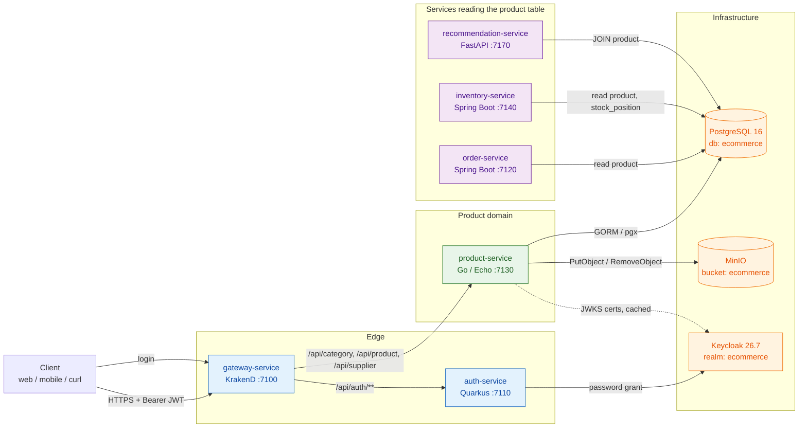
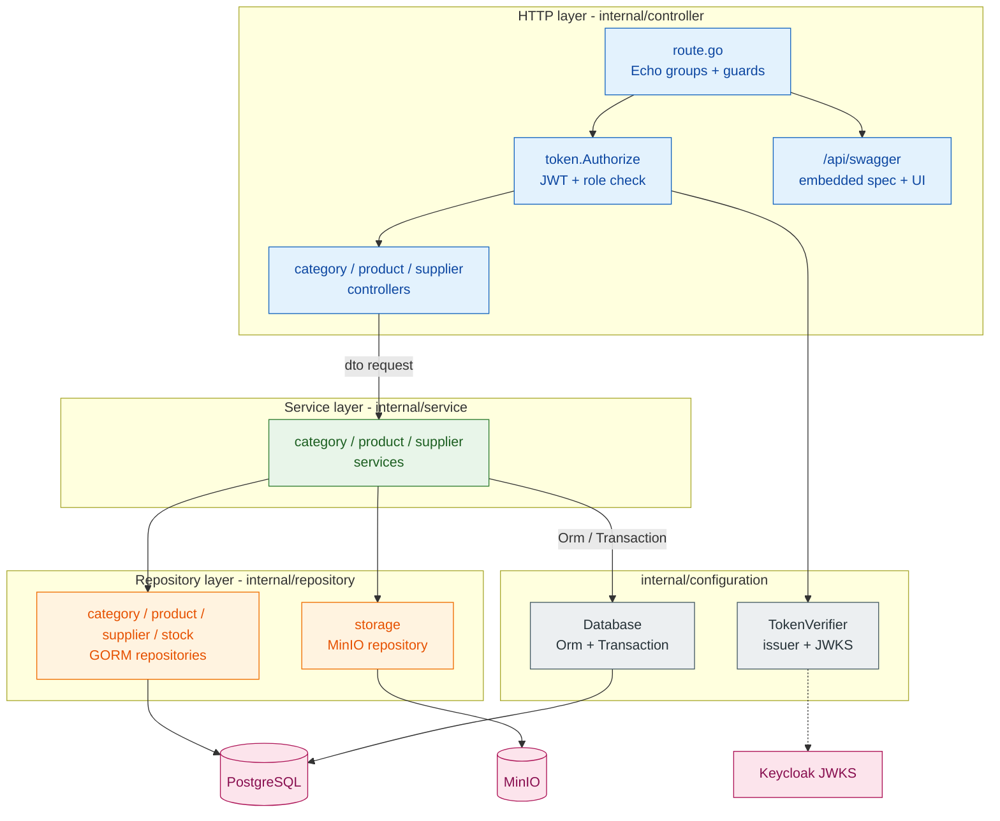
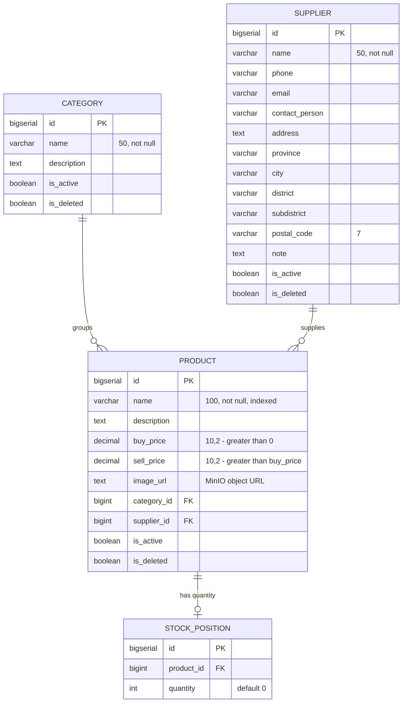
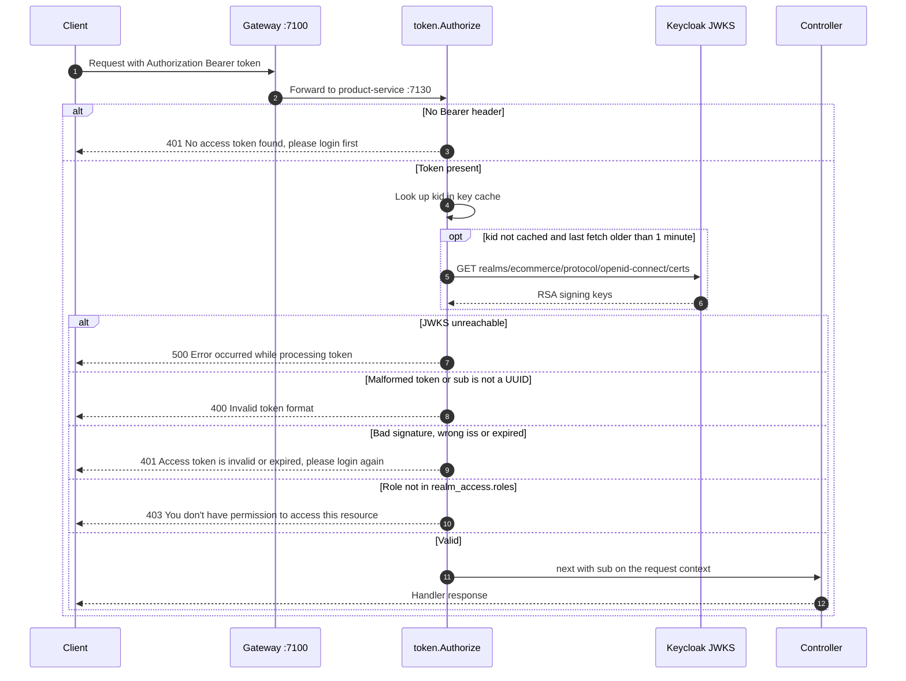
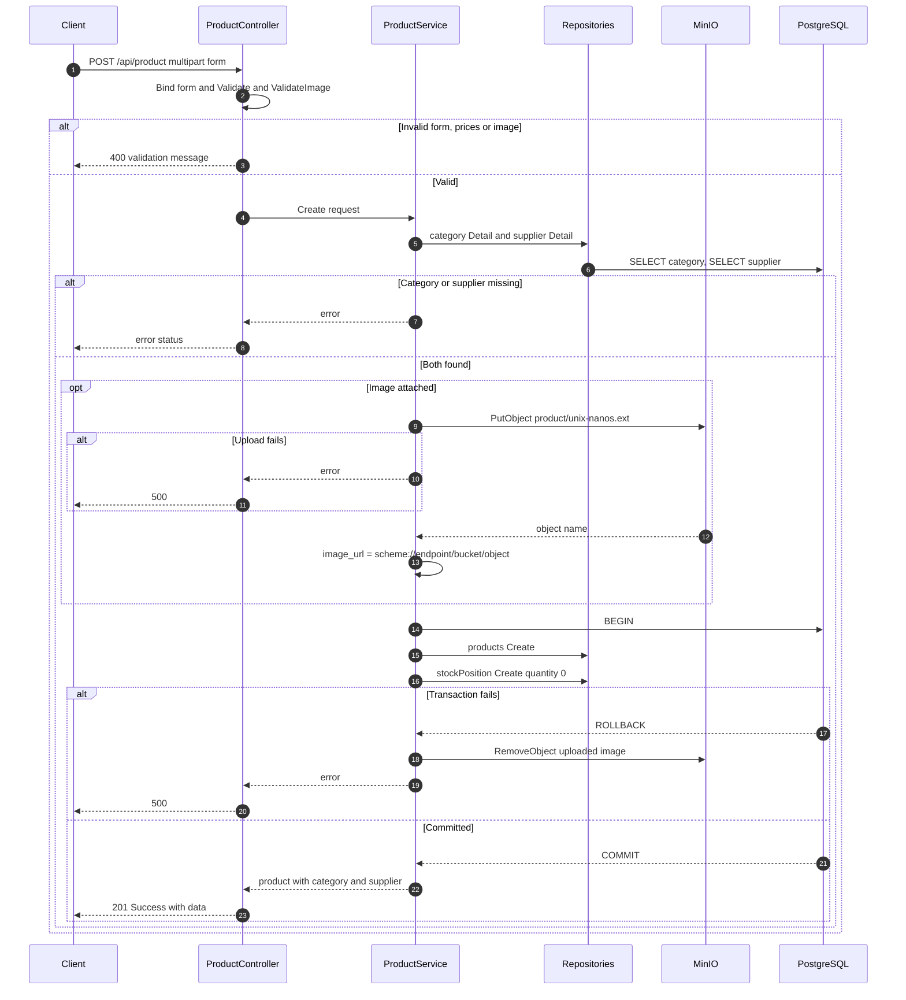
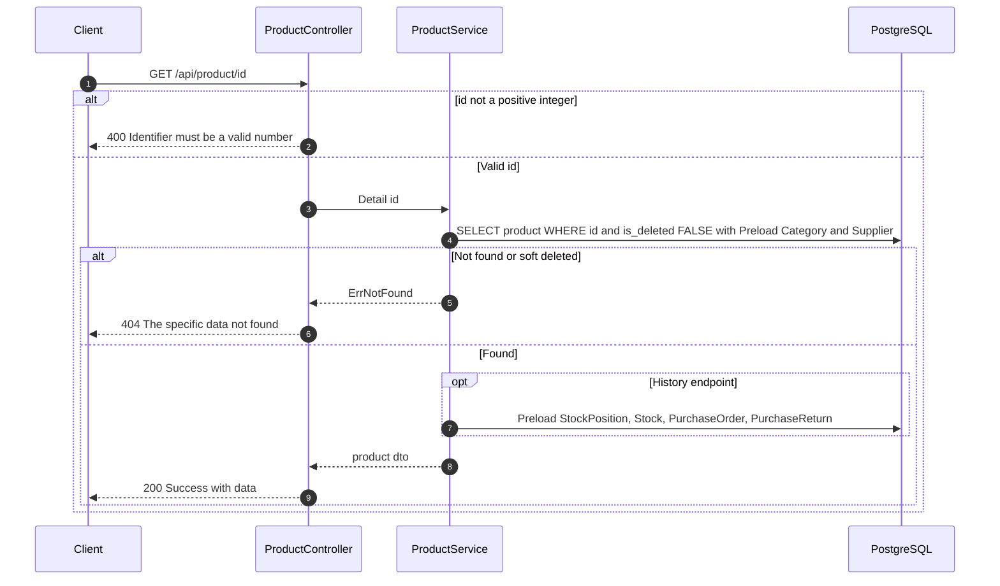
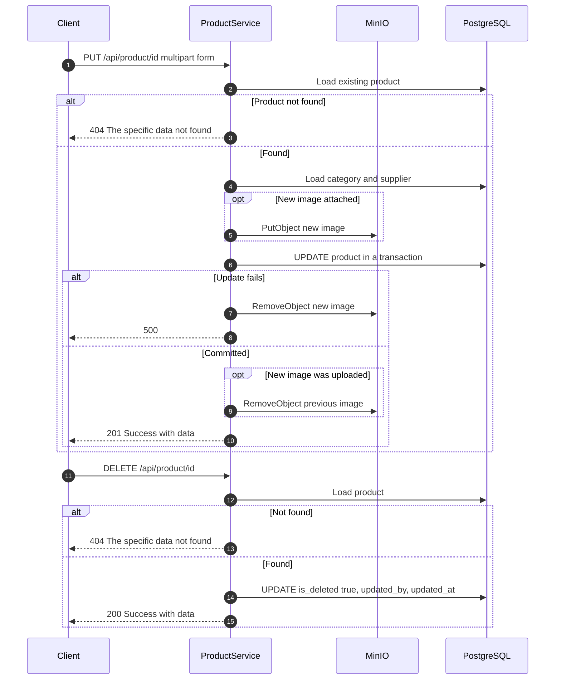

# product-service

The product catalog of the polygot-ecommerce platform: a Go service that manages **categories**, **suppliers** and **products**, and stores product images in MinIO.
It is the only service that writes the catalog tables. The other services read the same tables to price orders, track stock and build recommendations.

## Table of Contents

- [Overview](#overview)
- [Tech Stack](#tech-stack)
- [Architecture](#architecture)
- [Project Flow](#project-flow)
- [Getting Started](#getting-started)
- [API Documentation (Swagger)](#api-documentation-swagger)
- [Endpoints](#endpoints)
- [Testing](#testing)
- [Project Layout](#project-layout)
- [Design Notes](#design-notes)
- [Troubleshooting](#troubleshooting)

## Overview

`product-service` listens on port **7130** and sits behind the KrakenD gateway (`gateway-service`, port 7100), which forwards `/api/category/**`, `/api/product/**` and `/api/supplier/**` to it.

**Responsibilities**

- CRUD, search, activate/deactivate and soft delete for **categories**, **suppliers** and **products**.
- Uploading product images (jpg, jpeg, png, webp, max 5 MB) to the MinIO bucket and storing the object URL in `product.image_url`. When an image is replaced or a write fails, the service removes the object it no longer needs.
- Creating the starting `stock_position` row (quantity `0`) for every new product, in the same transaction as the product.
- Showing a product's stock history (`GET /api/product/history/{id}`): stock movements together with the purchase orders and purchase returns behind them.
- Verifying Keycloak access tokens itself (RS256, JWKS) and checking the `admin` / `user` realm roles on each route. This is a second check on top of the gateway's.
- Filling the audit columns (`created_by`, `updated_by`) with the `sub` claim of the caller's token.

**What it does not own**

- **The database schema.** Tables are created by Liquibase changelogs in [`/migrations`](../../migrations), which the whole repo shares. This service does not run migrations or GORM `AutoMigrate`.
- **Stock quantities after creation.** Stock moves (`stock`, `stock_position`, purchase orders and returns) belong to `inventory-service`. This service only creates the starting position and reads the history.
- **Identity.** Tokens are issued by Keycloak (realm `ecommerce`), usually through `auth-service` (`POST /api/auth/login`). This service only verifies them.
- **The MinIO bucket policy.** The `minio-init` container in `app/docker-compose.yml` creates the bucket and sets its policy. The service creates the bucket only if it is missing at startup.

**Role in the platform:** other services read the `product` table (and its relations) directly from the shared `ecommerce` database. `order-service` and `inventory-service` both map a JPA `Product` entity to `product`. `recommendation-service` joins `product` in its SQL (`repository/history.py`). `inventory-service` also maps `stock_position`, the row this service creates for each new product.

## Tech Stack

| Technology | Version | Why we use it |
|---|---|---|
| Go | 1.25.8 (`go.mod`), `golang:1.25-alpine` build image | Builds one static binary (`CGO_ENABLED=0`) that runs on a bare Alpine image. Goroutine-per-request handling fits an I/O-bound CRUD service. |
| Echo | `labstack/echo/v5` v5.3.1 | Small, fast router with route groups and per-route middleware. This lets one route (`GET /api/product/:id`) accept `user` while the rest require `admin`. Also provides the request logger and multipart helpers (`FormFile`). |
| GORM | `gorm.io/gorm` v1.31.2 | `Preload` loads the category, supplier, stock and purchase-order relations a product response needs. `Transaction` keeps the product and its stock position atomic. |
| GORM Postgres driver / pgx | `gorm.io/driver/postgres` v1.6.2 (pgx v5.10.0) | Pure-Go PostgreSQL driver, so no CGO is needed. It also lets the tests run the real Postgres dialect against a fake `database/sql` driver. |
| shopspring/decimal | v1.4.0 | Exact arithmetic for `buy_price` / `sell_price` (`DECIMAL(10,2)`), where float rounding is not acceptable. |
| MinIO Go SDK | `minio/minio-go/v7` v7.3.0 | S3-compatible client used to upload, remove and check product images and the bucket. The same code works with MinIO locally and any S3 endpoint later. |
| golang-jwt | `golang-jwt/jwt/v5` v5.3.1 | Parses and verifies Keycloak access tokens. Only RS256 is accepted, and `iss`/`exp` are checked. Signing keys are fetched from the realm JWKS endpoint and cached. |
| google/uuid | v1.6.0 | Parses the Keycloak `sub` claim into the `UUID` audit columns. |
| godotenv | v1.5.1 | Loads `.env` for local runs. In Docker the environment comes from compose. |
| swag + swaggo/files | `swaggo/swag` v1.16.6, `swaggo/files` v1.0.1 | Builds the Swagger 2.0 spec from handler comments (`swag init`). The spec is embedded with `go:embed`, and Swagger UI is served from the embedded swagger-ui assets, so the docs work without internet access. |
| testify | `stretchr/testify` v1.11.1 | `require` assertions in the unit tests. Mocks are hand-written in `internal/mocks`, not generated. |
| Docker | multi-stage, `golang:1.25-alpine` to `alpine:3.22` | Small runtime image that runs as a non-root user (`app`, uid 10001). Only the CA bundle is copied from the build stage, for MinIO over TLS. |

## Architecture

### Service in context



### Internal layers

Dependencies are wired by hand in `main.go` (`buildControllers`). Each layer depends on an interface of the layer below, which is what lets the tests swap in the doubles from `internal/mocks`.



## Project Flow

### Data model

Tables come from `migrations/changelog/*-create-table-{category,supplier,product,stock-position}.sql`. Every table also has the shared audit/soft-delete columns `is_active`, `is_deleted`, `created_by`, `updated_by`, `created_at`, `updated_at`.



### 1. Authentication and authorization (every `/api/**` business route)

The gateway validates the JWT first. The service then checks it again with `token.Authorize`: it reads the `Authorization: Bearer <token>` header, verifies the RS256 signature against the realm's `/protocol/openid-connect/certs` (keys are cached, and an unknown `kid` causes at most one refetch per minute), checks `iss` against `KEYCLOAK_ISSUER_URI` and requires `exp`. It then reads the roles from `realm_access.roles` and requires one of the roles the route allows. The `sub` claim is stored on the request context and later written to the audit columns.



### 2. Create a product with an image upload

`POST /api/product` takes `multipart/form-data`. The controller binds and validates the form: name is required, category and supplier are required, both prices must be greater than 0, `buy_price` must be lower than `sell_price`, and the optional image must be jpg/jpeg/png/webp up to 5 MB. The service checks that the category and supplier exist. It then uploads the image **before** writing the row, so `image_url` always points at an object that really exists. The product and its starting `stock_position` (quantity 0) are inserted in one transaction. If the transaction fails, or the request panics, the uploaded object is removed again.



> Note: in the create flow, a missing category or supplier comes back from the repository as `gorm.ErrRecordNotFound` without being mapped to a 404, so `exception.Resolve` reports it as **500**. The update flow has the same behaviour for category and supplier. Only a missing *product* is mapped to 404 there.

### 3. Get a product (detail and history)

`GET /api/product/{id}` (role `admin` or `user`) loads the product with its non-deleted category and supplier. `GET /api/product/history/{id}` (`admin`) also loads `stock_position` and the `stock` movements, each with its purchase order or purchase return (newest first), supplier and detail lines. Soft-deleted products return 404.



### 4. Update and delete a product

`PUT /api/product/{id}` uses the same multipart form as create. It loads the existing product, checks the category and supplier, and uploads the new image if one was sent. Without an image the current `image_url` is kept. The row is updated in a transaction, and the **old image is removed only after the commit succeeds**, so a failed update never leaves the product pointing at a missing object. On success the endpoint replies **201** (as its Swagger annotation says).

`DELETE /api/product/{id}` is a **soft delete**: it sets `is_deleted = true` and refreshes `updated_by`/`updated_at`. The image stays in MinIO. Activate/deactivate toggle `is_active` and return **409** if the product is already in that state. Categories and suppliers follow the same rules.



## Getting Started

### Prerequisites

- **Go 1.25.8+** (see `go.mod`).
- **PostgreSQL 16**, **MinIO** and **Keycloak 26.7** reachable from where you run the service. The easiest way to get them is the root stack (`app/docker-compose.yml`).
- The `ecommerce` schema **migrated** (see [Migrations](#migrations)).
- **swag CLI** to regenerate the Swagger docs: `go install github.com/swaggo/swag/cmd/swag@v1.16.6`.
- **Docker** with the Compose plugin, for the container and stack options.

### Configuration

Configuration is read from environment variables. For local runs, `godotenv` loads a `.env` file from the working directory; copy `.env.example` to `.env` and fill it in. A missing `.env` only logs `Error load .env file`.

| Variable | Default in code | Local `.env` value | Description |
|---|---|---|---|
| `PORT` | `7130` | `7130` | HTTP listen port. Not in `.env.example`, but read by `main.go`. |
| `DB_HOST` | none | `localhost` | PostgreSQL host (`postgres` in compose). |
| `DB_PORT` | none | `5432` | PostgreSQL port. |
| `DB_USER` | none | `postgres` | PostgreSQL user. |
| `DB_PASSWORD` | none | `p@ssw0rd` | PostgreSQL password. |
| `DB_NAME` | none | `ecommerce` | Database holding the catalog tables. The DSN uses `sslmode=disable TimeZone=Asia/Jakarta`. |
| `MINIO_ENDPOINT` | none | `localhost:9000` | MinIO `host:port`, without a scheme. Also used to build `image_url`. |
| `MINIO_ACCESS_KEY` | none | `admin` | MinIO access key. |
| `MINIO_SECRET_KEY` | none | `password` | MinIO secret key. |
| `MINIO_USE_SSL` | `false` (anything that is not a valid boolean) | `false` | `true` uses HTTPS for MinIO and `https://` in `image_url`. |
| `MINIO_BUCKET` | none | `ecommerce` | Bucket for product images (stored under the `product/` prefix). Created at startup if missing. |
| `KEYCLOAK_ISSUER_URI` | `http://localhost:8080/realms/ecommerce` | same | Realm URL. It must equal the token `iss` claim exactly (a trailing `/` is trimmed). JWKS is read from `<issuer>/protocol/openid-connect/certs`. |

In the compose stack these values are set in `app/docker-compose.yml` (`DB_HOST=postgres`, `MINIO_ENDPOINT=minio:9000`, `KEYCLOAK_ISSUER_URI=http://keycloak:8080/realms/${KEYCLOAK_REALM:-ecommerce}`, and so on). They can be overridden through a root `.env` (`POSTGRES_USER`, `POSTGRES_PASSWORD`, `ECOMMERCE_DB`, `MINIO_ROOT_USER`, `MINIO_ROOT_PASSWORD`, `PRODUCT_BUCKET`, `KEYCLOAK_REALM`, `PRODUCT_SERVICE_PORT`).

> The service connects to PostgreSQL and MinIO at startup and exits (`log.Fatalf`) if either is unavailable. Keycloak is **not** contacted at startup. Keys are fetched on the first authenticated request.

### Migrations

The schema lives in the root [`/migrations`](../../migrations) folder (Liquibase, `db.changelog-master.xml`), not in this service.

```bash
# from the repo root
./app/init/migrate.sh updateSQL   # preview
./app/init/migrate.sh             # apply
./migration.sh "create table foo" # scaffold a new changelog file + register it in the master
```

`./build.sh` runs `app/init/migrate.sh` for you whenever `postgres` is part of what it starts.

### Clean

The Makefile has **no `clean` target**. Use native Go commands:

```bash
go clean -cache -testcache   # drop the build and test caches
rm -f cover.out product-service
```

### Build

```bash
go mod download
go build -o product-service .                                   # local binary
CGO_ENABLED=0 GOOS=linux go build -ldflags="-s -w" -o product-service .   # same flags as the Dockerfile
make swag                                                       # regenerate docs/ before building if annotations changed
```

The Swagger spec is embedded at compile time (`docs/embed.go`, `//go:embed swagger.json`), so **regenerate the docs before building** if you changed handler annotations.

### Run

**Locally (Makefile)**

```bash
cp .env.example .env   # then fill in the values (see table above)
make run               # = go run main.go
```

**Locally (native)**

```bash
go run .               # or: go run main.go
./product-service      # after go build
```

Then check it with `curl http://localhost:7130/health`, which returns `"Service is running"`.

**Docker (standalone)**

```bash
docker build -t polygot/product-service:latest .
docker run --rm -p 7130:7130 \
  -e DB_HOST=host.docker.internal -e DB_PORT=5432 -e DB_USER=postgres -e DB_PASSWORD='p@ssw0rd' -e DB_NAME=ecommerce \
  -e MINIO_ENDPOINT=host.docker.internal:9000 -e MINIO_ACCESS_KEY=admin -e MINIO_SECRET_KEY=password \
  -e MINIO_USE_SSL=false -e MINIO_BUCKET=ecommerce \
  -e KEYCLOAK_ISSUER_URI=http://localhost:8080/realms/ecommerce \
  polygot/product-service:latest
```

No `.env` is baked into the image, so pass every variable with `-e` (or `--env-file .env`, with the hosts changed to ones the container can reach).

**As part of the stack** (from the repo root)

```bash
./build.sh                                              # infra up, migrate, provision Keycloak, all services up
./build.sh product-service                              # rebuild + restart only this service (up -d --build)
docker compose -f app/docker-compose.yml up -d --build product-service
./down.sh                                               # stop the stack (./down.sh -v also deletes volumes)
```

In compose the container waits for `postgres`, `minio` and `keycloak` to be healthy and for `minio-init` to finish. It is health-checked with `wget http://127.0.0.1:7130/health`. Note that `./build.sh product-service` alone skips the migration and Keycloak steps, because those run only when `postgres`/`keycloak` are in the service list.

## API Documentation (Swagger)

The spec is **Swagger 2.0**, generated by swag from the comments in `main.go` and `internal/controller/**`.

| What | URL |
|---|---|
| Swagger UI (service) | `http://localhost:7130/api/swagger/index.html` (`/api/swagger` redirects here) |
| Spec JSON (service) | `http://localhost:7130/api/swagger/swagger.json` |
| Spec JSON (through gateway) | `http://localhost:7100/docs/product/openapi.json` (backend `/api/swagger/swagger.json`) |
| Spec files in repo | `docs/swagger.json`, `docs/swagger.yaml`, `docs/docs.go` |

The spec declares `host: localhost:7130` and `basePath: /`, so "Try it out" in the UI calls the service directly.

**Regenerate**

```bash
make swag
# = swag init -d ./,./ -o docs --ot go,json,yaml --pd true
```

Rebuild or restart afterwards. The served spec is the embedded `docs/swagger.json`, not a file read at runtime.

**Authorize**

Every business endpoint uses the `BearerAuth` scheme (`Authorization` header). In Swagger UI click **Authorize** and enter `Bearer <access_token>`, including the `Bearer ` prefix.

Get a token straight from Keycloak (public client `ecommerce-app`, direct access grants enabled). The users `adminapp` (role `admin`) and `userapp` (role `user`), both with password `P@ssw0rd`, are created by `app/init/keycloak-init.sh`:

```bash
TOKEN=$(curl -s -X POST http://localhost:8080/realms/ecommerce/protocol/openid-connect/token \
  -d grant_type=password -d client_id=ecommerce-app \
  -d username=adminapp -d 'password=P@ssw0rd' | jq -r .access_token)

curl -H "Authorization: Bearer $TOKEN" http://localhost:7130/api/product
```

Or through the gateway and `auth-service` (the response carries the token in `accessToken`):

```bash
curl -s -X POST http://localhost:7100/api/auth/login \
  -H 'Content-Type: application/json' \
  -d '{"username":"adminapp","password":"P@ssw0rd"}'
```

> The token's `iss` must equal `KEYCLOAK_ISSUER_URI`. A token fetched from `localhost:8080` has `iss=http://localhost:8080/realms/ecommerce`, while the container in the stack expects `http://keycloak:8080/realms/ecommerce`. See [Troubleshooting](#troubleshooting).

## Endpoints

All responses use the envelope `{"status": <int>, "message": "Success", "data": ...}`. Errors return `{"message": "..."}` with the HTTP status. IDs are positive integers. List endpoints take `page` (default 1), `page_size` (default 10, max 100), `sort_by` and `sort_order` (`asc`/`desc`).

| Method | Path | Role | Description |
|---|---|---|---|
| GET | `/` , `/health` | public | Liveness check, returns `"Service is running"`. |
| GET | `/api/swagger`, `/api/swagger/index.html`, `/api/swagger/swagger.json` | public | Swagger UI and spec. |
| POST | `/api/category` | admin | Create a category (JSON body). 201. |
| GET | `/api/category` | admin | Search categories: `name`, `description` (ILIKE), sort `id,name,description,created_at,updated_at`. |
| GET | `/api/category/{id}` | admin | Category detail. |
| PUT | `/api/category/{id}` | admin | Update a category (JSON body). |
| PUT | `/api/category/activate/{id}` | admin | Set `is_active=true` (409 if already active). |
| PUT | `/api/category/deactivate/{id}` | admin | Set `is_active=false` (409 if already inactive). |
| DELETE | `/api/category/{id}` | admin | Soft delete (`is_deleted=true`). |
| POST | `/api/product` | admin | Create a product (`multipart/form-data`: `name`, `description`, `buy_price`, `sell_price`, `category_id`, `supplier_id`, optional `image`). Also creates its `stock_position`. 201. |
| GET | `/api/product` | admin | Search products: `name`, `description` (ILIKE), `min/max_buy_price`, `min/max_sell_price`, `min/max_stock`. Sort `id,name,buy_price,sell_price,stock,created_at,updated_at`. |
| GET | `/api/product/{id}` | admin, user | Product detail with category and supplier. |
| GET | `/api/product/history/{id}` | admin | Product with stock position and stock movements (purchase orders and returns). |
| PUT | `/api/product/{id}` | admin | Update a product (same multipart form; image optional, replaces the old one). Returns 201. |
| PUT | `/api/product/activate/{id}` | admin | Activate a product. |
| PUT | `/api/product/deactivate/{id}` | admin | Deactivate a product. |
| DELETE | `/api/product/{id}` | admin | Soft delete a product (image kept). |
| POST | `/api/supplier` | admin | Create a supplier (JSON body). 201. |
| GET | `/api/supplier` | admin | Search suppliers: `name`, `phone`, `email`, `contact_person`, `province`, `city`, `district`, `subdistrict`, `postal_code` (partial match). Sort `id,name,email,contact_person,province,city,created_at,updated_at`. |
| GET | `/api/supplier/{id}` | admin | Supplier detail. |
| PUT | `/api/supplier/{id}` | admin | Update a supplier (JSON body). |
| PUT | `/api/supplier/activate/{id}` | admin | Activate a supplier. |
| PUT | `/api/supplier/deactivate/{id}` | admin | Deactivate a supplier. |
| DELETE | `/api/supplier/{id}` | admin | Soft delete a supplier. |

The gateway (`services/gateway-service/configuration/settings/product_service.json`) exposes the same paths on `http://localhost:7100` with the same roles. The Swagger and health routes are not proxied, except the spec at `/docs/product/openapi.json`.

## Testing

The tests are self-contained. They do **not** need PostgreSQL, MinIO or Keycloak:

- `internal/testutil/pgfake.go` is a fake `database/sql` driver, so GORM runs the real Postgres dialect with no database behind it.
- `internal/testutil/storage.go` is a fake S3/MinIO HTTP server.
- `internal/testutil/http.go` holds helpers for multipart and Echo requests.
- `internal/mocks` holds hand-written doubles of the repository and service interfaces.

```bash
make test
# = go test -race -coverprofile cover.out <every package that has tests>
#   go tool cover -html=cover.out   (opens the HTML report)

# native equivalents
go test ./...
go test -race -coverprofile cover.out ./...
go tool cover -func=cover.out      # per-function summary in the terminal
go tool cover -html=cover.out      # browser report
```

`cover.out` is git-ignored and excluded from the Docker build context. `ConnectDatabase` is the one piece left untested on purpose, because it needs a live Postgres.

## Project Layout

```text
product-service/
├── main.go                    # entry point: loads .env, connects DB + MinIO, wires layers, starts Echo; swag general annotations
├── Makefile                   # run, test (race + coverage), swag
├── Dockerfile                 # multi-stage build -> alpine:3.22, non-root, EXPOSE 7130
├── .env.example               # template of the variables the service reads
├── go.mod / go.sum            # module "product-service"
├── docs/
│   ├── docs.go                # swag-generated Go spec
│   ├── swagger.json/.yaml     # swag-generated Swagger 2.0 spec
│   └── embed.go               # go:embed swagger.json -> docs.Swagger (served at runtime)
└── internal/
    ├── account/               # caller id (token sub) carried on the request context
    ├── configuration/         # DB connect + Database (Orm/Transaction), MinIO connect, token verifier from env
    ├── constant/              # roles, image limits, paging defaults, messages
    ├── controller/            # Echo routes, health, Swagger UI, and category/product/supplier handlers
    ├── dto/                   # request/response DTOs, validation, paging, response envelope
    ├── exception/             # Exception type with HTTP status + sentinel errors
    ├── mocks/                 # hand-written doubles for service and repository interfaces
    ├── model/                 # GORM models (category, product, supplier, stock, stock_position, purchase order/return)
    ├── repository/            # GORM repositories (category, product, supplier, stock) + MinIO storage
    ├── service/               # business logic per aggregate
    ├── testutil/              # fake Postgres driver, fake MinIO server, HTTP helpers
    ├── token/                 # JWT verification, JWKS key cache, Authorize middleware
    └── util/                  # query-param parsing helpers
```

## Design Notes

- **Schema is external.** Models carry `gorm` column tags for mapping only. Liquibase in `/migrations` is the source of truth, so a model change needs a matching changelog (`./migration.sh`).
- **Soft delete everywhere.** Deletes set `is_deleted = true`. Every read filters `is_deleted = FALSE`, including preloaded relations. Rows are never removed physically by this service.
- **Upload first, then write, then clean up.** Images are uploaded before the DB write and removed if the write fails or panics. On update the previous image is removed only after the commit. This prefers a short-lived orphan object over a product pointing at a missing image.
- **Product and stock position are atomic.** Both inserts share one transaction, so every product has a `stock_position` row for `inventory-service` to work with.
- **Defense in depth on auth.** The gateway checks roles, and the service re-verifies the JWT (RS256 only, exact issuer, required `exp`) and roles per route. The JWKS cache refetches on an unknown `kid` at most once a minute, so random `kid` values cannot flood Keycloak.
- **Audit from the token.** `created_by`/`updated_by` come from the token `sub` (a UUID) stored on the request context, never from the request body.
- **Image URL format.** `image_url` is `http(s)://<MINIO_ENDPOINT>/<MINIO_BUCKET>/product/<unix-nanos>.<ext>`. Public reads depend on the bucket policy set by `minio-init` (`MINIO_BUCKET_POLICY`, default `download`).

## Troubleshooting

| Symptom | Cause / fix |
|---|---|
| Startup exits with `Failed to connect to database` | `DB_*` wrong or Postgres not up. Check `DB_HOST` (`localhost` locally, `postgres` in compose). |
| Startup exits with `Failed to check MinIO bucket` / `Failed to connect to MinIO` | MinIO not reachable or wrong keys. `MINIO_ENDPOINT` must be `host:port` without `http://`. |
| `relation "product" does not exist` | The schema was not migrated. Run `./app/init/migrate.sh` (or `./build.sh` with `postgres`). |
| 401 `Access token is invalid or expired` for a fresh token | `iss` mismatch. A token issued via `localhost:8080` will not validate against `KEYCLOAK_ISSUER_URI=http://keycloak:8080/...` (the compose value), and vice versa. Get the token from the same host the service is configured with, or align `KEYCLOAK_ISSUER_URI` / Keycloak's hostname setting. |
| 500 `Error occurred while processing token` | The service cannot fetch JWKS from `<issuer>/protocol/openid-connect/certs`. Check that Keycloak is up and reachable from the service. |
| 403 on `/api/product` with a `user` token | Expected. Only `GET /api/product/{id}` accepts the `user` role. |
| 400 `image format must be one of jpg, jpeg, png, or webp` / `image size must not exceed 5 MB` | Image rejected before upload. |
| 500 when creating/updating a product with a non-existent `category_id`/`supplier_id` | The not-found from the category/supplier lookup is not mapped to 404 in the product service (see the note in [Project Flow](#2-create-a-product-with-an-image-upload)). Check the IDs. |
| `image_url` opens fine in the container network but not in the browser | In compose `MINIO_ENDPOINT=minio:9000`, so URLs use the internal hostname. Use `localhost:9000` from the host, or set an endpoint the clients can resolve. |
| Swagger shows old endpoints | The spec is embedded at build time. Run `make swag`, then rebuild/restart. |
| `make swag`: `swag: command not found` | `go install github.com/swaggo/swag/cmd/swag@v1.16.6` and make sure `$(go env GOPATH)/bin` is on `PATH`. |
